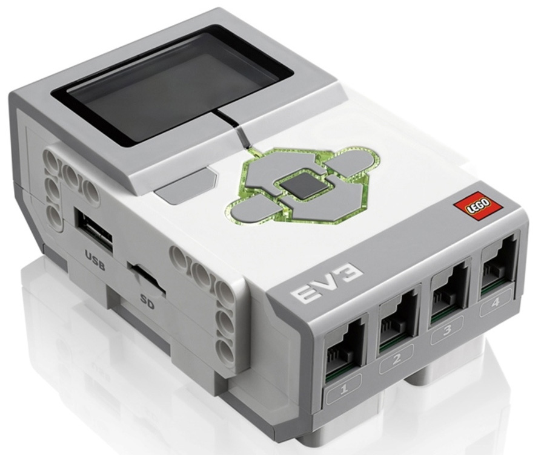

# O LEGO EV3

**Lego EV3** — образовательная робототехническая платформа. TRIK Studio поддерживает данную платформу для [программирования](../pioneer/about.md#programming).


Подробную информацию читайте на официальном [сайте](https://education.lego.com/ru-ru/product/mindstorms-ev3) производителя.


## Программирование LEGO EV3 

Для программирования контроллера Lego EV3 выберите «Lego EV3» в настройках TRIK Studio во вкладке [«Роботы»](../studio/interface/faq-robot-settings.md).

.png>)

Используйте [специализированные](blocks.md) и [общие](../studio/programming-visual/blocks.md) блоки для написания программ.

Подробнее о визуальном программировании читайте в статье


[programming-visual](../studio/programming-visual/)

