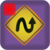
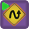

# Блоки LEGO EV3

Специализированные блоки для LEGO EV3 делятся на несколько категорий:

1. [Действия](blocks.md#bloki-deistviya) — блоки, выполняющие какое-либо действие на роботе: включение моторов, проигрывание звука и т.д.
2. [Ожидания](blocks.md#bloki-ozhidaniya) — блоки, ждущие наступления какого-либо события: определённых показаний датчиков, нажатия на кнопку и т.д.
3. [Рисования на дисплее](blocks.md#risovanie-na-displee) — блоки, используемые для вывода графики и текста на экран.
4. [Line Leader](blocks.md#line-leader) — блоки для продвинутого датчика «Line Leader».

&#x20;Блоки, доступные для всех платформ см. в статье «[Общие блоки](../studio/programming-visual/blocks.md)».

## Блоки действия

| Вид                                                                                          | Название                                                                | Описание                                                                                                                                                                                                                         |
| -------------------------------------------------------------------------------------------- | ----------------------------------------------------------------------- | -------------------------------------------------------------------------------------------------------------------------------------------------------------------------------------------------------------------------------- |
|        | [Отправить сообщение в задачу](blocks.md#otpravit-soobshenie-v-zadachu) | Отправляет данное сообщение в параллельную задачу с заданным идентификатором (идентификатор должен быть указан при создании задачи в блоке «[Параллельные задачи](../studio/programming-visual/blocks.md#parallelnye-zadachi)»). |
|                      | [Гудок](blocks.md#gudok)                                                | Проиграть на роботе звук с фиксированной частотой.                                                                                                                                                                               |
|                  | [Играть звук](blocks.md#igrat-zvuk)                                     | Проиграть на роботе звук с заданной частотой и длительностью.                                                                                                                                                                    |
|            | [Моторы вперед](blocks.md#motory-vpered)                                | Включить моторы по заданным портам с заданной мощностью.                                                                                                                                                                         |
|           | [Моторы назад](blocks.md#motory-nazad)                                  | Включить моторы в режиме реверса по заданным портам с заданной мощностью.                                                                                                                                                        |
|               | [Моторы стоп](blocks.md#motory-stop)                                    | Выключить моторы по заданным портам.                                                                                                                                                                                             |
|      | [Сбросить показания энкодера](blocks.md#sbrosit-pokazaniya-enkodera)    | Сбросить показания количества оборотов моторов.                                                                                                                                                                                  |
|                       | [Светодиод](blocks.md#svetodiod)                                        | Установить цвет светодиода на передней панели робота.                                                                                                                                                                            |
|               | [Отправить письмо роботу](blocks.md#otpravit-pismo-robotu)              | Отправить письмо другому роботу.                                                                                                                                                                                                 |
|        | [Калибровка гироскопа](blocks.md#kalibrovka-giroskopa)                  | Устанавливает гироскоп в 0 в текущей позиции.                                                                                                                                                                                    |
|   | [Начать калибровку компаса](blocks.md#nachat-kalibrovku-kompasa)        | Начинает калибровку компаса программно.                                                                                                                                                                                          |
|    | [Закончить калибровку компаса](blocks.md#zakonchit-kalibrovku-kompasa)  | Заканчивает калибровку компаса.                                                                                                                                                                                                  |
|                   | [Считать цвета в переменные](blocks.md#schitat-cveta-v-peremennye)      | Читать RGB в переменной.                                                                                                                                                                                                         |

### Отправить сообщение в задачу

.png>)

Отправляет данное сообщение в параллельную задачу с заданным идентификатором (идентификатор должен быть указан при создании задачи в блоке «[Параллельные задачи](../studio/programming-visual/blocks.md#parallelnye-zadachi)»).

В качестве сообщения может быть любое выражение.

### Гудок

.png>)

Проиграть на роботе звук с фиксированной частотой.

Параметры:

1. &#x20;Ждать ли завершения проигрывания звука или сразу же перейти к следующему блоку. Допустимые значения — «истина», «ложь».
2. &#x20;Громкость воспроизведения.

### Играть звук

.png>)

Проиграть на роботе звук с заданной частотой и длительностью. Аналогичен блоку «[Гудок](blocks.md#gudok)», но позволяет также задавать параметры звука.

Параметры:

* &#x20;Частота (Гц).
* &#x20;Длительность (мс).
* &#x20;Ждать ли завершения проигрывания звука или сразу же перейти к следующему блоку. Допустимые значения — истина, ложь.
* &#x20;Громкость воспроизведения (от 0 до 100%).

### **Моторы вперед**

.png>)

Включить моторы по заданным портам с заданной мощностью. Порты задаются буквами A, B или C, разделенными запятыми.

Мощность задается в процентах числом от -100 до 100, если задано отрицательное значение, мотор включается в режиме реверса.

Моторы имеют разные режимы работы: режим торможения и режим скольжения (отображаемые красным или зелёным прямоугольником на блоке соответственно). Режимы влияют на то, как двигатель отрабатывает команду — режим торможения стопорит двигатель при отключении, режим скольжения позволяет двигателю прокручиваться по инерции.

### **Моторы назад**

.png>)

Включить моторы в режиме реверса по заданным портам с заданной мощностью. Параметры аналогичны параметрам блока «[Моторы вперёд](blocks.md#motory-vpered)».

### **Моторы стоп**

.png>)

Выключить моторы по заданным портам.

### **Сбросить показания энкодера**

.png>)

Сбросить показания количества оборотов моторов.

### **Светодиод**

.png>)

Установить цвет светодиода на передней панели робота.

### **Отправить письмо роботу**

.png>)

Отправить письмо другому роботу. Если имя получателя не заполнено, сообщение будет отослано всем соединенным роботам.

### Калибровка гироскопа

.png>)

Устанавливает гироскоп в 0 в текущей позиции.

### Начать калибровку компаса

.png>)

Начинает калибровку компаса программно.\
\
Чтобы откалибровать компас, робот должен повернуться на месте больше чем на 540° в одну, а затем в обратную сторону. После поворотов необходимо добавить блок «[Закончить калибровку компаса](blocks.md#zakonchit-kalibrovku-kompasa)».

### Закончить калибровку компаса

.png>)

Заканчивает калибровку компаса. Результат калибровки возвращается в переменной. Ненулевой результат означает успешную калибровку.

### Считать цвета в переменные

.png>)

Читать RGB в переменной.

## Блоки ожидания

| Вид                                                                                        | Название                                                                               | Описание                                                                                                                                  |
| ------------------------------------------------------------------------------------------ | -------------------------------------------------------------------------------------- | ----------------------------------------------------------------------------------------------------------------------------------------- |
|   | [Получить сообщение из другой задачи](blocks.md#poluchit-soobshenie-iz-drugoi-zadachi) | Ждать получения сообщения из другой параллельной задачи.                                                                                  |
|      | [Ждать датчик касания](blocks.md#zhdat-datchik-kasaniya)                               | Ждать, пока не сработает датчик касания.                                                                                                  |
|          | [Ждать энкодер](blocks.md#zhdat-enkoder)                                               | Ждать, пока показания счетчика количества оборотов на заданном моторе не достигнут указанного в значении параметра «Предел оборотов».     |
|            | [Ждать цвет](blocks.md#zhdat-cvet)                                                     | Ждать, пока сенсор цвета в режиме распознавания цветов не вернет указанный цвет.                                                          |
|   | [Ждать интенсивность цвета](blocks.md#zhdat-intensivnost-cveta)                        | Ждать, пока значение, возвращаемое сенсором цвета на указанном порту, не будет сравнимо с указанным в значении параметра «Интенсивность». |
|            | [Ждать свет](blocks.md#zhdat-svet)                                                     | Ждать, пока значение, возвращаемое сенсором света на указанном порту, не будет сравнимо с указанным в значении параметра «Проценты».      |
|    | [Ждать датчик расстояния](blocks.md#zhdat-datchik-rasstoyaniya)                        | Ждать, пока расстояние, возвращаемое ультразвуковым сенсором расстояния, не будет сравнимо с указанным в значении параметра «Расстояние». |
|          | [Ждать нажатия кнопки](blocks.md#zhdat-nazhatiya-knopki)                               | Ждать нажатия на кнопку на корпусе робота.                                                                                                |
|      | [Ждать датчик звука](blocks.md#zhdat-datchik-zvuka)                                    | Ждать, пока громкость, считанная микрофоном на заданном порту, не будет выше или ниже заданного значения.                                 |
|        | [Ждать гиродатчик](blocks.md#zhdat-girodatchik)                                        | Ждать, пока значение, возвращаемое гироскопом на указанном порту, не будет сравнимо с указанным в значении параметра «Значение».          |
|          | [Ждать приема сообщения](blocks.md#zhdat-priema-soobsheniya)                           | Сохраняет сообщение от другого робота в заданную переменную.                                                                              |

### Получить сообщение из другой задачи

.png>)

Ждать получения сообщения из другой параллельной задачи.

Когда сообщение будет получено, оно будет присвоено указанной в блоке переменной.

Свойство «Дождаться сообщения» позволяет указать, что делать, если очередь сообщений пуста: дождаться прихода нового сообщения или продолжить работу, присвоив переменной пустую строку.

Сообщение автоматически приводится к типу, соответствующему типу переменной-приёмника. Пример: если вы посылаете число в виде строки, то оно будет принято как число.

### Ждать датчик касания

.png>)

Ждать, пока не сработает датчик касания.

Параметром указывается номер порта, к которому подключен датчик. Допустимые значения: 1, 2, 3, 4.

### Ждать энкодер

.png>)

Ждать, пока показания счетчика количества оборотов на заданном моторе не достигнут указанного в значении параметра «Предел оборотов».

Параметры:

1. &#x20;Порт — название порта, к которому подключен мотор (A, B или C).
2. Считанное значение — операция, которая будет использоваться для сравнения с введенным пределом оборотов.
3. &#x20;Предел оборотов.

### Ждать цвет

.png>)

Ждать, пока сенсор цвета в режиме распознавания цветов не вернет указанный цвет.

Параметры:

1. Цвет.
2. Порт — номер порта, к которому подключен датчик цвета.

### Ждать интенсивность цвета

.png>)

Ждать, пока значение, возвращаемое сенсором цвета на указанном порту, не будет сравнимо с указанным в значении параметра «Интенсивность».

Параметры:

1. Интенсивность (от 0 до 100%).&#x20;
2. Порт — номер порта, к которому подключен сенсор цвета.
3. &#x20;Считанное значение — операция, которая будет использоваться для сравнения с введенной интенсивностью.

### Ждать свет

.png>)

Ждать, пока значение, возвращаемое сенсором света на указанном порту, не будет сравнимо с указанным в значении параметра «Проценты».

Параметры:

1. &#x20;Проценты (от 0 до 100%).
2. Порт — номер порта, к которому подключен сенсор цвета.
3. Считанное значение — операция, которая будет использоваться для сравнения со значением параметра «Проценты».

### Ждать датчик расстояния

.png>)

Ждать, пока расстояние, возвращаемое ультразвуковым сенсором расстояния, не будет сравнимо с указанным в значении параметра «Расстояние».

Параметры:

1. Расстояние (в сантиметрах, от 0 до 255).
2. &#x20;Порт — номер порта, к которому подключен датчик расстояния.
3. &#x20;Считанное значение — операция, которая будет использоваться для сравнения с введенным расстоянием.

### Ждать нажатия кнопки

.png>)

Ждать нажатия на кнопку на корпусе робота.

### Ждать датчик звука

.png>)

Ждать, пока громкость, считанная микрофоном на заданном порту, не будет выше или ниже заданного значения.

### Ждать гиродатчик

.png>)

Ждать, пока значение, возвращаемое гироскопом на указанном порту, не будет сравнимо с указанным в значении параметра «Значение».

### Ждать приема сообщения

.png>)

Сохраняет сообщение от другого робота в заданную переменную. Если сообщения нет, то робот ждет приход сообщения, если установлен флаг. Иначе в переменную установится значение по умолчанию.

## Рисование на дисплее

| Вид                                                                              | Название                                                                                 | Описание                                                          |
| -------------------------------------------------------------------------------- | ---------------------------------------------------------------------------------------- | ----------------------------------------------------------------- |
|     | [Напечатать текст](blocks.md#napechatat-tekst)                                           | Печатает заданную строку в заданном месте на экране робота.       |
|   | [Очистить экран](blocks.md#ochistit-ekran)                                               | Стереть всё, что нарисовано на экране.                            |
|      | [Нарисовать прямоугольник](../trik/programming-visual/blocks.md#narisovat-pryamougolnik) | Нарисовать на экране прямоугольник.                               |
|     | [Нарисовать точку](blocks.md#narisovat-tochku)                                           | Нарисовать на экране точку в указанных координатах.               |
|      | [Нарисовать линию](blocks.md#narisovat-liniyu)                                           | Нарисовать на экране отрезок.                                     |
|    | [Нарисовать круг](blocks.md#narisovat-krug)                                              | Нарисовать на экране круг с заданным центром и заданным радиусом. |

### Напечатать текст

.png>)

Печатает заданную строку в заданном месте на экране робота.

Значение свойства «Текст» по умолчанию трактуется как строка в чистом виде, оно так и будет выведено на экран. Чтобы система считала, что это выражение на текстовом языке (это может быть полезно, например, при отладке значения переменных), поставьте галочку «Вычислять» в редакторе свойств.

### Очистить экран

.png>)

Стереть всё, что нарисовано на экране.

### Нарисовать прямоугольник

.png>)

Нарисовать на экране прямоугольник.

Параметры:

1. &#x20;X, Y — координаты левого верхнего угла.
2. &#x20;Ширина прямоугольника.
3. &#x20;Высота прямоугольника.
4. &#x20;Обновить картинку (истина или ложь).

### Нарисовать точку

.png>)

Нарисовать на экране точку в указанных координатах.

### Нарисовать линию

.png>)

Нарисовать на экране отрезок.

Параметры:

1. &#x20;X1, Y1 — координаты начала отрезка.
2. &#x20;X2, Y2 — координаты конца отрезка.
3. &#x20;Обновить картинку (истина или ложь).

### Нарисовать круг

.png>)

Нарисовать на экране круг с заданным центром и заданным радиусом.

Параметры:

1. &#x20;X, Y — координаты центра круга.
2. &#x20;Радиус круга.
3. &#x20;Обновить картинку (истина или ложь).

## Line Leader

| Вид                                                                                    | Название                                                                                      | Описание                                          |
| -------------------------------------------------------------------------------------- | --------------------------------------------------------------------------------------------- | ------------------------------------------------- |
|       | [Калибровка белого](blocks.md#kalibrovka-belogo)                                              | Калибрует порог белого для сенсора.               |
|       | [Калибровка черного](blocks.md#kalibrovka-chernogo)                                           | Калибрует порог черного для сенсора.              |
|         | [Калибровка ПИД-регулятора](blocks.md#kalibrovka-pid-regulyatora)                             | Устанавливает уставку сенсора                     |
|          | [Датчик линии в спящий режим](blocks.md#datchik-linii-v-spyashii-rezhim)                      | Отправляет датчик линии в режим энергосбережения. |
|         | [Пробудить датчик линии](blocks.md#probudit-datchik-linii)                                    | Включает датчик линии для работы.                 |
|        | [Средневзвешенное значение в переменную](blocks.md#srednevzveshennoe-znachenie-v-peremennuyu) | Считывает средневзвешенное значение в переменную. |
|        | [Считать сенсор в массив](blocks.md#schitat-sensor-v-massiv)                                  | Считать значения с сенсора (восемь значений).     |
|   | [Управляющее значение в переменную](blocks.md#upravlyayushee-znachenie-v-peremennuyu)         | Считывает управляющее значение в переменную.      |

### Калибровка белого

.png>)

Калибрует порог белого для сенсора. Должен находиться на белом.

### Калибровка черного

.png>)

Калибрует порог черного для сенсора. Должен находиться на черном.

### Калибровка ПИД — регулятора

.png>)

Устанавливает уставку сенсора (середина сенсора над линией), П/(П фактор), И/(И фактор), Д/(Д фактор).

### Датчик линии в спящий режим

.png>)

Отправляет датчик линии в режим энергосбережения.

### Пробудить датчик линии

.png>)

Включает датчик линии для работы.

### Средневзвешенное значение в переменную

.png>)

Считывает средневзвешенное значение в переменную.

Значение высчитывается внутри сенсора, где каждый из восьми сенсоров берется с коэффициентом, и вычисляется среднее.

Ожидается значение от 0 до 80 (-1 — ошибка).

### Считать сенсор в массив

.png>)

Считать значения с сенсора (восемь значений). Значения от 0 до 100. 0 — черный, 100 — белый.

### Управляющее значение в переменную

.png>)

Считывает управляющее значение в переменную. Значение высчитывается внутри сенсора и может быть использовано сразу для моторов.

Ожидается значение от -100 до 100 (-101 — ошибка)
