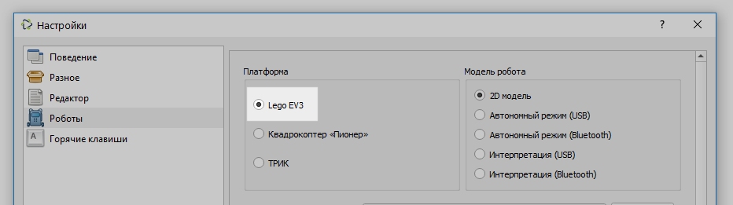

# Подключение контроллера LEGO EV3 к TRIK Studio

Контроллер LEGO EV3 может быть подключен к TRIK Studio с помощью:

1. [USB](connect-to-studio.md#usb).
2. [Bluetooth](connect-to-studio.md#bluetooth).

В каждом из двух вариантов сначала необходимо в настройках TRIK Studio в разделе [«Роботы»](../studio/settings.md#robots) выбрать платформу LEGO EV3.

## Подключение по USB 

1. Подключите USB-провод к контроллеру LEGO EV3 и к компьютеру с TRIK Studio.
2. Включите контроллер LEGO EV3.

После этого можно загружать программы на робота. Никаких дополнительных действий и драйверов не требуется.

## Подключение по Bluetooth 

Процедура подключения робота LEGO EV3 по Bluetooth аналогична [подключению робота LEGO NXT](../nxt/connect-to-studio.md).
