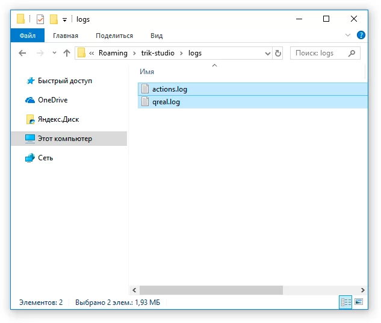
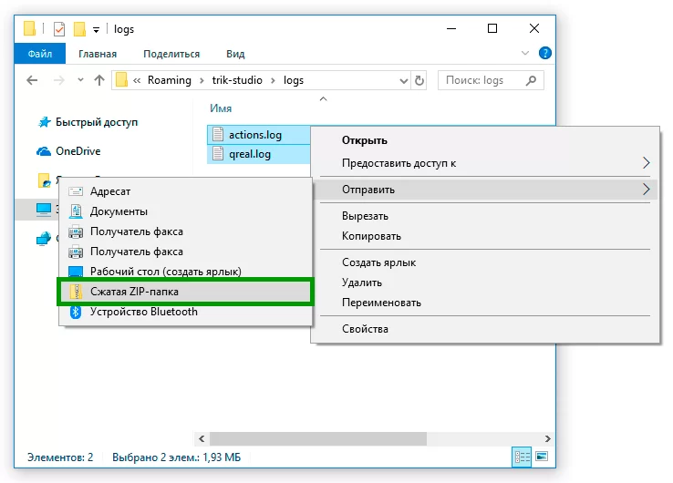
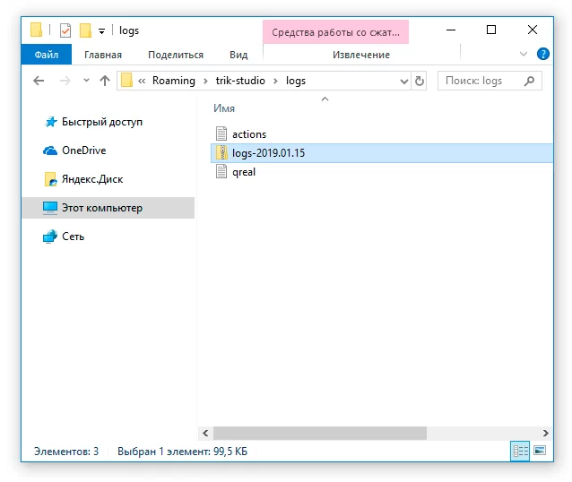
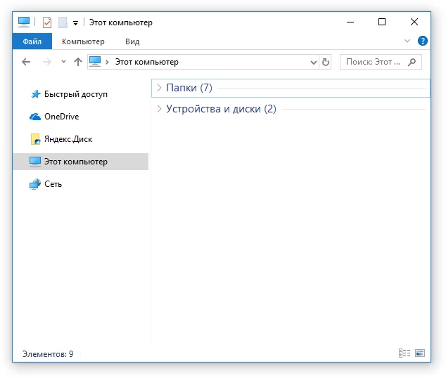
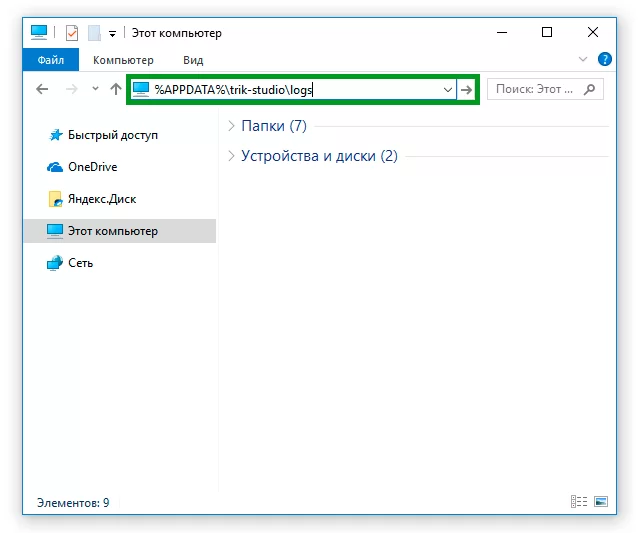
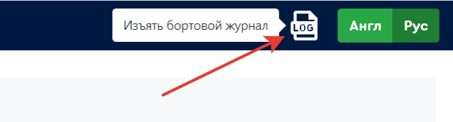

# Действия при неправильной работе TRIK Studio или контроллера ТРИК

Во время работы TRIK Studio и контроллера ТРИК записываются лог-файлы (логи), фиксирующие действия программы и пользователя.

Данные файлы позволяют точнее определить возможные причины сбоев, поэтому мы просим присылать их нам вместе с описанием проблемы.

О том, где взять эти файлы, смотрите в соответствующих разделах:

1. [Логи TRIK Studio.](logging.md#trikstudio)
2. [Логи на контроллере ТРИК](logging.md#trik).

## Логи TRIK Studio <a href="#trikstudio" id="trikstudio"></a>

### Способ 1

1\. В меню TRIK Studio выберите «Справка» → «Открыть лог-файлы».

.png>)

2\. В открывшемся окне выделите файлы `actions.log` и `qreal.log`.



3\. Нажмите правой кнопкой мыши на любой из выделенных файлов. В появившемся контекстном меню выберите «Отправить» → «Сжатая ZIP-папка».



4\. Введите название с указанием даты в формате «ГГГГ.ММ.ДД».



5\. Отправьте нам получившийся архив через [форму обратной связи](https://trikset.com/support#feedback). Мы рассмотрим ваш запрос и исправим ошибку.

### Способ 2

1\. Откройте проводник.



2\. В адресной строке введите следующий путь:

```
%APPDATA%\trik-studio\logs
```



3\. Дальнейшие действия аналогичны пунктам 2–5, описанным в [первом способе](logging.md#sposob-1).


## Сбор логов на контроллере ТРИК <a href="#trik" id="trik"></a>


**Внимание!** Логи собираются только в случае, если контроллер экстренно перезагружается.


1\. Подключитесь к контроллеру по Wi-Fi любым из [способов](../trik/wi-fi/network-connection.md).

2\. Войдите в [веб-интерфейс](../trik/web-interface.md), набрав ip-адрес контроллера в браузере.

3\. Выберите в веб-интерфейсе пункт «Бортовой журнал».

4\. В правом верхнем углу нажмите на значок  .



5\. На компьютер загрузится архив. Отправьте его нам через [форму обратной связи](https://trikset.com/support#feedback). Мы рассмотрим ваш запрос и исправим ошибку.
