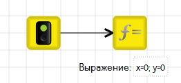
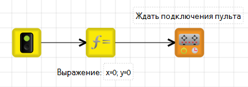
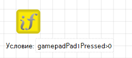
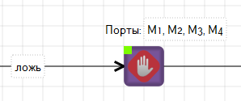
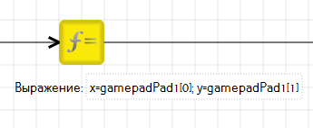
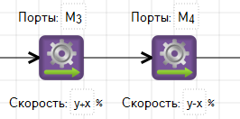
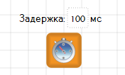
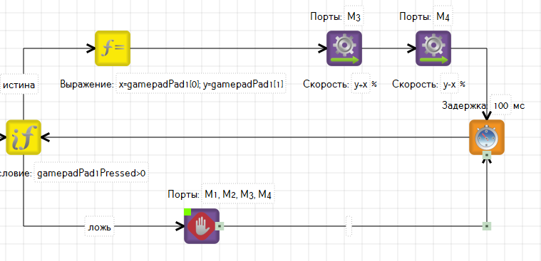
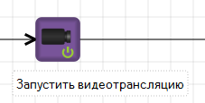
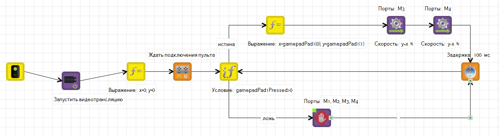

# Управление роботом с пульта

Для управления роботом с [пульта](about/) необходимо написать программу и запустить её на роботе.

## Пример взаимодействия с пультом

1. Напишите [алгоритм](remote-control.md#algorithm) для использования пульта в TRIK Studio.
2. [Подключите](../trik/wi-fi/) контроллер к компьютеру и [загрузите](../trik/run-upload-programs.md) написанную программу на робота.
3. [Подключите](../trik/wi-fi/) смартфон к контроллеру, выбрав сеть контроллера.
4. Откройте приложение [TRIK Gamepad](about/app.md) на вашем смартфоне.
5. [Выполните](../trik/run-upload-programs.md) алгоритм на контроллере.

## Алгоритм программы 

1\. Введите переменные для координат касания до геймпада — `x` и `y` — и инициализируйте их, присвоив им нулевые значения в блоке «[Выражение](../studio/programming-visual/blocks.md#expression)»:

2\. Добавьте блок «[Ждать подключения пульта](../trik/programming-visual/blocks.md#wait-for-gamepad-connect)»:

3\. Для проверки нажатия на геймпаде на левую область (Pad1) добавьте блок «[Условие](../studio/programming-visual/blocks.md#condition)» с условием [`gamepadPad1Pressed`](../trik/programming-visual/sensory-variables.md#gamepadpad-1-pressed-gamepadpad-2-pressed) `> 0`:

4\. В случае, если касания нет, необходимо моторы останавливать. Для этого добавьте блок «[Моторы стоп](../trik/programming-visual/blocks.md#stop-motors)»:

5\. Если на геймпаде нажата область [Pad1](about/app.md), необходимо получить координаты касания. Для этого используйте массив [`gamepadPad1`](../trik/programming-visual/sensory-variables.md#gamepadpad-1-gamepadpad2) в блоке «[Выражение](../studio/programming-visual/blocks.md#expression)»:

6\. После получения координат добавьте простой регулятор с помощью блоков «[Моторы вперед](../trik/programming-visual/blocks.md#motors-forward)». Смещение по координате `Y` отвечает за скорость робота, а по `X` — за поворот.

7\. Для замыкания условия добавьте блок «[Таймер](../studio/programming-visual/blocks.md#timer)» со значением `100 мc` (в программе это время для нового обращения к пульту).

8\. Замкните цикл на блоке «Условие» связью от блока «Таймер».

9\. Если у вас есть видеокамера, добавьте блок «[Запустить видеотрансляцию](../trik/programming-visual/blocks.md#camera-on)» в начало программы:                                                                                 &#x20;

### Общий вид алгоритма


Готовую программу вы можете найти в корневой папке с TRIK Studio `/examples/trik/remoteControl` или скачать [здесь](https://dl.trikset.com/trikset-help/remoteControl.qrs).

