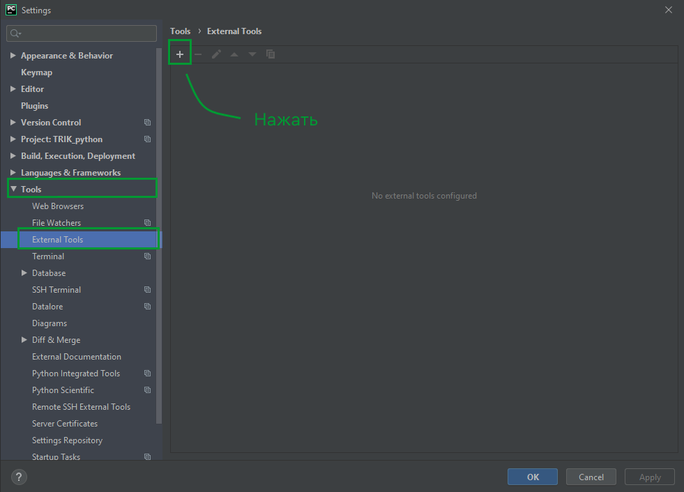
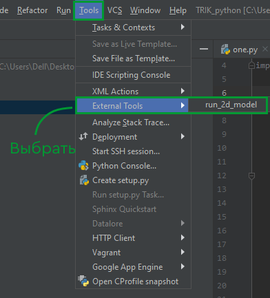
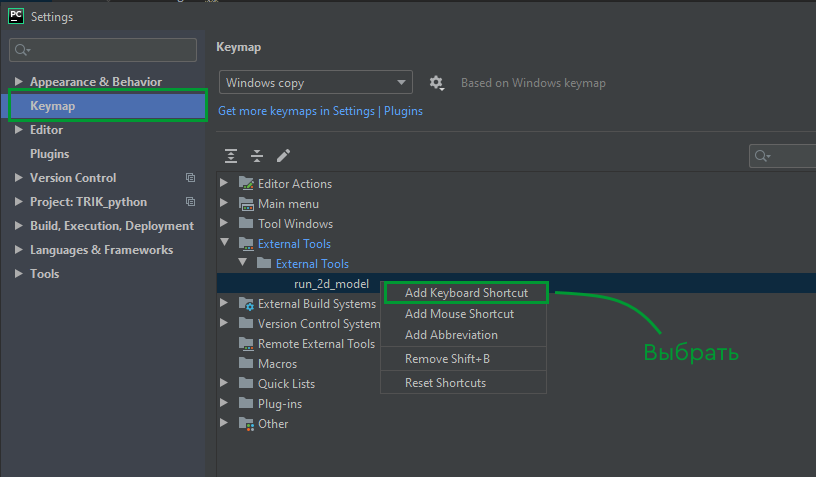
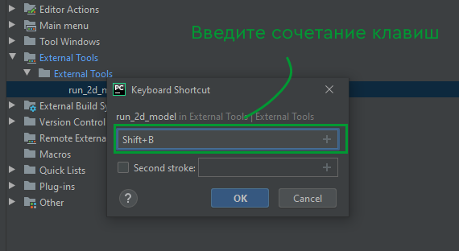
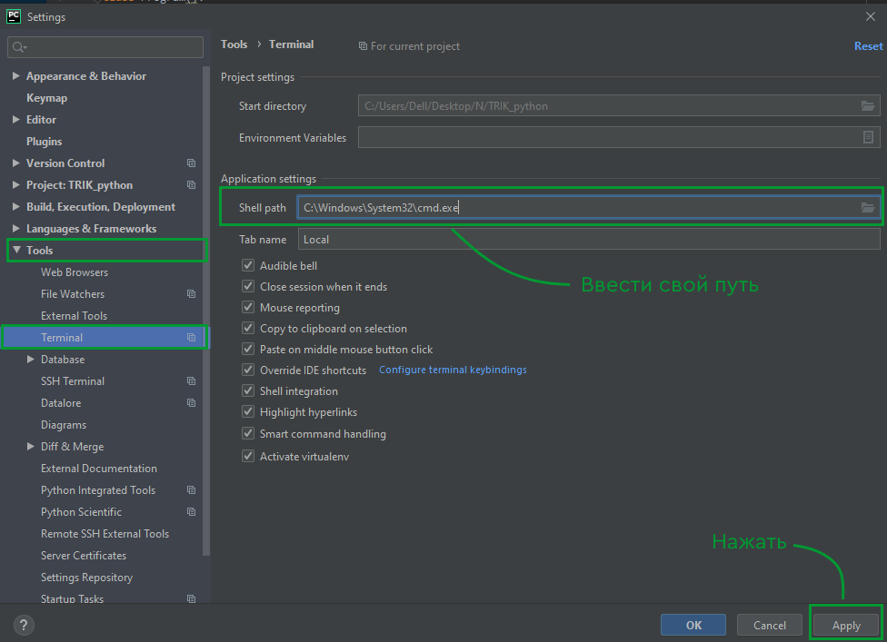

# Запуск 2D-модели в TRIK Studio из PyCharm

В данной статье рассматривается настройка и использование внешней среды программирования **PyCharm** для вызова программ в [2D-модели](../../studio/2d-model/) TRIK Studio. &#x20;

Это позволит опытным пользователям TRIK Studio использовать все возможности профессиональных текстовых редакторов и их плагинов: статические анализаторы, автоформаттеры, цветовые темы.

Также рассказывается как автоматически запускать программу на нескольких полях, что может быть полезно участникам соревнований с автоматизированными системами проверки (например, [Олимпиады НТИ ИРС](https://trikset.com/education/nti)).

## **Подготовка** 

Предполагается, что пользователь пишет программу во внешнем редакторе и хотел бы запустить данную программу на одном или нескольких полях. Поля могут быть представлены как в формате `.xml` (подробнее в статье [«Гибкая настройка 2D-модели»](../../studio/2d-model/settings.md)), так и в формате `.qrs`.

1. Скачайте файл [run\_2d\_model.cmd](https://gist.github.com/anastasiia-kornilova/2b955e62c3cef7a509fc043a189ea3ff) для Windows или [run\_2d\_model.sh](https://gist.github.com/anastasiia-kornilova/f13a708562debabeeb126381f3d535e5) для Linux и поместите его в папку, в которой установлена TRIK Studio.
2. Поместите поля, на которых необходимо тестировать программу, в отдельную папку. Если поля представлены в формате `.xml`, создайте в данной папке пустой проект `default.qrs`.

## Настройка PyCharm


Инструкция протестирована на PyCharm Professional Edition (2019.3).\
Скачать PyCharm можно на [официальном сайте](https://www.jetbrains.com/ru-ru/pycharm/).


1\. Откройте папку с исходным кодом в **PyCharm** c помощью `File → Open`.

2\. Выберите `File → Settings` или нажмите комбинацию клавиш `«Ctrl+Alt+S»`.

.png>)

3\. Выберите `Tools → External tools` и нажмите на значок `«+»`.

4\.  В поле `Name` введите желаемое имя тула, например, `«run_2d_model»`. В открывшимся окне подставьте в поле `Program` свой путь к файлу `run_2d_model.cmd`. В поле `Arguments` впишите параметры `$FileDir$` и `$FileName$` или выберите `Insert Macros` и выберите из списка нужные параметры. В поле `Working Directory` впишите `$FileDir$` или выберите `Insert Macros` и выберите нужный параметр. Нажмите кнопку `«ОК»`.

5\. Для того чтобы запустить код, выберите `Tools→ External tools` и `run_2d_model` (либо свое название, выбранное ранее).

6\. Для добавления «горячих клавиш» выберите `File → Settings` или нажмите комбинацию клавиш `«Ctrl+Alt+S»`. В открывшемся меню выберите вкладку `Keymap` и перейдите к созданному external tool. Нажмите на `run_2d_model` правой кнопкой мыши, выберите `Add Keyboard Shortcut`.

7\. В открывшемся окне введите желаемое сочетание клавиш для вызова тула и нажмите кнопку `«ОК»`.

8\. Теперь для запуска кода достаточно нажать выбранное сочетание (в данном случае `Shift+B`, но возможно выбрать любое другое).


В случае возникновения ошибки выберите `Settings → Tools → Terminal` и введите свой путь к файлу cmd.exe (`shell path`). Затем нажмите `Apply`.


