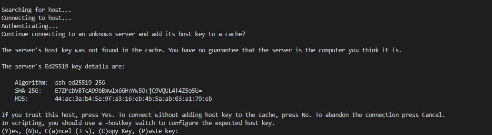
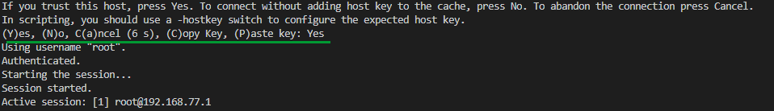

# Загрузка программ на нескольких роботов ТРИК из VSCode

В данной статье рассматривается возможность одновременной загрузки программ на группу роботов с использованием внешнего текстового редактора **VSCode**. Статья является продолжением материала


[run-2d-from-vscode.md](run-2d-from-vscode.md)


## Настройка

Скачайте файл [send\_files.cmd](https://gist.github.com/anastasiia-kornilova/e1344f658a91449cf16217ec03147a18) для Windows и поместите его в папку, в которую установлена TRIK Studio.


Инструкция протестирована на январском релизе 2020 года (version 1.42).\
Скачать VSCode можно на [официальном сайте](https://code.visualstudio.com/Download).


При первом запуске программы для установки соединения с роботом потребуется подтверждение от пользователя.



Чтобы разрешить соединение, введите в командной строке `Y` или `Yes`.



1\. Откройте папку с файлами, которые хотите отправить, в VSCode с помощью `File → Open Folder`.

2\. Вызовите `Terminal → Configure Tasks`.

.png>)

3\. Если ранее задач не было, то выберите в выпадающем меню `Create tasks.json file from template → Others`. Откроется файл `tasks.json`. Если tasks были созданы ранее, он откроется сразу после пункта 2.

.jpg>)

4\. Удалите всё из этого файла и вставьте данный код:

```javascript
{
    "version": "2.0.0",
        "tasks": [ {
            "label": "Send files",
            "type": "shell",
            "windows": {
                "command": "C:\\TRIKStudio\\send_files.cmd  <path to scripts dir> <file with ip addresses>"
            },
            "group": "test",
            "presentation": {
                "reveal": "always",
                "panel": "new"
            }
        }]
}
```

Здесь:

* `<path to scripts dir>` — полный путь к папке с программами, которые необходимо загрузить на роботов,
* `<file with ip addresses>` — название файла `.txt`, в котором содержатся ip-адреса роботов для загрузки файлов. Каждый ip-адрес на новой строке.

5\. В строке, соответствующей полю `"windows": { "command"` укажите путь к файлу `send_files.cmd`. Файл с ip-адресами роботов должен находиться в той же папке, что и отправляемые программы. Например:

```javascript
"command": "C:\TRIKStudio\send_files.cmd C:\Users\Admin\myfiles ip_addr.txt"
```

.png>)

6\. Сохраните файл `tasks.json`.

7\. Теперь при нажатии `Terminal → Run Task` в выпадающем меню выбираем `Send files`, чтобы загрузить программы на роботов, или соответствующую комбинацию клавиш `Ctrl+Shift+B`.
