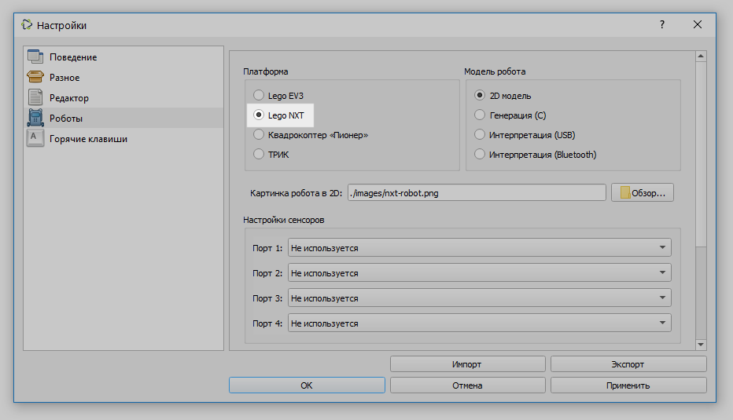
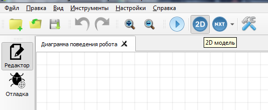
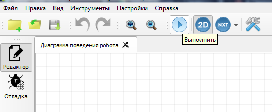
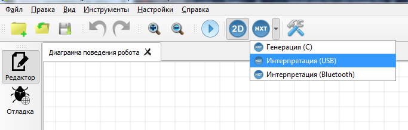
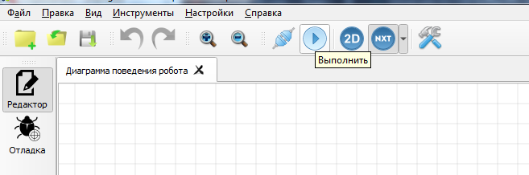

# Запуск программ и их загрузка на контроллер LEGO NXT

Для работы с контроллером LEGO NXT в настройках TRIK Studio перейдите в [раздел «Роботы»](../studio/settings.md#robots) и выберите платформу LEGO NXT.

Существует несколько вариантов выполнения программ для контроллера LEGO NXT:

* [Пошаговая интерпретация диаграммы с моделированием поведения робота на двумерной модели.](run-upload-programs.md#2d)
* [Пошаговая интерпретация диаграммы с посылкой команд в робота по Bluetooth или USB](run-upload-programs.md#interpretaciya-s-posylkoi-komand-v-robota-po-bluetooth-ili-usb).
* [Загрузка программы на робот и дальнейшее её автономное исполнение без связи с компьютером.](run-upload-programs.md#zagruzka-na-kontroller)

## **Интерпретация с моделированием поведения робота** 


В режиме двумерной модели робота команды не передаются роботу, а исполняются пошагово для виртуальной модели, отображающейся на экране. Подробнее см. в статье [«2D-модель»](../studio/2d-model/).


&#x20;1\. Включите режим двумерной модели.

2\. Нажмите на кнопку «Выполнить».

3\. Откроется окно двумерной модели и начнется выполнение программы.

4\. При переключении в режим редактирования можно отслеживать шаги выполнения программы.

## **Интерпретация** с посылкой команд в робота по Bluetooth или USB

1\. Включите режим «Интерпретация (USB)» или «Интерпретация (Bluetooth).

2\. Нажмите на кнопку «Выполнить».

## **Загрузка на контроллер**

Из TRIK Studio можно загрузить готовую программу на робота, чтобы в дальнейшем автономно её исполнять без связи с компьютером.


Раздел дополняется.

