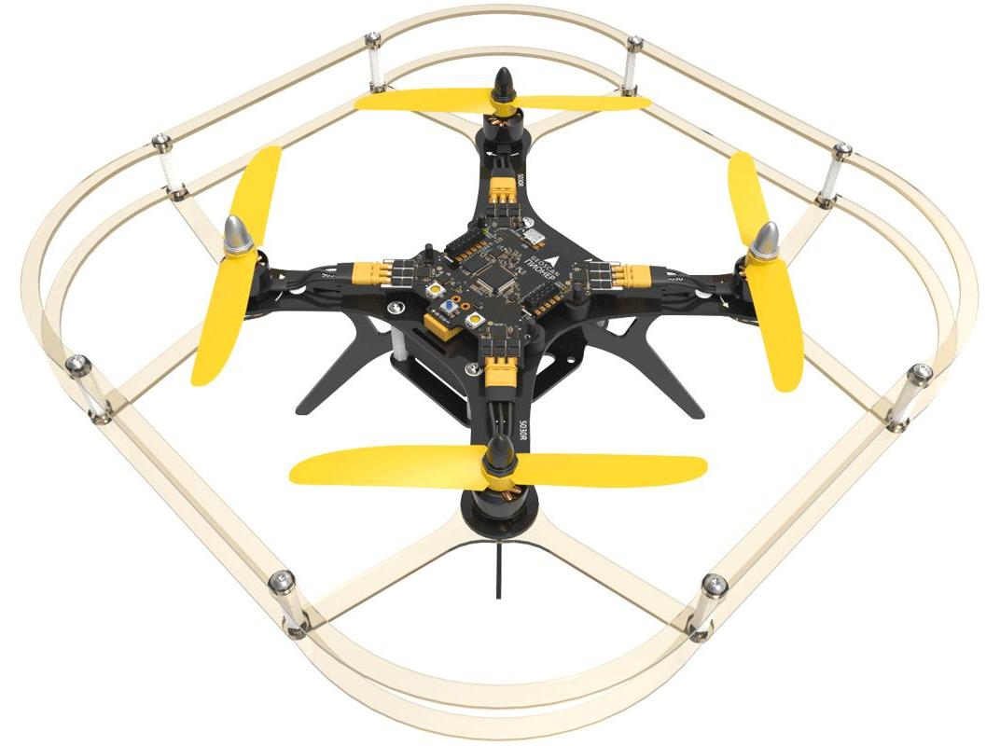
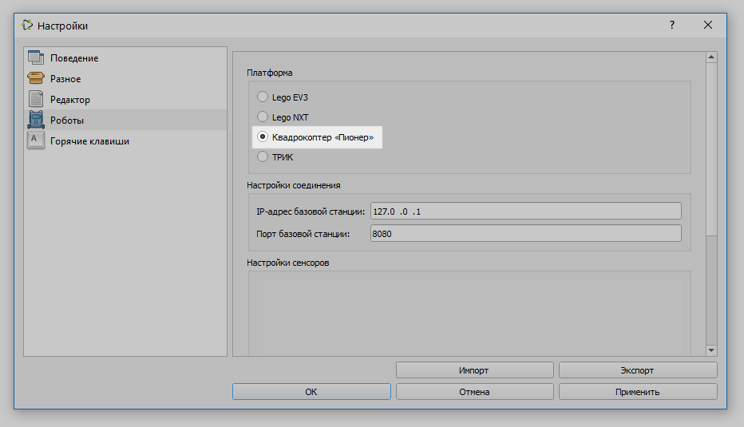

# О квадрокоптере Геоскан Пионер

**Квадрокоптер Геоскан Пионер** — многофункциональный учебно-методический комплекс. TRIK Studio поддерживает данную платформу для [программирования](about.md#programming).


Подробную информацию читайте на официальном [сайте](https://www.geoscan.aero/ru/products/pioneer/copter) производителя.


## Программирование квадрокоптера 

Для программирования квадрокоптера Геоскан Пионер выберите «Квадрокоптер "Пионер"» в настройках TRIK Studio во вкладке [«Роботы»](../studio/interface/faq-robot-settings.md).

Используйте [специализированные](blocks.md) и [общие](../studio/programming-visual/blocks.md) блоки для написания программ.

Подробнее о визуальном программировании читайте в статье


[programming-visual](../studio/programming-visual/)

