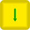
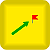

# Блоки квадрокоптера Геоскан Пионер

Блоки, доступные для всех платформ, смотрите в статье


[blocks.md](../studio/programming-visual/blocks.md)


## Блоки квадрокоптера Геоскан Пионер

|                                           Вид                                           |       Название       | Описание                                                                                                                                                                                    |
| :-------------------------------------------------------------------------------------: | :------------------: | ------------------------------------------------------------------------------------------------------------------------------------------------------------------------------------------- |
|             |         Взлёт        | Команда начала полета.                                                                                                                                                                      |
|             |        Посадка       | Команда завершения полета.                                                                                                                                                                  |
|       | Лететь на точку (ЛК) | Указывает точку назначения в локальных координатах. За начало отсчёта (0,0,0) принимается место взлета. Значения координат задаются в метрах.                                               |
|   |  Получить точку (ЛК) | Возвращает текущую позицию в локальной системе координат.                                                                                                                                   |
|            |       Светодиод      | Задает цвет светодиода на квадрокоптере.                                                                                                                                                    |
|    |         Магнит       | Управляет работой [модуля захвата груза](https://pioneer-doc.readthedocs.io/ru/master/const/module/cargo.html). Чтобы включить магнит, поставьте галочку в чекбоксе значения свойств блока. |
|           |        Команда       | Позволяет выполнить команду [на языке Lua](https://pioneer-doc.readthedocs.io/ru/master/programming/lua/lua\_main.html). Для выполнения команды поставьте галочку в чекбоксе.               |
|       |       Рыскание       | Управляет поворотом вокруг вертикальной оси. Для поворота по часовой стрелке, задайте значение угла в градусах со знаком «минус».                                                           |
|       | Прочитать дальномер  | Считывает информацию с дальномера.                                                                                                                                                          |
