# 2D-модель

Интерактивный режим имитационного моделирования — отличительная особенность TRIK Studio. В нем команды не передаются роботу, а исполняются для виртуальной модели, отображающейся на экране. Для платформ [ТРИК](../../trik/about/), [Lego EV3](../../ev3/about.md) и [Lego NXT](../../nxt/about.md) — это трехколесная тележка.

Изначально робот находится в бесконечном пустом пространстве, а у пользователя есть возможность расставлять препятствия в виде стен, рисовать цветные линии и области на полу.

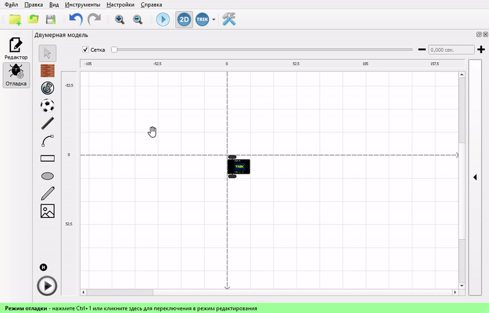

При этом эмулируется работа большинства реальных датчиков конструктора. Например, датчика касания, ультразвукового датчика расстояния, датчиков цвета и света для NXT, компас и гироскоп для EV3, инфракрасного и ультразвукового датчиков расстояния, датчика касания и датчика освещённости для ТРИК.

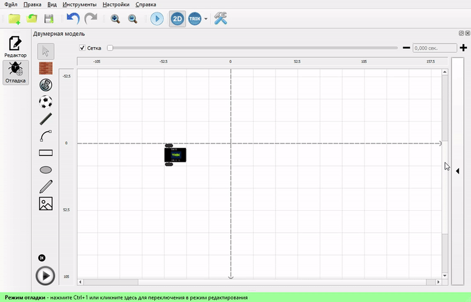

Двумерная модель может иметь устройства, недоступные на реальном роботе. Например, возможность рисовать цветные линии маркером на полу. Внешний вид и набор устройств двумерной модели зависит от выбранной платформы.

Режим двумерной модели полезен для отладки программ и в случае отсутствия реального робота.

## Работа со сценой 

| Комбинация клавиш | Описание действия               |
| ----------------- | ------------------------------- |
| Ctrl+Колесо мыши  | Увелечение / уменьшение сцены.  |
| Shift+Колесо мыши | Прокрутка сцены по горизонтали. |

Для переключения между режимами «Таскания сцены» и «Выделения» воспользуйтесь [контестным меню](./#kontekstnoe-menyu).

## Окно двумерной модели 

Для открытия окна 2D-модели необходимо нажать кнопку  на панели инструментов или в [настройках](../settings.md#robots) выбрать пункт «2D-модель».

.png>)

Элементы окна 2D-модели:

* [Панель редактирования мира](./#editor-world)
* [Сетка](./#grid)
* [Линейка](./#ruler)
* [Кнопка возврата на старт](./#return-to-start)
* [Кнопка «Старт/стоп»](./#start-stop)
* [Панель управления скоростью](./#speed-control)
* [Настройки модели](./#panel-nastroiki-modeli)
  * [Эмулятор экрана и кнопок робота](./#emulyator-ekrana)
  * [Управление портами](./#ports)
  * [Управление моторами](./#panel-upravleniya-motorami)
  * [Управление физикой робота](./#upravlenie-fizikoi-robota)
  * [Параметры модели](./#parametry-modeli)
* [Всплывающее меню робота](./#fast-settings)

## **Редактирование модели мира** 

Редактирование модели мира **** осуществляется с помощью соответствующей панели.

|                                                                                                                                                         | Название                             | Описание                                                                                                                                                                                                                                                                                                                                                                                                                                                 | Горячая клавиша |
| ------------------------------------------------------------------------------------------------------------------------------------------------------- | ------------------------------------ | -------------------------------------------------------------------------------------------------------------------------------------------------------------------------------------------------------------------------------------------------------------------------------------------------------------------------------------------------------------------------------------------------------------------------------------------------------- | :-------------: |
|  | **Курсор**                           | Переключение в режим выбора.                                                                                                                                                                                                                                                                                                                                                                                                                             |        1        |
|               | **Стена**                            | 
Добавление на сцену препятствия в виде стены.

При добавлении с нажатой клавишей <code>Shift</code> стена помещается либо под прямым углом, либо под углом в 45<strong>°</strong> относительно границ окна. Отображается стена в виде «кирпичной» линии.  При касании такой линии датчиком касания или при попадании в зону действия датчиком расстояния происходит срабатывание сенсора. Робот не может проехать сквозь стену.
 |        2        |
|                   | **Банка**                            | Добавление на сцену препятствия в виде банки                                                                                                                                                                                                                                                                                                                                                                                                             |        3        |
| 

                                                             | **Мяч**                              | Добавление на сцену препятствия в виде мяча. При касании тележки он отскакивает на некоторое расстояние.                                                                                                                                                                                                                                                                                                                                                 |        4        |
|              | **Линия**                            | 
Добавление на сцену прямой линии.

При добавлении линии с нажатой клавишей <code>Shift</code> линия помещается либо под прямым углом, либо под углом в 45<strong>°</strong> относительно границ окна.  На линию могут реагировать датчики света и цвета, расположенные на виртуальном роботе.

Можно <a href="./#editor-line">настраивать</a> цвет и толщину линии.
                                                 |        5        |
|                                       | **Кривая Безье**                     | 
Добавление на сцену линии с возможностью закругления.  На линию могут реагировать датчики света и цвета, расположенные на виртуальном роботе.  Можно <a href="./#editor-line">настраивать</a> цвет и толщину линии.
                                                                                                                                                                                                                   |        6        |
|                                    | **Прямоугольник**                    | 
Добавление на сцену прямоугольника.  Можно <a href="./#editor-line">настраивать</a> цвет и толщину линий прямоугольника, а также цвет его заливки.
                                                                                                                                                                                                                                                                                          |        7        |
|            | **Эллипс**                           | 
Добавление на сцену эллипса.  Можно <a href="./#editor-line">настраивать</a> цвет и толщину линий эллипса, а также цвет его заливки.
                                                                                                                                                                                                                                                                                                        |        8        |
|             | **Стилус**                           | 
Рисование линии мышью. 

На нарисованную линию могут реагировать датчики света и цвета, расположенные на виртуальном роботе.

Можно <a href="./#editor-line">настраивать</a> цвет и толщину линий.
                                                                                                                                                                                                                            |        9        |
|                                                                                      | ****[**Картинка**](./#add-image)**** | Добавление на сцену готового фона.                                                                                                                                                                                                                                                                                                                                                                                                                       |        0        |

### Редактор линий, стилуса и эллипса 

При выделении линии, кривой Безье, стилуса, прямоугольника или эллипса появляется всплывающее окно, позволяющее настраивать их цвет и толщину.

У инструментов эллипс и прямоугольник есть возможность закрасить внутреннюю область заданным цветом. Также можно редактировать размеры, форму и положение выделенных геометрических объектов.

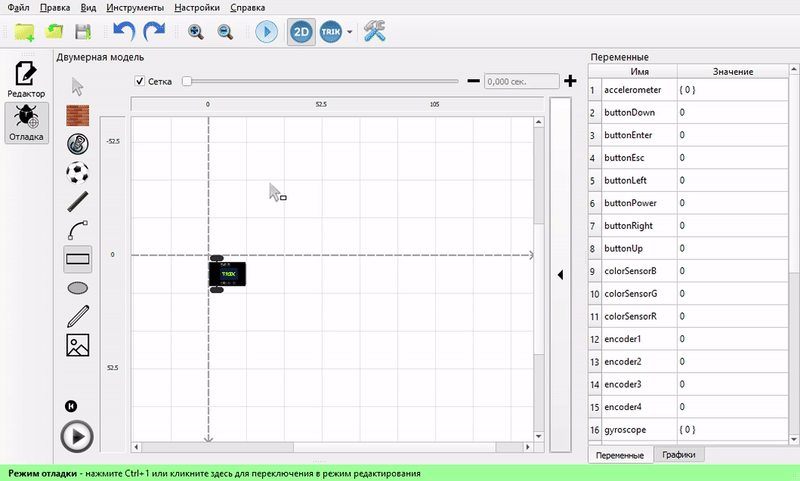

### Работа с фоном 

Помимо инструментов рисования различных геометрических объектов,  поддержана возможность загрузки нескольких готовых изображений из файла.

При включенной сетке изображения автоматически выравниваются по ней при перетаскивании.

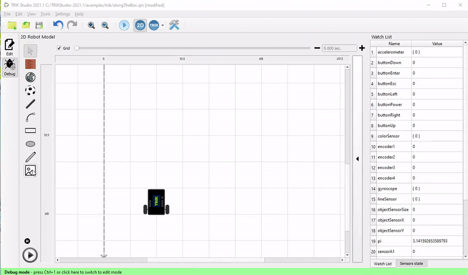

Если выделить изображение, его можно будет переместить, изменить размеры и настроить следующие параметры:&#x20;

| Свойство                                                                                    | Описание                                                                                                                                                                                                  |
| ------------------------------------------------------------------------------------------- | --------------------------------------------------------------------------------------------------------------------------------------------------------------------------------------------------------- |
|  ****  | **Картинка не будет включена в файл сохранения**. При открытии текущего проекта на другом компьютере или переименовании файла с картинкой изображение в 2D-модели пропадёт.                               |
|         | **Картинка будет запакована в проект.** Будьте внимательны, это значительно увеличит размер файла сохранения. Однако при открытии проекта на другом компьютере, изображение останется в двумерной модели. |
|              | **Изображение будет на переднем плане.** Робот видит это изображение с помощью сенсоров.                                                                                                                  |
|               | **Изображение будет на заднем плане.** Робот не видит это изображение.                                                                                                                                    |
| 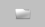                  | **Изменить картинку...** Заменить изображение на выбранное через диалоговое окно.                                                                                                                         |

## Панель настройки модели

Для открытия панели с настройками нажмите кнопку справа от [сцены](../interface/#editor-window-1):

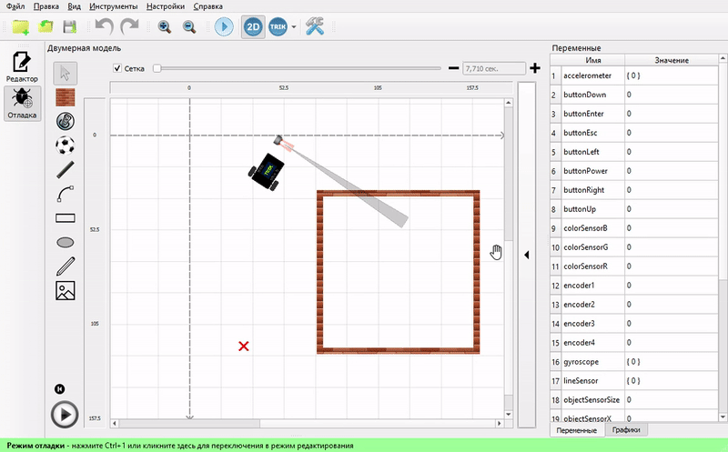

На данной панели располагаются:

* [Эмулятор экрана](./#emulyator-ekrana)
* [Панель управления портами](./#ports)
* [Панель управления моторами](./#motors)
* [Параметры управления физикой робота](./#upravlenie-fizikoi-robota)
* [Параметры модели](./#parametry-modeli)

### Эмулятор экрана

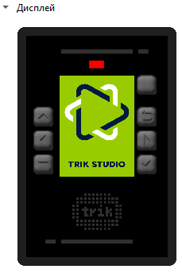

Эмулятор экрана и кнопок робота отображает вывод программы на экран робота и позволяет эмулировать нажатие на его кнопки (кликом мыши по соответствующей кнопке на роботе).

### Панель управления портами 

Панель управления портами позволяет менять конфигурацию и расположение сенсоров модели робота.

\
\
Для каждого порта можно выбрать интересующий датчик, и он автоматически добавится на сцену.

При изменении конфигурации сенсоров из настроек сенсоры в двумерной модели автоматически подстраиваются. При этом будет считаться, что сенсор соединен с роботом. То есть при движении иконки робота сенсоры будут двигаться вместе с ним, даже если они находятся на некотором расстоянии от модели робота.

Рядом с ультразвуковым или инфракрасным датчиком отображается серый конус, обозначающий область, в которой этот датчик будет регистрировать препятствия.

#### Поворот и перемещение сенсоров

Для каждого порта можно выбрать интересующий датчик, и он автоматически добавится на сцену. Добавленные сенсоры всегда закреплены на роботе, их можно перемещать и вращать.

При вращении с нажатой клавишей `Shift` сенсор поворачивается либо под прямым углом, либо под углом в 45° относительно границ окна.

### Панель управления моторами

Панель управления моторами позволяет задать, какой из портов моторов будет соответствовать левому и правому колесам.

### Управление физикой робота

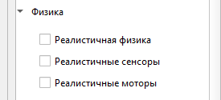

* **Реалистичная физика** точнее эмулирует силы, действующие на робота: он поворачивает при столкновении со стеной, разгоняется с ускорением и т. д.
* **Реалистичные сенсоры** — включить / выключить эмуляцию неточной работы сенсоров.
* **Реалистичные моторы** — включить / выключить эмуляцию неточной работы моторов.

### Параметры модели

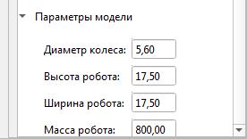

Отображение параметров модели робота:

* диаметра колеса,
* высоты робота,
* ширины робота,
* массы робота.

## Контекстное меню

Также функции двумерной модели доступны при нажатии на правую кнопку мыши на сцене.

| Пункт меню                        | Описание                                                                                                            |
| --------------------------------- | ------------------------------------------------------------------------------------------------------------------- |
| **Режим таскания сцены**          | Позволяет перемещать сцену с роботом, стенами и линиями при клике и перетаскивании на свободный участок сцены.      |
| **Режим выделения**               | Позволяет выделять группу стен, линий и других частей модели при клике и перетаскивании на свободный участок сцены. |
| **Сохранить модель мира...**      | Сохранение нарисованной сцены в виде XML-файла, который потом может быть загружен и использован в другом проекте.   |
| **Загрузить модель мира…**        | Загрузка ранее сохранённой модели мира.                                                                             |
| **Очистить всё**                  | Удаление всех стен и цветных линий. Робот при этом остаётся на сцене.                                               |
| **Очистить пол от следов робота** | Удаление всех цветных линий, нарисованных маркером робота. Остальные элементы остаются на сцене.                    |

## Сетка 

Включение отображения на сцене сетки и привязка стен к её узлам. Слайдер позволяет настроить размер сетки.

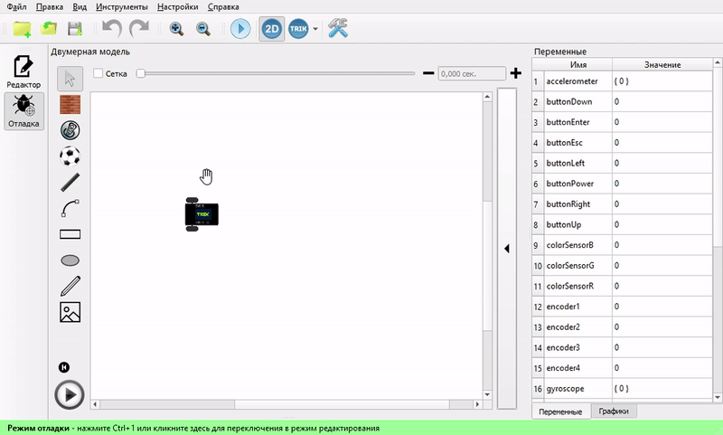

## Панель управления скоростью 

Панель управления скоростью позволяет задать скорость симуляции.

При выборе низкой скорости одной секунде модельного времени соответствует несколько секунд реального, при выборе высокой скорости — наоборот.

Здесь же отображается текущее модельное время, прошедшее с запуска программы. Оно может отличаться от реального времени (зависит от настроек скорости и возможностей компьютера).

## Линейка 

Линейка показывает расстояния на сцене, в сантиметрах (относительно размера робота).

## Кнопка возврата на старт 

Кнопка возврата на старт устанавливает робота в исходное положение, задаваемое красным крестиком на сцене.

Крестик можно вращать вокруг своей оси, выделив его и таская конец появившейся стрелки. Так задаётся начальное направление робота.

При добавлении с нажатой клавишей «Shift» стрелка крестика помещается либо под прямым углом, либо под углом в 45**°** относительно границ окна.

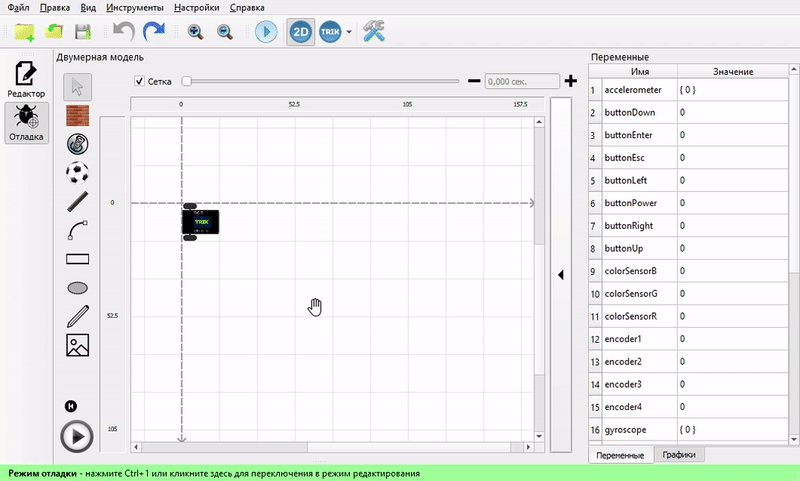

## Кнопка «Старт / стоп» 

&#x20; Запуск программы.

 Остановка программы.

## Всплывающее меню робота 

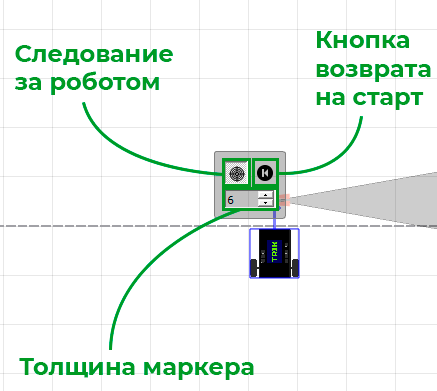

Всплывающее меню управления роботом появляется при его выделении.

| Элемент                     | Описание                                                                                                                       |
| --------------------------- | ------------------------------------------------------------------------------------------------------------------------------ |
| **Следование за роботом**   | При включённом режиме сцена автоматически перемещается, выставляя робот в центр, если он выезжает за границы видимого участка. |
| **Возврат робота**          | Возврат робота на исходную позицию, обозначаемую красным крестиком.                                                            |
| **Изменение толщины следа** | Изменение толщины следа, оставляемого роботом при рисовании маркером.                                                          |
