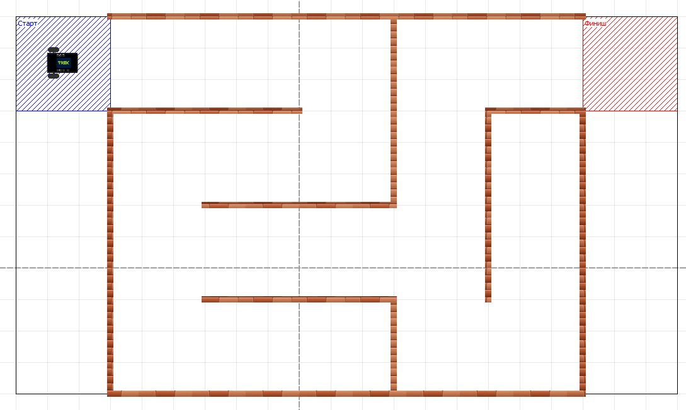
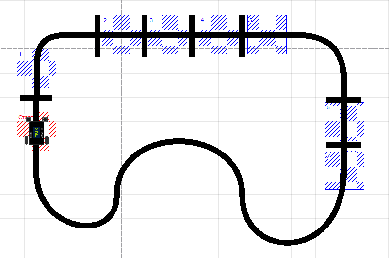

# Примеры задания ограничений

Задание ограничений — уникальная возможность TRIK Studio, предназначенная для автоматизированной проверки заданий. Этот инструмент имеет множество применений:

* самопроверка домашнего задания учениками,
* ускорение процесса проверки заданий учителем,
* проведение онлайн-соревнований с автоматической проверкой решений участников.

Язык ограничений в TRIK Studio — очень мощный инструмент, который позволяет проверить практически все аспекты выполнения программы и поведения робота, и может показаться сложным на первый взгляд. Однако не стоит расстраиваться — в данной статье мы разберем процесс создания задач с ограничениями, начиная от простых ограничений, которые покрывают большинство задач, и заканчивая сложными ограничениями, что может быть полезно для энтузиастов.

* [Ограничения на время исполнения программы и на зоны «Старт» и «Финиш»](examples.md#ogranicheniya-na-vremya-ispolneniya-programmy-i-na-zony-start-i-finish)
* [Разбор примеров](examples.md#razbor-primerov)
  * [Пример 1. Проезд из зоны «Старт» в зону «Финиш» с ограничением на зону для перемещений](examples.md#primer-1-proezd-iz-zony-start-v-zonu-finish-s-ogranicheniem-na-zonu-dlya-peremeshenii)
  * [Пример 2. Проезд из зоны «Старт» в зону «Финиш» с остановкой](examples.md#primer-2-proezd-iz-zony-start-v-zonu-finish-s-ostanovkoi)
  * [Пример 3. Проезд из зоны «Старт» в зону «Финиш» вдоль стены с проверкой датчиков](examples.md#ex3)
  * [Пример 4. Подсчет перекрестков и вывод на экран](examples.md#ex4)
  * [Пример 5. Кегельринг](examples.md#ex5)
  * [Пример 6. Проверка поведения робота](examples.md#ex4)

## Ограничения на время исполнения программы и на зоны «Старт» и «Финиш»

Для тех, кто только начинает знакомиться с языком создания ограничений в TRIK Studio, мы предлагаем начать с простых ограничений на время исполнения программы, зону «Старт» и «Финиш». Для большинства робототехнических задач этого более чем достаточно.

1\. Определите для задачи и модели мира следующие условия и параметры.

* **Оптимальное время выполнения программы.** Если программа будет выполняться больше этого времени, проверяющая система выдаст ошибку «Программа работала слишком долго».
* **Зона «Старт».**  Зона, из которой робот должен начать выполнение программы, иначе проверяющая система выдаст ошибку.
* **Зона** **«Финиш».** Зона, в которую должен приехать робот по окончании выполнения программы, иначе проверяющая система выдаст ошибку.

2\. Отредактируйте в xml-файле мира значение тега `<regions>`, добавив туда зоны «Старт» и «Финиш». Меняя значения `x`, `y`, `width` и `height` , вы можете редактировать местоположение и размер зон. Чтобы проверить положение зоны, загрузите файл в виртуальную модель мира и проверьте расположение зон. После этого, при необходимости, вы можете сделать зоны «Старт» и «Финиш» невидимыми, выставив атрибут `visible="false"`. &#x20;

```markup
<regions>
    <region type="rectangle" visible="true" color="blue" text="Старт" x="-450" y="-400" width="150" height="150" id="start_zone"/>
    <region type="rectangle" visible="true" color="green" text="Финиш" x="450" y="-400" width="150" height="150" id="finish_zone"/>
</regions>
```

3\. Скопируйте в xml-файл мира, для которого необходимы ограничения, шаблон блока `<constraints>`, приведенный ниже.

```markup
<constraints>
    <!--  Ограничение на время выполнения программы -->
     <timelimit value="300000"/>

    <!-- Ограничение, которое проверится один раз перед началом программы -->
    <constraint checkOnce="true" failMessage="Робот должен находиться в зоне старта перед запуском!">
        <inside objectId="robot1" regionId="start_zone"/>
    </constraint>
    
    <!-- Событие, которое проверяет, что робот находится в зоне финиша по окончании выполнения программы -->
    <event id="finish checker" settedUpInitially="true">
        <condition>
            <inside objectId="robot1" regionId="finish_zone"/>
        </condition>
        <trigger>
            <success/>
        </trigger>
    </event>
</constraints>
```

4\. Заполните тег `<timelimit value="300000">`. Укажите оптимальное, на ваш взгляд, время выполнения программы. Обратите внимание, что время указывается в миллисекундах, т.е. 300000 мс = 5 минут, 120000 мс = 2 минуты и т.п.

5\. Задание с ограничениями готово! Теперь вы умеете проверять стартовое и конечное положение робота, время исполнения программы.&#x20;

## Разбор примеров

Теперь давайте разберем применение данной техники для различных задач и рассмотрим варианты более детальных проверок.

### Пример 1. Проезд из зоны «Старт» в зону «Финиш» с ограничением на зону для перемещений

Задача прохождения лабиринта. Стартовав в синем квадрате, необходимо проехать до зоны финиша. Для того чтобы проверять, что пользователь действительно проходит лабиринт, а не объезжает его, задано пространственное ограничение.



Ниже приведен полный код для проверки этой задачи.

```markup
<?xml version='1.0' encoding='utf-8'?>
<root>
	<!-- Описание мира -->
	<world>
		<trace/>
		<walls>
			<wall end="450:-400" id="" begin="-300:-400"/>
			<wall end="-300:200" id="" begin="-300:-250"/>
			<wall end="450:200" id="" begin="-300:200"/>
			<wall end="450:200" id="" begin="450:-250"/>
			<wall end="150:-100" id="" begin="150:-400"/>
			<wall end="300:50" id="" begin="300:-250"/>
			<wall end="450:-250" id="" begin="300:-250"/>
			<wall end="-150:-250" id="" begin="-300:-250"/>
			<wall end="0:-250" id="" begin="-150:-250"/>
			<wall end="-150:-100" id="" begin="150:-100"/>
			<wall end="150:50" id="" begin="-150:50"/>
			<wall end="150:200" id="" begin="150:50"/>
		</walls>
		<colorFields/>
		<!-- Задание регионов (зон) на карте мира -->
		<regions>
			<region type="rectangle" visible="true" color="blue" text="Старт" x="-450" y="-400" width="150" height="150" id="start_zone"/>
			<region type="rectangle" visible="true" color="green" text="Финиш" x="450" y="-400" width="150" height="150" id="finish_zone"/>

			<region id="warzone" type="rectangle" filled="false" color="black" visible="true" x="-450" y="-400" width="1050" height="600"/>
		</regions>
	</world>
	<robots>
		<robot id="trikKitRobot" direction="0" position="-401:-351">
			<sensors>
				<sensor type="kitBase::robotModel::robotParts::Motor" direction="0" port="M4###output###JM4$$$D$$$4###" position="75:25"/>
				<sensor type="kitBase::robotModel::robotParts::Motor" direction="0" port="M3###output###JM3$$$C$$$3###" position="75:25"/>
				<sensor type="kitBase::robotModel::robotParts::Motor" direction="0" port="M2###output###JM2$$$B$$$2###" position="75:25"/>
				<sensor type="kitBase::robotModel::robotParts::Motor" direction="0" port="M1###output###JM1$$$A$$$1###" position="75:25"/>
			</sensors>
			<startPosition direction="0" x="-376" y="-326"/>
		</robot>
	</robots>
	<!-- Описание ограничений -->
	<constraints>
		<!-- Ограничение на время 5 минут -->
		<timelimit value="300000"/> 
		
		<constraint checkOnce="true" failMessage="Робот должен находиться в зоне старта перед запуском!">
			<inside objectId="robot1" regionId="start_zone"/>
		</constraint>

		<!-- Ограничение, проверяющее, что робот находится в допустимой зоне -->
		<constraint failMessage="Робот попытался объехать лабиринт!">
			<inside objectId="robot1" regionId="warzone"/>
		</constraint>

		<!-- Событие, которое проверяет, что робот находится в зоне финиша по окончании выполнения программы -->
		<event id="finish checker" settedUpInitially="true">
			<condition>
				<inside objectId="robot1" regionId="finish_zone"/>
			</condition>
			<trigger>
				<success/>
			</trigger>
		</event>
	</constraints>
</root>
```

Рассмотрим подробнее, как происходит проверка.

**1.** Зададим ограничение на время прохождения задания. Это ограничение является обязательным. Время указывается в миллисекундах.

```markup
<timelimit value="300000"/>
```

**2.** Зададим ограничение на зону, в которой должен находиться робот перед началом программы. По условию задачи это должен быть синий квадрат - зона старта. Это ограничение будет проверяться один раз, в начале программы, так как атрибут `checkOnce` равен `true`.&#x20;

С помощью тега [\<inside>](./#less-than-inside-greater-than) мы задаем пространственное ограничение. Он имеет два атрибута. В первом (objectId) указываем id объекта, местоположение которого мы хотим проверить, в нашем случае это робот. Во втором (regionId) указываем id региона, в котором должен находиться наш объект.&#x20;

В случае, если условие, которое описано в `<inside>` не выполняется, то программа будет завершена с ошибкой. Для этого у тега [\<constraint>](./#less-than-constraint-greater-than-less-than-constraint-greater-than) есть атрибут failMessage, который позволяет задать текст сообщения об ошибке.

```markup
<constraint checkOnce="true" failMessage="Робот должен находиться в зоне старта перед запуском!">
    <inside objectId="robot1" regionId="start_zone"/>
</constraint>
```

**3.** Для того, чтобы проверять, что пользователь действительно проходит лабиринт, а не объезжает его, давайте зададим еще одно пространственное ограничение.&#x20;

Отредактируем в xml-файле мира значение тега `<regions>`, добавив туда регион с `id = “warzone”`.

```markup
<region id="warzone" type="rectangle" filled="false" color="black" visible="true" x="-450" y="-400" width="1050" height="600"/>
```

Это ограничение будет проверяться во все время выполнения программы. В теге [\<inside>](./#less-than-inside-greater-than) укажем id объекта и id региона, в нашем случае это робот и черный прямоугольник, ограничивающий лабиринт.

В случае, если робот в любой момент времени окажется вне указанного региона, программа будет завершена с ошибкой, текст которой указан в атрибуте `failMessage`.

```markup
<constraint failMessage="Робот попытался объехать лабиринт!">
    <inside objectId="robot1" regionId="warzone"/>
</constraint>
```

**4.** Теперь нам осталось проверить, что робот доезжает до зоны финиша.&#x20;

Для этого давайте создадим событие, которое будет проверять находится робот в нужной зоне или нет. Атрибут `settedUpInitially="true"` означает, что событие будет запущено (взведено) сразу при старте программы.

В теге [\<condition>](./#less-than-conditions-greater-than-less-than-conditions-greater-than) мы указываем какое именно условие необходимо проверить. В нашем случае условие аналогично описанным выше - мы проверяем, что робот находится в регионе с `id = "finish"`. В случае, если это условие выполнится, то пользователю будет показано сообщение об успешном выполнении программы. Для этого в теге [\<trigger>](./#less-than-trigger-greater-than-less-than-trigger-greater-than) мы пишем дочерний тег [\<success/>](./#less-than-success-greater-than).

```markup
<event id="finish checker" settedUpInitially="true">
    <!-- Условие -->
    <condition>
        <inside objectId="robot1" regionId="finish_zone"/>
    </condition>
    <!-- Триггер -->
    <trigger>
        <success/>
    </trigger>
</event>
```

### Пример 2. Проезд из зоны «Старт» в зону «Финиш» с остановкой

Задача проехать вперед и остановиться в зоне финиша.

Эта задача немного отличается от Примера 1 тем,  что добавляется еще одно условие  для успешного завершения программы - роботу необходимо не просто оказаться в зоне финиша, но и остановиться.


Ниже приведен полный код для проверки этой задачи.

```markup
<?xml version='1.0' encoding='utf-8'?>
<root version="20190819">
    <world>
    <!-- Задание регионов (зон) на карте мира -->
		<regions>
            <region id="finish_zone" text="Finish" textX="0" width="200" height="150" color="green" x="320" y="-50" visible="true" type="rectangle" filled="true" textY="0"/>
            <region id="start_zone" text="Start" textX="0" width="100" height="-100" color="#0000ff" x="-20" y="70" visible="true" type="rectangle" filled="true" textY="0"/>
			
						<region type="rectangle" id="warzone" text="Поле, которое нельзя покидать" x="-20" y="-140" width="610" height="320" color="orange" visible="true"/>
		</regions>
    </world>
    <robots>
        <robot id="trikKitRobot" direction="0" position="0:0">
            <sensors>
                <sensor port="M3###output###М3###" direction="0" position="75:25" type="kitBase::robotModel::robotParts::Motor"/>
                <sensor port="M4###output###М4###" direction="0" position="75:25" type="kitBase::robotModel::robotParts::Motor"/>
                <sensor port="M1###output###М1###" direction="0" position="75:25" type="kitBase::robotModel::robotParts::Motor"/>
                <sensor port="M2###output###М2###" direction="0" position="75:25" type="kitBase::robotModel::robotParts::Motor"/>
            </sensors>
            <startPosition id="{888338bf-3f53-44a4-ac0a-8aeea2d036b2}" y="25" direction="0" x="25"/>
            <wheels left="M3###output###М3###" right="M4###output###М4###"/>
        </robot>
    </robots>
    <settings realisticMotors="false" realisticSensors="false" realisticPhysics="false"/>
    <!-- Задание ограничений -->
    <constraints>
        <!-- Ограничение на время -->
        <timelimit value="10000"/>
    
        <!-- Зональное ограничение на начало езды. Проверяется один раз в начале программы-->
        <constraint checkOnce="true" failMessage="Робот должен находиться в синем квадрате перед запуском!">
            <inside objectId="robot1" regionId="start_zone"/>
        </constraint>
	    
	    	<!-- Робот находится в допустимой зоне-->
	    	<constraint failMessage="Робот покинул допустимую зону!">
	    		<inside objectId="robot1" regionId="warzone"/>
	    	</constraint>
    
        <!-- Событие, оповещающее об успешном выполнении программы (зона финиша + робот остановился) -->
        <event id="finish checker" settedUpInitially="true">
            <conditions glue="and">
                <inside regionId="finish" objectId="robot1"/>
                <equals>
                    <objectState object="robot1.M3.power"/>
                    <int value="0"/>
                </equals>
                <equals>
                    <objectState object="robot1.M4.power"/>
                    <int value="0"/>
                </equals>
            </conditions>
            
            <trigger>
                <success/>
            </trigger>
        </event>
    </constraints>
</root>
```

Теперь давайте рассмотрим подробнее как происходит проверка.

**1.** Зададим ограничение на время прохождения задания.

```markup
<timelimit value="10000"/>
```

**2.** Зададим ограничение на начальное положение робота. Оно проверится один раз в начале программы.

```markup
<constraint checkOnce="true" failMessage="Робот должен находиться в синем квадрате перед запуском!">
    <inside objectId="robot1" regionId="start_zone"/>
</constraint>
```

**3.** Зададим ограничение на зону, которую робот не может покидать.

```markup
<constraint failMessage="Робот покинул допустимую зону!">
    <inside objectId="robot1" regionId="warzone"/>
</constraint>
```

**4.** А теперь создадим событие, которое будет проверять, что робот находится в финишной зоне и при этом он остановился в ней, а не проехал дальше.

Зональное ограничение задается с помощью тега [\<inside>](./#less-than-inside-greater-than). Для того, чтобы проверить, что робот остановился, нужно проверить, что мощность на обоих моторах равна нулю. Для этого используем тег [\<equals>](./#less-than-equals-greater-than-less-than-equals-greater-than). С помощью тега [\<objectState>](./#less-than-objectstate-greater-than) укажем объект, значение которого мы хотим сравнить. В нашем случае это мощность на моторах, поэтому в атрибуте `object` пишем `robot1.M3.power` или `robot1.M4.power,` где `M3` и `M4` обозначают порты, к которым в текущей конфигурации подключены моторы. А значение, с которым нужно сравниться, записываем с помощью тега [\<int> ](./#less-than-int-greater-than)и его атрибута `value`.

Таким образом, в этом событии проверяется три условия: робот находится в зоне финиша, мощность на моторе M3 равна нулю и мощность на моторе M4 также равна нулю. В случае выполнения этих условий пользователю будет показано сообщение об успешном выполнении программы.

```markup
<event id="finish checker" settedUpInitially="true">
    <!-- Составное условие -->
    <conditions glue="and">
        <inside regionId="finish" objectId="robot1"/>
        
        <equals>
            <objectState object="robot1.M3.power"/>
            <int value="0"/>
        </equals>
        
        <equals>
            <objectState object="robot1.M4.power"/>
            <int value="0"/>
        </equals>
    </conditions>
    
    <trigger>
        <success/>
    </trigger>
</event>
```

### Пример 3. Проезд из зоны «Старт» в зону «Финиш» вдоль стены с проверкой датчиков <a href="#ex3" id="ex3"></a>

Стартовав в синем квадрате, необходимо проехать вдоль стены с помощью датчика расстояния ИК до красного квадрата.


Ниже приведен полный код для проверки этого задания.

```markup
<?xml version='1.0' encoding='utf-8'?>
<root version="20190819">
    <world>
        <walls>
            <wall stroke-width="10" end="-110:50" stroke="#ff000000" begin="-200:50" stroke-style="none" fill="#ff000000" id="{f148f786-7d73-4c42-a3aa-c7a29892d3d7}"/>
            <wall stroke-width="10" end="0:100" stroke="#ff000000" begin="-110:50" stroke-style="none" fill="#ff000000" id="{8f39faac-9392-4878-86e9-9fe5dbea0007}"/>
            <wall stroke-width="10" end="250:110" stroke="#ff000000" begin="0:100" stroke-style="none" fill="#ff000000" id="{bf465864-fa2e-4b59-ac65-e27bd85300d5}"/>
            <wall stroke-width="10" end="350:160" stroke="#ff000000" begin="250:110" stroke-style="none" fill="#ff000000" id="{ba5441dd-8dd8-4100-ad8b-66d634792e3f}"/>
            <wall stroke-width="10" end="400:260" stroke="#ff000000" begin="350:160" stroke-style="none" fill="#ff000000" id="{ca85b1de-8e9c-49e9-8c40-c2c49f43dcaa}"/>
        </walls>
        <skittles/>
        <balls/>
        <colorFields/>
        <images/>
        <regions>
            <region visible="true" type="rectangle" x="350" filled="true" y="50" width="150" height="200" id="good_zone3" color="#ffff00"/>
            <region visible="true" type="rectangle" x="-250" filled="true" y="-50" width="150" textY="0" height="100" text="Start" id="start_zone" textX="0" color="#0000ff"/>
            <region visible="true" type="rectangle" x="0" filled="true" y="0" width="400" height="150" id="good_zone2" color="#ffff00"/>
            <region visible="true" type="rectangle" x="400" filled="true" y="150" width="100" textY="0" height="100" text="Finish" id="finish" textX="0" color="#ff0000"/>
            <region visible="true" type="rectangle" x="-200" filled="true" y="-50" width="250" height="150" id="good_zone1" color="#ffff00"/>
        </regions>
    </world>
    <robots>
        <robot direction="0" position="-200:-25" id="trikKitRobot">
            <sensors>
                <sensor type="trik::robotModel::parts::TrikInfraredSensor" direction="69.6769" position="42:18" port="A1###input###А1###sensorA1"/>
                <sensor type="kitBase::robotModel::robotParts::Motor" direction="0" position="75:25" port="M4###output###М4###"/>
                <sensor type="kitBase::robotModel::robotParts::Motor" direction="0" position="75:25" port="M3###output###М3###"/>
                <sensor type="" direction="0" position="0:0" port="A5###input###А5###sensorA5"/>
                <sensor type="" direction="0" position="0:0" port="A6###input###А6###sensorA6"/>
            </sensors>
            <startPosition direction="0" x="-175" y="0" id="{84223544-d500-411a-9fdb-b382eb98d09f}"/>
            <wheels right="M3###output###М3###" left="M4###output###М4###"/>
        </robot>
    </robots>
    <settings realisticPhysics="false" realisticSensors="false" realisticMotors="false"/>
    <constraints>
        <!-- Лимит времени. Обязательное ограничение -->
        <timelimit value="40000"/>
        <!-- Проверка, что на порт А1 установлен датчик расстояния -->
        <constraint checkOnce="true" failMessage="У робота должен быть установлен датчик расстояния на порт А1">
            <equals>
                <typeOf objectId="robot1.A1"/>
                <string value="twoDModel::robotModel::parts::RangeSensor"/>
            </equals>
        </constraint>
        <!-- Провека, что нет датчиков, кроме датчика расстояния-->
        <constraint checkOnce="true" failMessage="У робота не должно быть датчиков, кроме датчика расстояния">
            <conditions glue="and">
                <equals>
                    <typeOf objectId="robot1.A2"/>
                    <string value="undefined"/>
                </equals>
                <equals>
                    <typeOf objectId="robot1.A3"/>
                    <string value="undefined"/>
                </equals>
                <equals>
                    <typeOf objectId="robot1.A4"/>
                    <string value="undefined"/>
                </equals>
                <equals>
                    <typeOf objectId="robot1.A5"/>
                    <string value="undefined"/>
                </equals>
                <equals>
                    <typeOf objectId="robot1.A6"/>
                    <string value="undefined"/>
                </equals>
                <equals>
                    <typeOf objectId="robot1.D1"/>
                    <string value="undefined"/>
                </equals>
                <equals>
                    <typeOf objectId="robot1.D2"/>
                    <string value="undefined"/>
                </equals>
                <equals>
                    <typeOf objectId="robot1.F1"/>
                    <string value="undefined"/>
                </equals>
            </conditions>
        </constraint>

        <!-- Зональное ограничение на начало езды. Проверяется один раз в начале программы-->
        <constraint checkOnce="true" failMessage="Робот должен находиться в синей зоне перед стартом!">
            <inside objectId="robot1" regionId="start_zone"/>
        </constraint>
        <!-- Проверяет, что робот находится в допустимом регионе на протяжении всего времени выполнения программы -->
        <constraint failMessage="Робот покинул допустимую зону!">
            <conditions glue="or">
                <inside objectId="robot1" regionId="good_zone1"/>
                <inside objectId="robot1" regionId="good_zone2"/>
                <inside objectId="robot1" regionId="good_zone3"/>
            </conditions>
        </constraint>
        <!-- Событие, оповещающее об успешном выполнении программы -->
        <event id="finish checker" settedUpInitially="true">
            <condition>
                <inside objectId="robot1" regionId="finish"/>
            </condition>
            <trigger>
                <success/>
            </trigger>
        </event>
    </constraints>
</root>

```

Теперь давайте рассмотрим подробнее как происходит проверка.

**1.** Зададим ограничение на время выполнения задания.

```markup
<timelimit value="40000"/>
```

**2.** По условию задачи у робота должен быть подключен только датчик расстояния (других датчиков быть не должно). Для того чтобы убедиться в этом, сравним значение объекта на порту `A1` со значением, которое обозначает датчик расстояния. Подробнее о названиях датчиков для разных конструкторов можно узнать по [ссылке](./#nazvaniya-datchikov).

```markup
<constraint checkOnce="true" failMessage="У робота должен быть установлен датчик расстояния на порт А1">
    <equals>
        <typeOf objectId="robot1.A1"/>
        <string value="twoDModel::robotModel::parts::RangeSensor"/>
    </equals>
</constraint>
```

**3**. Выполним проверку, что к другим портам не подключены никакие датчики. Для этого сравним значение на каждом порту со строкой `“undefined”`.

```markup
<constraint checkOnce="true" failMessage="У робота не должно быть датчиков, кроме датчика расстояния">
    <conditions glue="and">
        <equals>
            <typeOf objectId="robot1.A2"/>
            <string value="undefined"/>
        </equals>
        <equals>
            <typeOf objectId="robot1.A3"/>
            <string value="undefined"/>
        </equals>
        <equals>
            <typeOf objectId="robot1.A4"/>
            <string value="undefined"/>
        </equals>
        <equals>
            <typeOf objectId="robot1.A5"/>
            <string value="undefined"/>
        </equals>
        <equals>
            <typeOf objectId="robot1.A6"/>
            <string value="undefined"/>
        </equals>
        <equals>
            <typeOf objectId="robot1.D1"/>
            <string value="undefined"/>
        </equals>
        <equals>
            <typeOf objectId="robot1.D2"/>
            <string value="undefined"/>
        </equals>
        <equals>
            <typeOf objectId="robot1.F1"/>
            <string value="undefined"/>
        </equals>
    </conditions>
</constraint>
```

**4**. Зададим ограничение на начальное положение робота. Оно проверится один раз в начале программы, потому что выставлен флаг `checkOnce` .

```markup
<constraint checkOnce="true" failMessage="Робот должен находиться в синем квадрате перед запуском!">
    <inside objectId="robot1" regionId="start_zone"/>
</constraint>
```

**5.** Зададим ограничение на зону, которую робот не может покидать. В предыдущих примерах мы рассматривали ситуацию, когда роботу нужно было находиться в одной зоне. В данном случае допустимая зона состоит из нескольких прямоугольников, поэтому нам нужно проверять, что робот находится в одной из этих зон. Для этого используем тег `<conditions></conditions>` с атрибутом `glue = “or”`.

```markup
<constraint failMessage="Робот покинул допустимую зону!">
    <conditions glue="or">
        <inside objectId="robot1" regionId="good_zone1"/>
        <inside objectId="robot1" regionId="good_zone2"/>
        <inside objectId="robot1" regionId="good_zone3"/>
    </conditions>
</constraint>
```

**6.** И наконец, создадим событие, которое будет оповещать об успешном выполнении программы в случае, если робот находится в зоне финиша.

```markup
<event id="finish checker" settedUpInitially="true">
    <condition>
        <inside objectId="robot1" regionId="finish"/>
    </condition>
    <trigger>
        <success/>
    </trigger>
</event>
```

### Пример 4. Подсчет перекрестков и вывод на экран <a href="#ex4" id="ex4"></a>

Движение по линии с подсчетом перекрестков: при заезде на перекресток робот должен выводить на экран номер этого перекрестка.



Ниже приведен полный код для проверки этого задания.

```markup
<?xml version='1.0' encoding='utf-8'?>
<root version="20190819">
    <world>
        <walls/>
        <skittles/>
        <balls/>
        <colorFields>
            <cubicBezier id="{6199f811-617a-463d-848f-39b28b918584}" stroke-style="solid" fill-style="none" stroke="#ff000000" begin="-174.411:98.5051" cp1="-173.503:9.71619" stroke-width="12" cp2="-184.608:-31.2306" fill="#ff000000" end="-103.03:-28.2828"/>
            <line id="{311aba08-eff0-4d50-98f1-fc7595e22b79}" stroke-style="solid" fill-style="none" stroke="#ff000000" begin="-97.2997:-28.5387" stroke-width="12" fill="#ff000000" end="353.7:-28.5387"/>
            <line id="{e4428c3f-4ef1-4214-b5be-9a22eb4f875e}" stroke-style="solid" fill-style="none" stroke="#ff000000" begin="-175.556:244" stroke-width="12" fill="#ff000000" end="-175.556:106.222"/>
            <line id="{c921474d-3f18-4f98-b3fd-c83fa6e712b8}" stroke-style="solid" fill-style="none" stroke="#ff000000" begin="-202.02:102.353" stroke-width="12" fill="#ff000000" end="-149.459:102.353"/>
            <line id="{5f4000d6-8494-45bb-8e0c-44a5779f3140}" stroke-style="solid" fill-style="none" stroke="#ff000000" begin="-49.8316:-64.6465" stroke-width="12" fill="#ff000000" end="-49.8316:11.4478"/>
            <line id="{c20e8d67-e66b-4cd1-a4d5-da909d32717a}" stroke-style="solid" fill-style="none" stroke="#ff000000" begin="48.2829:-65.5219" stroke-width="12" fill="#ff000000" end="48.2829:10.5724"/>
            <line id="{3abe2138-f488-429d-bb27-94b6a13c913e}" stroke-style="solid" fill-style="none" stroke="#ff000000" begin="146.599:-64.8485" stroke-width="12" fill="#ff000000" end="146.599:11.2458"/>
            <line id="{ccaf1f51-b4b8-4ed4-9110-cf08067e7bf4}" stroke-style="solid" fill-style="none" stroke="#ff000000" begin="249.63:-65.5219" stroke-width="12" fill="#ff000000" end="249.63:10.5724"/>
            <line id="{6866e178-6a20-4048-8eab-ed3554098cd4}" stroke-style="solid" fill-style="none" stroke="#ff000000" begin="460.157:66.3198" stroke-width="12" fill="#ff000000" end="460.157:260.178"/>
            <cubicBezier id="{47001b3d-8af4-432d-8e66-9cc7728f2a39}" stroke-style="solid" fill-style="none" stroke="#ff000000" begin="358.194:-28.399" cp1="438.051:-29.9289" stroke-width="12" cp2="457.133:13.7415" fill="#ff000000" end="459.881:62.7527"/>
            <cubicBezier id="{edb3034d-f57c-4349-a714-3439433d2db2}" stroke-style="solid" fill-style="none" stroke="#ff000000" begin="458.622:252.499" cp1="457.591:441.101" stroke-width="12" cp2="251.469:440.071" fill="#ff000000" end="249.408:304.03"/>
            <cubicBezier id="{ff2677c7-98f1-46e0-b17c-197a3d94e664}" stroke-style="solid" fill-style="none" stroke="#ff000000" begin="249.408:304.03" cp1="251.469:155.622" stroke-width="12" cp2="-10.3061:151.5" fill="#ff000000" end="-9.27549:302.999"/>
            <cubicBezier id="{c841736a-ce7b-4bc4-90bb-7bb72bb7dd99}" stroke-style="solid" fill-style="none" stroke="#ff000000" begin="-9.27549:302.999" cp1="-9.02218:404.61" stroke-width="12" cp2="-177.667:378.931" fill="#ff000000" end="-175.204:250.438"/>
            <line id="{34475443-f1cf-4718-bb44-bd4bfc7221bf}" stroke-style="solid" fill-style="none" stroke="#ff000000" begin="428.351:105.655" stroke-width="12" fill="#ff000000" end="489.769:105.655"/>
            <line id="{9e883af6-6280-4577-b0da-608011ca26ed}" stroke-style="solid" fill-style="none" stroke="#ff000000" begin="428.197:199.401" stroke-width="12" fill="#ff000000" end="489.615:199.401"/>
        </colorFields>
        <images/>
        <regions>
            <region id="region_1" type="rectangle" textX="0" width="80" textY="0" visible="true" y="0" text="1" filled="true" height="80" color="#0000ff" x="-215"/>
            <region id="region_2" type="rectangle" textX="0" width="80" textY="0" visible="true" y="-70" text="2" filled="true" height="80" color="#0000ff" x="-40"/>
            <region id="region_3" type="rectangle" textX="0" width="80" textY="0" visible="true" y="-70" text="3" filled="true" height="80" color="#0000ff" x="55"/>
            <region id="region_4" type="rectangle" textX="0" width="80" textY="0" visible="true" y="-70" text="4" filled="true" height="80" color="#0000ff" x="160"/>
            <region id="region_5" type="rectangle" textX="0" width="80" textY="0" visible="true" y="-70" text="5" filled="true" height="80" color="#0000ff" x="260"/>
            <region id="region_6" type="rectangle" textX="0" width="80" textY="0" visible="true" y="110" text="6" filled="true" height="80" color="#0000ff" x="420"/>
            <region id="region_7" type="rectangle" textX="0" width="80" textY="0" visible="true" y="210" text="7" filled="true" height="80" color="#0000ff" x="420"/>
            <region id="start_zone" type="rectangle" textX="0" width="80" textY="0" visible="true" y="130" text="Старт" filled="true" height="80" color="#ff0000" x="-215"/>
        </regions>
    </world>
    <robots>
        <robot id="trikKitRobot" position="-199.667:149.444" direction="-90">
            <sensors>
                <sensor type="kitBase::robotModel::robotParts::Motor" port="M3###output###М3###" position="75:25" direction="0"/>
                <sensor type="" port="A1###input###JA1###sensorA1" position="0:0" direction="0"/>
                <sensor type="" port="A2###input###JA2###sensorA2" position="0:0" direction="0"/>
                <sensor type="" port="LineSensorPort###input###TrikLineSensorPort###lineSensor" position="0:0" direction="0"/>
                <sensor type="kitBase::robotModel::robotParts::EncoderSensor" port="E3###input###M3$$$Е3###encoder3" position="75:25" direction="0"/>
                <sensor type="kitBase::robotModel::robotParts::EncoderSensor" port="E4###input###M4$$$Е4###encoder4" position="75:25" direction="0"/>
                <sensor type="trik::robotModel::parts::TrikLightSensor" port="A5###input###А5###sensorA5" position="54:42" direction="0"/>
                <sensor type="trik::robotModel::parts::TrikLightSensor" port="A6###input###А6###sensorA6" position="54:8" direction="0"/>
                <sensor type="kitBase::robotModel::robotParts::Motor" port="M4###output###М4###" position="75:25" direction="0"/>
            </sensors>
            <startPosition id="{9f3c8967-8967-4a0d-a118-ba8041db8a37}" y="174.444" direction="-90" x="-174.667"/>
            <wheels left="M3###output###М3###" right="M4###output###М4###"/>
        </robot>
    </robots>
    <settings realisticMotors="false" realisticSensors="false" realisticPhysics="true"/>
    <constraints>
        <timelimit value="50000"/>
        <constraint failMessage="Робот должен находиться в зоне старта перед запуском!" checkOnce="true">
            <inside regionId="start_zone" objectId="robot1"/>
        </constraint>
        <event id="id_1" settedUpInitially="true">
            <conditions glue="and">
                <inside regionId="region_1" objectId="robot1"/>
                <equals>
                    <objectState object="robot1.display.labels.last.text"/>
                    <string value="1"/>
                </equals>
            </conditions>
            <trigger>
                <setUp id="id_2"/>
            </trigger>
        </event>
        <event id="id_1_fail" settedUpInitially="true">
            <conditions glue="and">
                <inside regionId="region_1" objectId="robot1"/>
                <notEqual>
                    <objectState object="robot1.display.labels.last.text"/>
                    <string value="1"/>
                </notEqual>
            </conditions>
            <trigger>
                <fail message="Неверный номер перекрестка! Обратите внимание, что номер перекрестка должен выводиться последней строчкой"/>
            </trigger>
        </event>
        <event id="id_2" settedUpInitially="false">
            <conditions glue="and">
                <inside regionId="region_2" objectId="robot1"/>
                <equals>
                    <objectState object="robot1.display.labels.last.text"/>
                    <string value="2"/>
                </equals>
            </conditions>
            <trigger>
                <setUp id="id_3"/>
            </trigger>
        </event>
        <event id="id_3" settedUpInitially="false">
            <conditions glue="and">
                <inside regionId="region_3" objectId="robot1"/>
                <equals>
                    <objectState object="robot1.display.labels.last.text"/>
                    <string value="3"/>
                </equals>
            </conditions>
            <trigger>
                <setUp id="id_4"/>
            </trigger>
        </event>
        <event id="id_4" settedUpInitially="false">
            <conditions glue="and">
                <inside regionId="region_4" objectId="robot1"/>
                <equals>
                    <objectState object="robot1.display.labels.last.text"/>
                    <string value="4"/>
                </equals>
            </conditions>
            <trigger>
                <setUp id="id_5"/>
            </trigger>
        </event>
        <event id="id_5" settedUpInitially="false">
            <conditions glue="and">
                <inside regionId="region_5" objectId="robot1"/>
                <equals>
                    <objectState object="robot1.display.labels.last.text"/>
                    <string value="5"/>
                </equals>
            </conditions>
            <trigger>
                <setUp id="id_6"/>
            </trigger>
        </event>
        <event id="id_6" settedUpInitially="false">
            <conditions glue="and">
                <inside regionId="region_6" objectId="robot1"/>
                <equals>
                    <objectState object="robot1.display.labels.last.text"/>
                    <string value="6"/>
                </equals>
            </conditions>
            <trigger>
                <setUp id="id_7"/>
            </trigger>
        </event>
        <event id="id_7" settedUpInitially="false">
            <conditions glue="and">
                <inside regionId="region_7" objectId="robot1"/>
                <equals>
                    <objectState object="robot1.display.labels.last.text"/>
                    <string value="7"/>
                </equals>
            </conditions>
            <trigger>
                <success/>
            </trigger>
        </event>
    </constraints>
</root>

```

Давайте рассмотрим то, как происходит проверка.

**1.** После каждого перекрестка зададим зоны, в которых будет проверяться, что на экран выведен правильный номер перекрестка. Для этого в xml-файле мира отредактируйте значение тега [\<regions>](../settings.md#less-than-region-greater-than), добавив туда необходимое количество зон для проверки.  Меняя значения `x`, `y`, `width` и `height` , вы можете редактировать местоположение и размер зон. Чтобы проверить положение зоны, загрузите файл в виртуальную модель мира и проверьте расположение зон. После этого, при необходимости, вы можете сделать зоны невидимыми, выставив атрибут `visible="false"`.&#x20;

```markup
<!-- Пример зоны -->
<region id="region_1" type="rectangle" textX="0" width="80" textY="0" visible="true" y="0" text="1" filled="true" height="80" color="#0000ff" x="-215"/>
```

**2.** После этого в блоке [\<constraints>](./#less-than-constraints-greater-than-less-than-constraints-greater-than) зададим проверку ограничений.  Первым укажем ограничение на время выполнения задания.

```markup
<timelimit value="50000"/>
```

**3.** Зададим ограничение на начальное положение робота.

```markup
<constraint failMessage="Робот должен находиться в зоне старта перед запуском!" checkOnce="true">
    <inside regionId="start_zone" objectId="robot1"/>
</constraint>
```

**4.** В каждой зоне, которая находится после перекрестка, будем проверять, что на экран выведен правильный номер. Для этого в теге [\<inside>](./#inside) укажем `id` нужного региона и проверим, что последнее выведенное сообщение на экран контроллера (`robot1.display.labels.last.text`) равно номеру пройденного перекрестка. После этого по цепочке будем вызывать аналогичные события для остальных зон.

```markup
<event id="id_1" settedUpInitially="true">
    <conditions glue="and">
        <inside regionId="region_1" objectId="robot1"/>
        <equals>
            <objectState object="robot1.display.labels.last.text"/>
            <string value="1"/>
        </equals>
    </conditions>
    <trigger>
        <setUp id="id_2"/>
    </trigger>
</event>
```

**5.** Будем выводить сообщение об ошибке в случае, если на экран выведен неправильный номер. Для этого сравним сообщение, которое было выведено на экран, с ожидаемым правильным значением. В случае, если сообщения не совпадают, пользователю будет выведено заданное сообщение об ошибке и программа прекратит выполнение.

```markup
<event id="id_1_fail" settedUpInitially="true">
    <conditions glue="and">
        <inside regionId="region_1" objectId="robot1"/>
        <notEqual>
            <objectState object="robot1.display.labels.last.text"/>
            <string value="1"/>
        </notEqual>
    </conditions>
    <trigger>
        <fail message="Неверный номер перекрестка! Обратите внимание, что номер перекрестка должен выводиться последней строчкой"/>
    </trigger>
</event>
```

**6.** Зададим событие, которое будет выводить сообщение об успешном выполнении программы, если правильно пройдены все заданные перекрестки.

```markup
<event id="id_7" settedUpInitially="false">
    <conditions glue="and">
        <inside regionId="region_7" objectId="robot1"/>
        <equals>
            <objectState object="robot1.display.labels.last.text"/>
            <string value="7"/>
        </equals>
    </conditions>
    <trigger>
        <success/>
    </trigger>
</event>
```

### Пример 5. Кегельринг <a href="#ex5" id="ex5"></a>

Робот должен должен вытолкнуть все кегли за пределы круга.


Ниже приведен полный код для проверки этого задания.

```markup
<?xml version='1.0' encoding='utf-8'?>
<root version="20190819">
    <world>
        <walls/>
        <skittles>
            <skittle markerY="0.107756" y="0.107756" rotation="0" startRotation="0" id="{skittle1}" x="-90.3433" markerX="-90.3433"/>
            <skittle markerY="62.9765" y="62.9765" rotation="0" startRotation="0" id="{skittle2}" x="-63.8519" markerX="-63.8519"/>
            <skittle markerY="62.963" y="62.963" rotation="0" startRotation="0" id="{skittle3}" x="62.3031" markerX="62.3031"/>
            <skittle markerY="-89.2259" y="-89.2259" rotation="0" startRotation="0" id="{skittle4}" x="-0.323222" markerX="-0.323222"/>
            <skittle markerY="89.0101" y="89.0101" rotation="0" startRotation="0" id="{skittle5}" x="-1.45453" markerX="-1.45453"/>
            <skittle markerY="-1.44107" y="-1.44107" rotation="0" startRotation="0" id="{skittle6}" x="88.1212" markerX="88.1212"/>
            <skittle markerY="-63.1785" y="-63.1785" rotation="0" startRotation="0" id="{skittle7}" x="62.3031" markerX="62.3031"/>
            <skittle markerY="-64.7408" y="-64.7408" rotation="0" startRotation="0" id="{skittle8}" x="-63.8519" markerX="-63.8519"/>
        </skittles>
        <balls/>
        <colorFields/>
        <images>
            <image imageId="{ed8c2ee9-a500-4993-b874-611ba6b78853}" id="{d91a151a-4519-4646-89fd-395c863b5e77}" isBackground="false" rect="0:0:-6:-6" position="0:0"/>
            <image imageId="{9275be02-a681-4b9f-981e-56bcb9f17cee}" id="{8f470550-4bb5-4b34-b46e-c349d686bd9a}" isBackground="false" rect="0:0:-6:-6" position="0:0"/>
            <image imageId="{229679a6-12a5-44d0-97d9-99f132ded1e2}" id="{5dcb114e-03d4-493b-9849-daf4cd364a2a}" isBackground="false" rect="0:0:-6:-6" position="0:0"/>
            <image imageId="{27036474-ec49-423d-9f20-141d0c7d1044}" id="{ebb8366d-61c7-422f-9460-865851d1e0f1}" isBackground="false" rect="0:0:-6:-6" position="0:0"/>
            <image imageId="{69f0b63a-2937-4b12-bad7-2e240210db2e}" id="{f7bd0d83-ae88-46c8-bd9e-95fd3c32c174}" isBackground="false" rect="0:0:-6:-6" position="0:0"/>
            <image imageId="{80069e12-f4e6-4d56-8487-d8d4dd9e5ce2}" id="{1345cda3-f2e1-49b9-ae6b-35b4aa2eb850}" isBackground="false" rect="0:0:-6:-6" position="0:0"/>
            <image imageId="{7904d24c-5993-4013-80b5-bc899c0daabf}" id="{116c53b9-aa2c-4a16-bf8c-d291629c416f}" isBackground="false" rect="0:0:-4:-4" position="0:0"/>
            <image imageId="{742a7dc4-05a6-47c2-87fc-d04f1b3f0be4}" id="{9ee0c06d-b9c0-4da8-8227-98ffdc24f0be}" isBackground="false" rect="-200:-201:399:401" position="0:0"/>
        </images>
        <regions>
            <region type="ellipse" filled="true" textY="0" y="-150" visible="true" width="300" text="Ring" id="warzone" x="-150" height="300" textX="0" color="#ff0000"/>
        </regions>
    </world>
    <robots>
        <robot direction="0" id="trikKitRobot" position="-25:-24.4321">
            <sensors>
                <sensor type="kitBase::robotModel::robotParts::EncoderSensor" direction="0" port="E1###input###M1$$$Е1###encoder1" position="75:25"/>
                <sensor type="trik::robotModel::parts::TrikLightSensor" direction="0" port="A5###input###А5###sensorA5" position="50:25"/>
                <sensor type="kitBase::robotModel::robotParts::EncoderSensor" direction="0" port="E2###input###M2$$$Е2###encoder2" position="75:25"/>
                <sensor type="trik::robotModel::parts::TrikLightSensor" direction="0" port="A3###input###А3###sensorA3" position="56:43"/>
                <sensor type="kitBase::robotModel::robotParts::Motor" direction="0" port="M2###output###М2###" position="75:25"/>
                <sensor type="trik::robotModel::parts::TrikInfraredSensor" direction="0" port="A1###input###А1###sensorA1" position="22:25"/>
                <sensor type="kitBase::robotModel::robotParts::Motor" direction="0" port="M1###output###М1###" position="75:25"/>
                <sensor type="kitBase::robotModel::robotParts::Motor" direction="0" port="M4###output###М4###" position="75:25"/>
                <sensor type="trik::robotModel::parts::TrikLightSensor" direction="0" port="A2###input###А2###sensorA2" position="56:5"/>
                <sensor type="kitBase::robotModel::robotParts::Motor" direction="0" port="M3###output###М3###" position="75:25"/>
                <sensor type="kitBase::robotModel::robotParts::EncoderSensor" direction="0" port="E3###input###M3$$$Е3###encoder3" position="75:25"/>
                <sensor type="kitBase::robotModel::robotParts::EncoderSensor" direction="0" port="E4###input###M4$$$Е4###encoder4" position="75:25"/>
            </sensors>
            <startPosition y="0.567901" direction="0" id="{2b1161e8-ba72-40ed-bf22-be49c2ab4cb9}" x="0"/>
            <wheels left="M4###output###М4###" right="M3###output###М3###"/>
        </robot>
    </robots>
    <settings realisticSensors="false" realisticPhysics="true" realisticMotors="false"/>
    <constraints>
        <timelimit value="60000"/>
        <constraint failMessage="Робот должен находиться в круге перед запуском!" checkOnce="true">
            <inside objectId="robot1" regionId="warzone"/>
        </constraint>
        <event settedUpInitially="true">
            <condition>
                <timer forceDropOnTimeout="true" timeout="100"/>
            </condition>
            <trigger>
                <setUp id="finish checker"/>
            </trigger>
        </event>
        <event id="finish checker" settedUpInitially="false">
            <conditions glue="and">
                <not>
                    <inside objectId="{skittle1}" regionId="warzone"/>
                </not>
                <not>
                    <inside objectId="{skittle2}" regionId="warzone"/>
                </not>
                <not>
                    <inside objectId="{skittle3}" regionId="warzone"/>
                </not>
                <not>
                    <inside objectId="{skittle4}" regionId="warzone"/>
                </not>
                <not>
                    <inside objectId="{skittle5}" regionId="warzone"/>
                </not>
                <not>
                    <inside objectId="{skittle6}" regionId="warzone"/>
                </not>
                <not>
                    <inside objectId="{skittle7}" regionId="warzone"/>
                </not>
                <not>
                    <inside objectId="{skittle8}" regionId="warzone"/>
                </not>
            </conditions>
            <trigger>
                <success/>
            </trigger>
        </event>
    </constraints>
</root>
```

Теперь разберем подробнее, как происходит проверка.

**1.** Отредактируем xml-файл мира, добавив в тег [\<regions>](../settings.md#less-than-region-greater-than)  зону круга.

```markup
<region type="ellipse" filled="true" textY="0" y="-150" visible="true" width="300" text="Ring" id="warzone" x="-150" height="300" textX="0" color="#ff0000"/>
```


**2.** Зададим ограничение на время выполнения задания.

```markup
<timelimit value="60000"/>
```

**3.** Зададим ограничение на начальное положение робота.

```markup
<constraint failMessage="Робот должен находиться в круге перед запуском!" checkOnce="true">
    <inside objectId="robot1" regionId="warzone"/>
</constraint>
```

**4.** Зададим событие, которое проверяет, что все кегли находятся за пределами круга, и после этого выводит сообщение об успешном выполнении программы.

```markup
<event id="finish checker" settedUpInitially="false">
    <conditions glue="and">
        <not>
            <inside objectId="{skittle1}" regionId="warzone"/>
        </not>
        <not>
            <inside objectId="{skittle2}" regionId="warzone"/>
        </not>
        <not>
            <inside objectId="{skittle3}" regionId="warzone"/>
        </not>
        <not>
            <inside objectId="{skittle4}" regionId="warzone"/>
        </not>
        <not>
            <inside objectId="{skittle5}" regionId="warzone"/>
        </not>
        <not>
            <inside objectId="{skittle6}" regionId="warzone"/>
        </not>
        <not>
            <inside objectId="{skittle7}" regionId="warzone"/>
        </not>
        <not>
            <inside objectId="{skittle8}" regionId="warzone"/>
        </not>
    </conditions>
    <trigger>
        <success/>
    </trigger>
</event>
```

### Пример 6. Проверка поведения робота <a href="#ex4" id="ex4"></a>

В начальном положении робот должен находиться в стартовой зоне на расстоянии от стены, к порту А1 должен быть подключен датчик касания. Успешным прохождением считается то, где робот подъедет к стене, коснется ее датчиком касания, отъедет от нее и так 5 раз.


Идея проверяющей программы состоит в том, что в любой момент времени взведено либо событие, ждущее пока робот подъедет к стене, либо что он вернулся назад. Оба эти события взводят друг друга. Когда робот возвращается на исходную позицию, увеличивается счетчик итераций. При этом задано дополнительное событие, проверяющее значение счетчика. Оно выведет сообщение об успешном выполнении программы, когда значение будет равно пяти.

Ниже приведен полный код для проверки этого задания.

```markup
<?xml version='1.0' encoding='utf-8'?>
<root version="20190819">
    <world>
        <walls>
            <wall fill="#ff000000" stroke-width="0" stroke="#ff000000" begin="-68:-204" id="{6f8bd6be-2983-4b0b-bbf8-5a26d1ed1ef7}" end="-68:77" stroke-style="none"/>
        </walls>
        <skittles/>
        <balls/>
        <colorFields/>
        <images/>
        <regions>
            <region x="-270" textY="0" y="-110" text="Стартовое поле" id="start_zone" color="#0000ff" filled="true" width="80" visible="true" textX="0" type="rectangle" height="80"/>
            <region x="-280" textY="0" y="-230" text="Поле, которое нельзя покидать" id="warzone" color="#ffff00" filled="true" width="210" visible="false" textX="0" type="rectangle" height="285"/>
        </regions>
    </world>
    <robots>
        <robot position="-256:-103" id="trikKitRobot" direction="0">
            <sensors>
                <sensor port="A5###input###А5###sensorA5" position="0:0" type="" direction="0"/>
                <sensor port="M3###output###М3###" position="75:25" type="kitBase::robotModel::robotParts::Motor" direction="0"/>
                <sensor port="M4###output###М4###" position="75:25" type="kitBase::robotModel::robotParts::Motor" direction="0"/>
                <sensor port="A1###input###А1###sensorA1" position="75:25" type="trik::robotModel::parts::TrikTouchSensor" direction="0"/>
            </sensors>
            <startPosition x="-231" y="-78" id="{99807fe9-54b1-42d7-991b-2b9cf102abe7}" direction="0"/>
            <wheels left="M4###output###М4###" right="M3###output###М3###"/>
        </robot>
    </robots>
    <settings realisticPhysics="false" realisticMotors="false" realisticSensors="false"/>
    <constraints>
        <!-- Ограничение на временя в 30 секунд -->
        <timelimit value="300000"/>
        <!-- Проверка, что на порту А1 установлен датчик касания -->
        <constraint checkOnce="true" failMessage="На порту А1 должен быть выставлен датчик касания">
            <equals>
                <typeof objectId="robot1.А1"/>
                <string value="twoDModel::robotModel::parts::TouchSensor"/>
            </equals>
        </constraint>
        <!-- Провека, что нет датчиков, кроме датчика касания на порту А1 -->
        <constraint checkOnce="true" failMessage="У робота не должно быть датчиков, кроме датчика касания на порту А1">
            <conditions glue="and">
                <equals>
                    <typeOf objectId="robot1.A2"/>
                    <string value="undefined"/>
                </equals>
                <equals>
                    <typeOf objectId="robot1.A3"/>
                    <string value="undefined"/>
                </equals>
                <equals>
                    <typeOf objectId="robot1.A4"/>
                    <string value="undefined"/>
                </equals>
                <equals>
                    <typeOf objectId="robot1.A5"/>
                    <string value="undefined"/>
                </equals>
                <equals>
                    <typeOf objectId="robot1.A6"/>
                    <string value="undefined"/>
                </equals>
                <equals>
                    <typeOf objectId="robot1.D1"/>
                    <string value="undefined"/>
                </equals>
                <equals>
                    <typeOf objectId="robot1.D2"/>
                    <string value="undefined"/>
                </equals>
                <equals>
                    <typeOf objectId="robot1.F1"/>
                    <string value="undefined"/>
                </equals>
            </conditions>
        </constraint>
        <!-- Проверка, что в течении времени выполнения программы робот находится в допустимой зоне -->
        <constraint failMessage="Робот покинул допустимую зону!">
            <inside objectId="robot1" regionId="warzone"/>
        </constraint>
		
		    <!-- Событие, которое говорит о том, что робот поехал и стартует цепочку проверки -->
        <event id="First move" settedUpInitially="true">
            <condition>
                <greater>
                    <objectState object="robot1.M3.power"/>
                    <int value="0"/>
                </greater>
            </condition>
            <triggers>
                <setUp id="Touching wall"/>
                <setter name="counter">
                    <int value="0"/>
                </setter>
            </triggers>
        </event>

        <!-- Событие, которое выдает ошибку, если робот не тронулся с места в первую секунду -->
        <event id="Waiting for going forward too long" settedUpInitially="true">
            <conditions glue="and">
                <timer timeout="1000" forceDropOnTimeout="true"/>
                <settedUp id="First move"/>
            </conditions>
            <trigger>
                <fail message="Робот так и не поехал в первую секунду"/>
            </trigger>
        </event>

        <!-- Событие, которое проверяет, что робот подъехал к стене (сработал датчик касания) и взводит второе -->
        <event id="Touching wall">
            <condition>
                <equals>
                    <objectState object="robot1.A1.value"/>
                    <int value="1"/>
                </equals>
            </condition>
            <trigger>
                <setUp id="Returned back"/>
            </trigger>
        </event>

        <!-- Событие, которое проверяет, что робот вернулся назад, инкрементирует счетчик итераций и снова взводит первое -->
        <event id="Returned back">
            <condition>
                <inside objectId="robot1" regionId="start_zone"/>
            </condition>
            <triggers>
                <setUp id="Touching wall"/>
                <setUp id="Done?"/>
                <setter name="counter">
                    <sum>
                        <variableValue name="counter"/>
                        <int value="1"/>
                    </sum>
                </setter>
            </triggers>
        </event>

        <!-- Событие, которое проверяет, что количество итераций дошло до 5 и, таким образом, задание выполнено -->
        <event id="Done?">
            <condition>
                <notLess>
                    <variableValue name="counter"/>
                    <int value="5"/>
                </notLess>
            </condition>
            <trigger>
                <success/>
            </trigger>
        </event>
    </constraints>
</root>

```

Теперь давайте рассмотрим подробнее, как происходит проверка.

**1.** Зададим ограничение на время выполнения задания.

```markup
<timelimit value="40000"/>
```

**2.** По условию задачи у робота должен быть подключен только датчик касания (других датчиков быть не должно). Для того чтобы убедиться в этом, сравним значение объекта на порту `A1` со значением, которое обозначает датчик касания. Подробнее о названиях датчиков для разных конструкторов можно узнать по [ссылке](./#nazvaniya-datchikov).

```markup
<constraint checkOnce="true" failMessage="На порту А1 должен быть выставлен датчик касания">
    <equals>
        <typeof objectId="robot1.А1"/>
        <string value="twoDModel::robotModel::parts::TouchSensor"/>
    </equals>
</constraint>
```

**3.** Выполним проверку, что к другим портам не подключены никакие датчики. Для этого сравним значение на каждом порту со строкой `“undefined”`.

```markup
<constraint checkOnce="true" failMessage="У робота не должно быть датчиков, кроме датчика касания">
    <conditions glue="and">
        <equals>
            <typeOf objectId="robot1.A2"/>
            <string value="undefined"/>
        </equals>
        <equals>
            <typeOf objectId="robot1.A3"/>
            <string value="undefined"/>
        </equals>
        <equals>
            <typeOf objectId="robot1.A4"/>
            <string value="undefined"/>
        </equals>
        <equals>
            <typeOf objectId="robot1.A5"/>
            <string value="undefined"/>
        </equals>
        <equals>
            <typeOf objectId="robot1.A6"/>
            <string value="undefined"/>
        </equals>
        <equals>
            <typeOf objectId="robot1.D1"/>
            <string value="undefined"/>
        </equals>
        <equals>
            <typeOf objectId="robot1.D2"/>
            <string value="undefined"/>
        </equals>
        <equals>
            <typeOf objectId="robot1.F1"/>
            <string value="undefined"/>
        </equals>
    </conditions>
</constraint>
```

**4**. Зададим ограничение на зону, которую робот не может покидать.

```markup
<constraint failMessage="Робот покинул допустимую зону!">
    <inside objectId="robot1" regionId="warzone"/>
</constraint>
```

**5.** Зададим событие, которое проверяет, что робот начал двигаться вперед. В качестве условия укажем, что мощность, которая подана на мотор на порту М3, должна быть больше нуля. В том случае, если это условие выполняется, срабатывает два триггера. Первый запускает (взводит) событие с `id = "Touching wall"`, а второй присваивает переменной `counter` значение ноль.

Так как у атрибута `settedUpInitially` установлено значение `true`, то событие будет запущено (взведено) сразу при старте программы.

```markup
<event id="First move" settedUpInitially="true">
    <condition>
        <greater>
            <objectState object="robot1.M3.power"/>
            <int value="0"/>
        </greater>
    </condition>
    <triggers>
        <setUp id="Touching wall"/>
        <setter name="counter">
            <int value="0"/>
        </setter>
    </triggers>
</event>
```

**6.** Зададим событие, которое будет показывать ошибку в случае, если спустя `1000мс(=1сек)` после начала выполнения программы робот так и не начал движение вперед (т.е событие с `id=”First move”` всё ещё находится во взведенном состоянии и не было выполнено).  Т.к. в данном событии проверяется выполнение сразу нескольких условий, то используется тег [\<conditions>\</conditions>](./#less-than-conditions-greater-than-less-than-conditions-greater-than) с указанием логической связки.

```markup
<event id="Waiting for going forward too long" settedUpInitially="true">
    <conditions glue="and">
        <timer timeout="1000" forceDropOnTimeout="true"/>
        <settedUp id="First move"/>
    </conditions>
    <trigger>
        <fail message="Робот так и не поехал в первую секунду"/>
    </trigger>
</event>
```

**7.** Зададим событие, которое проверяет, что робот проехал до стены. В условии проверяется, что значение датчика касания, расположенного на порту A1, равно единице ( это означает, что сработал датчик касания). При выполнении этого условия срабатывает триггер и запускается (взводится) событие с `id="Returned back"`.

```markup
<event id="Touching wall">
    <condition>
        <equals>
            <objectState object="robot1.A1.value"/>
            <int value="1"/>
        </equals>
    </condition>
    <trigger>
        <setUp id="Returned back"/>
    </trigger>
</event>
```

**8.** Зададим событие, которое проверяет, что робот вернулся в зону старта после касания стены. Для этого необходимо задать условие `inside` с атрибутами `objectId="robot1"` (наш робот) и `regionId="start_zone"` (зона, в которую нужно вернуться).

При выполнении этого условия взводятся два события и инкрементируется счетчик итераций.. Первое событие проверяет, что робот коснулся стены, второе проверяет было ли выполнено условие задачи.

```markup
<!-- Событие, которое проверяет, что робот вернулся назад, инкрементирует счетчик итераций и снова взводит первое -->
<event id="Returned back">
    <condition>
        <inside objectId="robot1" regionId="start_zone"/>
    </condition>
    <triggers>
        <setUp id="Touching wall"/>
        <setUp id="Done?"/>
        <setter name="counter">
            <sum>
                <variableValue name="counter"/>
                <int value="1"/>
            </sum>
        </setter>
    </triggers>
</event>
```

**9.** Зададим событие, которое будет выводить сообщение об успешном выполнении программы, если значение переменной `counter` не меньше, чем 5.&#x20;

```markup
<event id="Done?">
    <condition>
        <notLess>
            <variableValue name="counter"/>
            <int value="5"/>
        </notLess>
    </condition>
    <trigger>
        <success/>
    </trigger>
</event>
```
