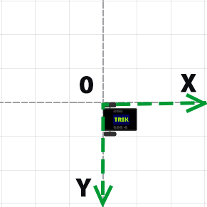
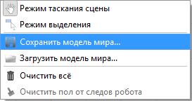
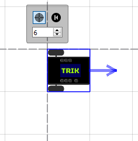
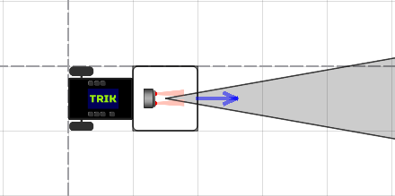
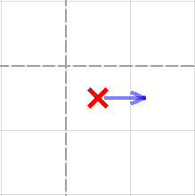
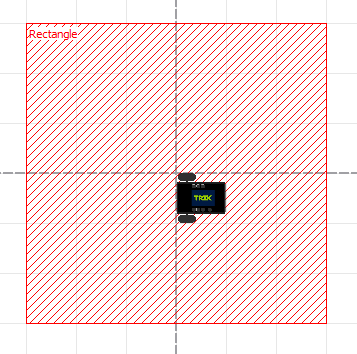
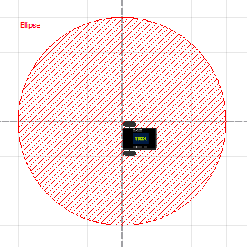

# Гибкая настройка 2D-модели

Помимо создания [виртуального мира](./#editor-world) роботов в TRIK Studio, можно делать более гибкую настройку при помощи редактирования XML-файла: указывать точнее расположения объектов, цвет, ширину и другие параметры.

Для начала необходимо [создать](settings.md#create-xml) XML-файл виртуальной модели.

## Система координат в 2D-модели

В отладке 2D-модели оси расположены следующим образом:




**Внимание!** Одна клетка имеет размеры 17,5×17,5 сантиметров или 50×50 пикселей.


## Создание XML-файла <a href="#create-xml" id="create-xml"></a>

Для создания пустого XML-файла используйте стандартные средства вашей операционной системы.

Для сохранения нарисованной в TRIK Studio модели мира:

1. Перейдите в [режим 2D](./).
2. Перейдите в [«Режим отладки»](../interface/#mode-debug).
3. Нажмите правой кнопкой мыши на сцену и в появившемся контекстном меню выберите «Сохранить модель мира…».\
   &#x20;&#x20;
4. Укажите место сохранения и имя файла.

## Редактирование XML-файла <a href="#editor-xml" id="editor-xml"></a>

Откройте сохраненный XML-файл в любом текстовом редакторе. Например, [Notepad++](https://notepad-plus-plus.org/).

XML-файл состоит из тегов и атрибутов.

### Теги

Тег — это элемент языка разметки. Существует начальный (открывающий) и конечный (закрывающий) тег. Текст, содержащийся между начальным и конечным тегом, отображается и размещается в соответствии со свойствами, указанными в начальном теге.

Например:

```markup
<walls> <!-- начальный (открывающий) тег -->
     <wall begin="200:-200" id="{a3ede76b-1d7e-4c72-9ed4-08d8ea9af4bf}" end="200:150"/>
</walls> <!-- конечный (закрывающий) тег -->
```

### **Атрибуты**

Атрибуты — это свойства тега, дающие дополнительные возможности форматирования текста. Они записываются в виде сочетания «имя атрибута — значение». Текстовые значения заключаются в кавычки.

В вышеуказанном примере атрибутами являются:

`begin="200:-200"`\
`id="{a3ede76b-1d7e-4c72-9ed4-08d8ea9af4bf}"`\
`end="200:150"`

Самая простая виртуальная модель мира без объектов в формате `.xml` выглядит следующим образом:


```markup
<?xml version='1.0' encoding='utf-8'?>
<root>
    <world>
        <background/>
        <walls/>
        <skittles/>
        <balls/>
        <colorFields/>
        <images/>
        <regions/>
    </world>
    <robots>
        <robot direction="0" id="trikKitRobot" position="0:0">
            <sensors/>
            <startPosition direction="0" id="{name}" y="25" x="25"/>
            <wheels left="M4###output###М4###" right="M3###output###М3###"/>
        </robot>
    </robots>
</root>
```


## Роботы

Для описания роботов имеются следующие теги:

| Тег                                                                                              | Описание                                                                                                                                                          |
| ------------------------------------------------------------------------------------------------ | ----------------------------------------------------------------------------------------------------------------------------------------------------------------- |
| ****[**robots**](settings.md#less-than-robots-greater-than-less-than-robots-greater-than)****    | Определяет робота на сцене. Используется как контейнер и должен содержать элемент [robot](settings.md#less-than-robot-greater-than-less-than-robot-greater-than). |
| ****[**robot**](settings.md#less-than-robot-greater-than-less-than-robot-greater-than)****       | Добавляет робота на сцену. Может использоваться как контейнер.                                                                                                    |
| ****[**sensors**](settings.md#less-than-sensors-greater-than-less-than-sensors-greater-than)**** | Определяет датчики на роботе. Используется как контейнер.                                                                                                         |
| ****[**sensor**](settings.md#less-than-sensor-greater-than)****                                  | Конфигурация портов датчиков.                                                                                                                                     |
| ****[**startPosition**](settings.md#less-than-startposition-greater-than)****                    | Определяет стартовое положение робота.                                                                                                                            |
| ****[**wheels**](settings.md#wheels)****                                                         | Конфигурация портов моторов.                                                                                                                                      |


### \<robots>...\</robots>

Определяет робота на сцене. Используется как контейнер, атрибутов не имеет.

```markup
<robots>
     <robot id="trikKitRobot" position="0:0" direction="0">
</robots>
```


### \<robot>...\</robot>

Добавляет робота на сцену. Может использоваться как контейнер.


**Внимание!** В TRIK Studio нельзя добавить несколько роботов на сцену.


#### Атрибуты

| **Атрибут**           | Описание                                                                                                                                     |
| --------------------- | -------------------------------------------------------------------------------------------------------------------------------------------- |
| **direction="0″**     | Направление робота, которое можно регулировать, нажав на робота и потянув за стрелку.                                                        |
| **position="x:y"**    | Положение робота, где x, y — положение левой верхней точки квадрата робота в [системе координат](settings.md#sistema-koordinat-v-2d-modeli). |
| **id="trikKitRobot"** | Уникальный идентификатор.                                                                                                                    |

#### Пример

```markup
<robot id="trikKitRobot" position="0:0" direction="0">
```




### \<sensors>...\</sensors>

Определяет датчики на роботе. Используется как контейнер, атрибутов не имеет.

```markup
<sensors>
     <sensor type="kitBase::robotModel::robotParts::Motor" direction="0" port="M4###output###JM4$$$D$$$4###" position="75:25"/>
</sensors>
```


### \<sensor/>

Конфигурация портов датчиков.

#### Атрибуты

| Атрибут                                                | Описание                                                                                                                                     |
| ------------------------------------------------------ | -------------------------------------------------------------------------------------------------------------------------------------------- |
| **position="x:y"**                                     | Положение датчика, где x, y — положение центральной точки квадрата датчика в [системе координат](settings.md#sistema-koordinat-v-2d-modeli). |
| **direction="0″**                                      | Направление датчика, которое можно регулировать, нажав на датчик и потянув за стрелку.                                                       |
| **port="A1###input######sensorA1"**                    | Порт, к которому подключен датчик.                                                                                                           |
| **type="trik::robotModel::parts::TrikInfraredSensor"** | Тип подключенного сенсора.                                                                                                                   |

Существует 5 видов датчиков для TRIK и 9 видов датчиков для EV3:



| Датчик                 | Описание                          |
| ---------------------- | --------------------------------- |
| **TrikSonarSensor**    | Ультразвуковой датчик расстояния. |
| **TrikLineSensor**     | Датчик линии.                     |
| **TrikLightSensor**    | Датчик освещённости.              |
| **TrikTouchSensor**    | Датчик касания.                   |
| **TrikInfraredSensor** | Инфракрасный датчик расстояния.   |



| Датчик                 | Описание                    |
| ---------------------- | --------------------------- |
| **RangeSensor**        | Датчик расстояния.          |
| **TouchSensor**        | Датчик касания.             |
| **Ev3Gyroscope**       | Гиродатчик.                 |
| **LightSensor**        | Датчик света.               |
| **ColorSensorGreen**   | Датчик цвета (зелёный).     |
| **ColorSensorFull**    | Датчик цвета (распознания). |
| **ColorSensorBlue**    | Датчик цвета (синий).       |
| **ColorSensorRed**     | Датчик цвета (красный).     |
| **ColorSensorPassive** | Датчик цвета (пассивный).   |



#### Пример

```markup
<sensor position="75:25" direction="0" port="A1###input###А1###sensorA1"
type="trik::robotModel::parts::TrikInfraredSensor"/>
```




### \<startPosition/>

Определяет стартовое положение робота.

#### Атрибуты

| Атрибут           | Описание                                                                                                             |
| ----------------- | -------------------------------------------------------------------------------------------------------------------- |
| **id="{name}"**   | Уникальный идентификатор.                                                                                            |
| **direction="0″** | Направление робота, если нажать на кнопку «вернуть». Чтобы отрегулировать, нажмите на крестик и потяните за стрелку. |
| **x="25″**        | Положение по оси x в [системе координат](settings.md#sistema-koordinat-v-2d-modeli).                                 |
| **y="25″**        | Положение по оси y в [системе координат](settings.md#sistema-koordinat-v-2d-modeli).                                 |

#### Пример

```markup
<startPosition id="{7a326d25-82f4-4eb4-9b42-1e75576f35a4}" direction="0" x="25" y="25"/>
```




### \<wheels/> <a href="#wheels" id="wheels"></a>

Конфигурация портов моторов.

#### Атрибуты

| **Атрибут**                     | Описание                                     |
| ------------------------------- | -------------------------------------------- |
| **left="M4###output###М4###"**  | Порт, к которому подключен левый двигатель.  |
| **right="M3###output###М3###"** | Порт, к которому подключен правый двигатель. |

#### Пример



```markup
<wheels left="M4###output###М4###" right="M3###output###М3###"/>
```



```markup
<wheels left="B###output###В###" right="C###output###С###"/>
```



## Объекты

&#x20;Для описания объектов имеются следующие теги:

| Тег                                                           | Описание                                                                                                                                                                                  |
| ------------------------------------------------------------- | ----------------------------------------------------------------------------------------------------------------------------------------------------------------------------------------- |
| walls                                                         | Определяет стены. Используется как контейнер, атрибутов не имеет.                                                                                                                         |
| skittles                                                      | Определяет банки. Используется как контейнер, атрибутов не имеет.                                                                                                                         |
| balls                                                         | Определяет мячи. Используется как контейнер, атрибутов не имеет.                                                                                                                          |
| colorFields                                                   | Определяет элементы, которые вы можете нарисовать (линию, кривую Безье, прямоугольник, эллипс, элементы, нарисованные с помощью стилуса). Используется как контейнер, атрибутов не имеет. |
| images                                                        | Определяет вставленную картинку. Используется как контейнер, атрибутов не имеет.                                                                                                          |
| regions                                                       | Определяет регионы. Используется как контейнер, атрибутов не имеет.                                                                                                                       |
| [wall](settings.md#less-than-wall-greater-than)               | Добавляет стену.                                                                                                                                                                          |
| [skittle](settings.md#less-than-skittle-greater-than)         | Добавляет банку.                                                                                                                                                                          |
| [ball](settings.md#less-than-ball-greater-than)               | Добавляет мяч.                                                                                                                                                                            |
| [line](settings.md#less-than-line-greater-than)               | Добавляет линию.                                                                                                                                                                          |
| [cubicBezier](settings.md#less-than-cubicbezier-greater-than) | Добавляет кривую Безье.                                                                                                                                                                   |
| [rectangle](settings.md#less-than-rectangle-greater-than)     | Добавляет прямоугольник.                                                                                                                                                                  |
| [ellipse](settings.md#less-than-ellipse-greater-than)         | Добавляет эллипс.                                                                                                                                                                         |
| [stylus](settings.md#less-than-stylus-greater-than)           | Определяет стилус на сцене. Используется как контейнер.                                                                                                                                   |
| [stylusLine](settings.md#less-than-stylusline-greater-than)   | Позволяет рисовать произвольные фигуры с помощью стилуса.                                                                                                                                 |
| [region](settings.md#less-than-region-greater-than)           | Позволяет добавлять регионы в на сцене.                                                                                                                                                   |

###

### \<wall>

Добавляет на сцену стену.

#### Атрибуты

| Атрибут         | Описание                                                                                                             |
| --------------- | -------------------------------------------------------------------------------------------------------------------- |
| **id="{name}"** | Уникальный идентификатор.                                                                                            |
| **begin="x:y"** | Начало стены, где x, y — положение начальной точки в [системе координат](settings.md#sistema-koordinat-v-2d-modeli). |
| **end="x:y"**   | Конец стены, где x, y — положение конечной точки в [системе координат](settings.md#sistema-koordinat-v-2d-modeli).   |

#### Пример

```markup
<wall id="{wall1}" begin="50:-50" end="250:-50"/>
```


### \<skittle>

Добавляет банку на сцену.

#### Атрибуты

| Атрибут           | Описание                                                                     |
| ----------------- | ---------------------------------------------------------------------------- |
| **markerY="44″**  | Позиция, на которую встанет банка по оси Y, если нажать на кнопку «вернуть». |
| **markerX="220″** | Позиция, на которую встанет банка по оси X, если нажать на кнопку «вернуть». |
| **id="{name}"**   | Уникальный идентификатор.                                                    |
| **y="44″**        | Положение по оси Y.                                                          |
| **x="220″**       | Положение по оси X.                                                          |

#### Пример

```markup
<skittle rotation="0" id="{skittle1}" markerY="44" startRotation="0" x="220" y="44"
markerX="220"/>
```


### \<ball>

Добавляет мяч на сцену.

#### Атрибуты

| Атрибут           | Описание                                                                   |
| ----------------- | -------------------------------------------------------------------------- |
| **markerY="169″** | Позиция, на которую встанет мяч по оси Y, если нажать на кнопку «вернуть». |
| **markerX="-18″** | Позиция, на которую встанет мяч по оси X, если нажать на кнопку «вернуть». |
| **id="{name}"**   | Уникальный идентификатор.                                                  |
| **y="169″**       | Положение по оси Y.                                                        |
| **x="-18″**       | Положение по оси X.                                                        |

#### Пример

```markup
<ball rotation="0" id="{ball1}" markerY="169" startRotation="0" x="-18" y="169" markerX="-18"/> 
```


### \<line>

Добавляет линию на сцену.

#### Атрибуты

| Атрибут                    | Описание                                                                                                                                                                                                                             |
| -------------------------- | ------------------------------------------------------------------------------------------------------------------------------------------------------------------------------------------------------------------------------------ |
| **begin="x:y"**            | Начало линии, где x, y — положение начальной точки в [системе координат](settings.md#sistema-koordinat-v-2d-modeli).                                                                                                                 |
| **end="x:y"**              | Конец линии, где x, y — положение конечной точки в [системе координат](settings.md#sistema-koordinat-v-2d-modeli).                                                                                                                   |
| **id="{name}"**            | Уникальный идентификатор.                                                                                                                                                                                                            |
| **stroke-width="6″**       | Ширина линии.                                                                                                                                                                                                                        |
| **fill="#ff000000″**       | Цвет заливки линии.                                                                                                                                                                                                                  |
| **fill-style="none"**      | Заливка. В данном случае этот атрибут не имеет смысла, т.к. линия всегда однородная.                                                                                                                                                 |
| **stroke-style="solid"**   | <p>Вид линии.  Существует 5 видов линии:</p><ul><li>solid — сплошная;</li><li>dot — точечный пунктир;</li><li>dash — штриховой пунктир;</li><li>dashdot — штрихпунктир;</li><li>dashdotdot — штрихпунктир с двумя точками.</li></ul> |
| **stroke="#ff000000″**     | Цвет линии.                                                                                                                                                                                                                          |

#### Пример

```markup
<line stroke-width="6" fill-style="none" end="250:-50" id="{line1}" stroke-style="solid"
fill="#ff000000" stroke="#ff000000" begin="50:-50"/>
```


### \<cubicBezier>

Добавляет кривую Безье.

#### Атрибуты

| Атрибут                  | Описание                                                                                                                    |
| ------------------------ | --------------------------------------------------------------------------------------------------------------------------- |
| **cp1="x:y"**            | Маркер, задающий изгиб кривой.                                                                                              |
| **cp2="x:y"**            | Маркер, задающий изгиб кривой.                                                                                              |
| **stroke-style="solid"** | Вид кривой Безье. Виды кривой Безье аналогичны видам линии.                                                                 |
| **begin="x:y"**          | Начало кривой Безье, где x, y — положение начальной точки в [системе координат](settings.md#sistema-koordinat-v-2d-modeli). |
| **end="x:y"**            | Конец кривой Безье, где x, y — положение конечной точки в системе координат.                                                |
| **id="{name}"**          | Уникальный идентификатор.                                                                                                   |
| **fill-style="none"**    | Заливка. В данном случае этот атрибут не имеет смысла, т.к. кривая Безье всегда однородная.                                 |
| **stroke-width="6″**     | Ширина кривой Безье.                                                                                                        |
| **stroke="#ff000000″**   | Цвет заливки кривой Безье.                                                                                                  |
| **fill="#ff000000″**     | Цвет кривой Безье.                                                                                                          |

#### Пример

```markup
<cubicBezier id="{cubicBezier1}" fill-style="none" stroke-width="6" end="-106.577:134.894"
begin="-112.95:-192.25" fill="#ff000000" cp1="-142.95:-192.25" cp2="17.0502:-192.25"
stroke="#ff000000" stroke-style="solid"/>
```


###

### \<rectangle>

Добавляет прямоугольник.

#### Атрибуты

| Атрибут                  | Описание                                                                                                                      |
| ------------------------ | ----------------------------------------------------------------------------------------------------------------------------- |
| **stroke-style="solid"** | Вид границ прямоугольника. Виды прямоугольника аналогичны видам линии.                                                        |
| **begin="x:y"**          | Начало прямоугольника, где x, y — положение начальной точки в [системе координат](settings.md#sistema-koordinat-v-2d-modeli). |
| **end="x:y"**            | Конец прямоугольника, где x, y — положение конечной точки в [системе координат](settings.md#sistema-koordinat-v-2d-modeli).   |
| **id="{name}"**          | Уникальный идентификатор.                                                                                                     |
| **fill-style="none"**    | Заливка. По умолчанию стоит «none». Заполненный прямоугольник будет со значением «solid».                                     |
| **fill="#ff000000″**     | Цвет границ прямоугольника.                                                                                                   |
| **stroke-width="6"**     | Ширина границ прямоугольника.                                                                                                 |
| **stroke="#ff000000″**   | Цвет заливки прямоугольника.                                                                                                  |

#### Пример

```markup
<rectangle stroke-width="6" fill-style="none" end="344:511" id="{rectengle1}" 
stroke-style="solid" fill="#ff000000" stroke="#ff000000" begin="285:229"/>
```


###

### \<ellipse>

Добавляет эллипс.

#### Атрибуты

| Атрибут                  | Описание                                                                                                                |
| ------------------------ | ----------------------------------------------------------------------------------------------------------------------- |
| **stroke-style="solid"** | Вид границ эллипса. Виды эллипса аналогичны видам линии.                                                                |
| **begin="x:y"**          | Начало эллипса, где x, y — положение начальной точки в  [системе координат](settings.md#sistema-koordinat-v-2d-modeli). |
| **end="x:y"**            | Конец эллипса, где x, y — положение конечной точки в [системе координат](settings.md#sistema-koordinat-v-2d-modeli).    |
| **id="{name}"**          | Уникальный идентификатор.                                                                                               |
| **fill-style="none"**    | <p>Заливка. По умолчанию стоит «none». Заполненный эллипс<br> — будет со значением «solid».</p>                         |
| **stroke-width="6″**     | Ширина границ эллипса.                                                                                                  |
| **fill="#ff000000″**     | Цвет границ эллипса.                                                                                                    |
| **stroke="#ff000000″**   | цвет заливки эллипса                                                                                                    |

#### Пример

```markup
<ellipse stroke-width="6" fill-style="none" end="-178:300" id="{ellipse1}" 
stroke-style="solid" fill="#ff000000" stroke="#ff000000" begin="-260:7"/>
```


###

### \<stylus>

Определяет стилус для рисования.

#### Атрибуты

| Атрибут                  | Описание                                                                                                             |
| ------------------------ | -------------------------------------------------------------------------------------------------------------------- |
| **stroke-style="solid"** | Вид фигуры. Виды фигур, нарисованных с помощью стилуса, аналогичны видам линии.                                      |
| **id="{name}"**          | Уникальный идентификатор.                                                                                            |
| **fill-style="none"**    | Заливка. В данном случае этот атрибут не имеет смысла, т.к. нарисованные фигуры с помощью стилуса всегда однородные. |
| **stroke-width="6″**     | Толщина стилуса.                                                                                                     |
| **fill="#ff000000″**     | Цвет стилуса.                                                                                                        |
| **stroke="#ff000000″**   | Цвет заливки стилуса.                                                                                                |

#### Пример

```markup
<stylus stroke-width="6" fill-style="none" id="{stylus_name}" stroke-style="solid" 
fill="#ff000000" stroke="#ff000000">
```


### \<stylusLine>

Позволяет рисовать произвольные фигуры с помощью стилуса. Этот блок кода состоит из множества отрезков.

#### Атрибуты

| Атрибут                  | Описание                                                                                                            |
| ------------------------ | ------------------------------------------------------------------------------------------------------------------- |
| **stroke-style="solid"** | вид фигуры. Виды фигур, нарисованных с помощью стилуса, аналогичны видам линии                                      |
| **id="{name}"**          |  уникальный идентификатор                                                                                           |
| **fill-style="none"**    | заливка. В данном случае этот атрибут не имеет смысла, т.к. нарисованные фигуры с помощью стилуса всегда однородные |
| **stroke-width="6″**     | толщина стилуса                                                                                                     |
| **fill="#ff000000″**     | цвет стилуса                                                                                                        |
| **stroke="#ff000000″**   | цвет заливки эллипса стилуса                                                                                        |

#### Пример

```markup
<stylusLine stroke-width="6" fill-style="none" end="-334:259" id="{name1}" stroke-style="solid"
fill="#ff000000" stroke="#ff000000" begin="-334:260"/>
<stylusLine stroke-width="6" fill-style="none" end="-333:258" id="{name2}" stroke-style="solid"
fill="#ff000000" stroke="#ff000000" begin="-334:259"/>
<stylusLine stroke-width="6" fill-style="none" end="-333:254" id="{name3}" stroke-style="solid"
fill="#ff000000" stroke="#ff000000" begin="-333:258"/>
```

&#x20;


### \<region>

Позволяет добавлять регионы на сцене. Существует 2 вида региональных ограничений:&#x20;

* rectangle — прямоугольник



* ellipse — эллипс



#### Атрибуты

| **Атрибут**          | Описание                                                                                                                                                         |
| -------------------- | ---------------------------------------------------------------------------------------------------------------------------------------------------------------- |
| **filled="true"**    | Заполненность. Значение по умолчанию — true.                                                                                                                     |
| **type="rectangle"** | Геометрический вид региона.                                                                                                                                      |
| **height="300″**     | Высота региона (в случае с эллипсом это высота прямоугольника, описывающего эллипс).                                                                             |
| **width="300″**      | Ширина региона (в случае с эллипсом это длина прямоугольника, описывающего эллипс).                                                                              |
| **text="Finish"**    | Название, которое будет выводиться в TRIK Studio.                                                                                                                |
| **textX="0″**        | Положение названия региона относительно левого нижнего угла по оси X.                                                                                            |
| **textY="0″**        | Положение названия региона относительно левого нижнего угла по оси Y.                                                                                            |
| **x="1300″**         | Положение начала региона (левого верхнего угла) по оси X (в случае с эллипсом это координата по оси X левого верхнего угла прямоугольника, описывающего эллипс). |
| **y="-200″**         | Положение начала региона (левого верхнего угла) по оси Y (в случае с эллипсом это координата по оси Y левого верхнего угла прямоугольника, описывающего эллипс). |
| **visible="false"**  | Видимость в TRIK Studio.                                                                                                                                         |
| **id="finish"**      | Уникальный идентификатор региона.                                                                                                                                |
| **color="#ff0000″**  | Цвет границ и заполнения.                                                                                                                                        |

#### Пример

```markup
<regions>
            <region filled="true" type="rectangle" height="300" width="300" textX="0" 
text="Finish" textY="0" x="1300" y="-200" visible="true" id="Start" color="#ff0000"/>
</regions>
```


## Пример настройки 2D-модели

### Задача «Штрихкод»

Необходимо нарисовать штрихкод. Штрихкод состоит из белых и черных линий одинаковой толщины. Черная линия задает 1 в двоичном числе, а белая 0. Первая черная линия на пути робота — это старший бит числа.

Порядок линий в штрихкоде: `1001011011`.

### Создание мира

В данной задаче линии должны быть одинаковой толщины и длины. От руки с помощью инструмента «Линия» или «Стилус» нарисовать линии очень сложно, поэтому отредактируйте линии вручную:

1\. Нарисуйте на сцене 10 линий.


2\. Сохраните модель мира.


3\. Откройте получившийся XML-файл в любом удобном редакторе. Обратите внимание на блок кода с тегом `<line...>`.


4\. Для удобства назовите каждую линию `black1`-`black5` и `white1`-`white5`. Сделать это можно в атрибуте `id`. Называйте линии в порядке, указанном выше.


5\. Укажите толщину линий «50» в атрибуте `stroke-width`.


6\. Присвойте цвет каждой линии: `#ff000000` — черный, `#ffffffff` — белый. Сделать это можно в атрибуте `fill`. Присваивайте цвета таким образом, чтобы получился штрихкод.


&#x20;7\. Выставьте положение каждой линии в атрибутах `begin` и `end` без зазоров, чтобы получился ровный штрихкод.&#x20;


### Результат


## Пример модели мира


Скачать

