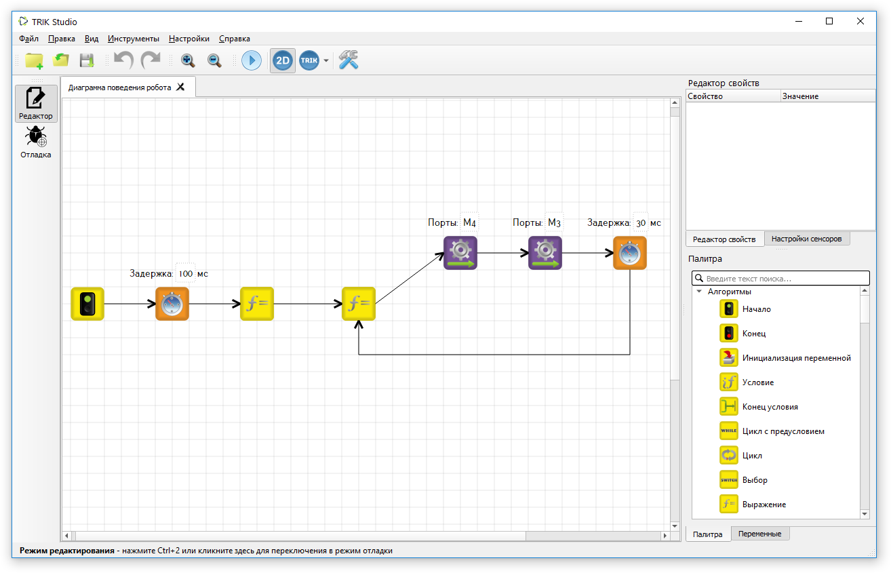
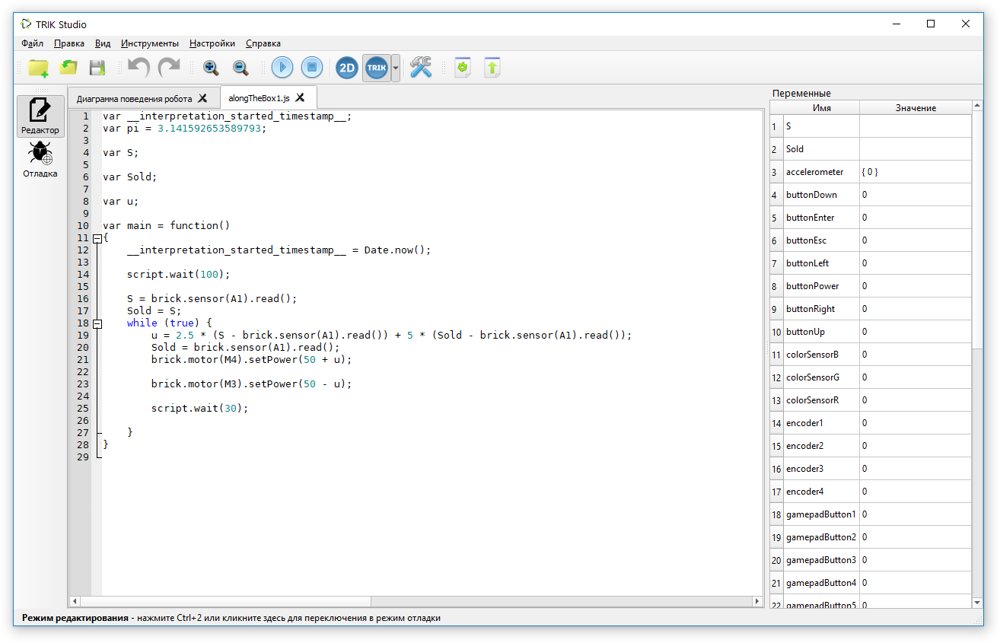
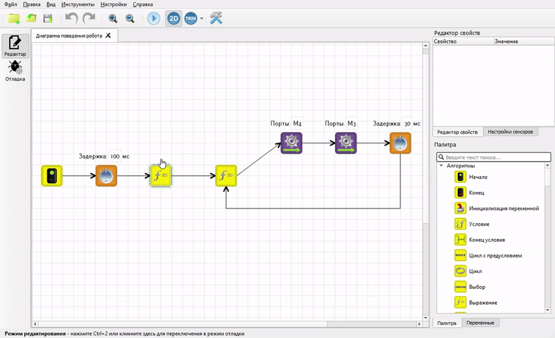

# О TRIK Studio

**TRIK Studio** — бесплатная среда программирования роботов.

Она позволяет решать задачи как с помощью [визуального](../programming-visual/) программирования, так и [текстовых языков](../programming-code.md).











Отличительной особенностью TRIK Studio является [интерактивный режим имитационного моделирования](../2d-model/). Чтобы научиться программировать, необязательно иметь конструктор.

TRIK Studio — универсальное программное обеспечение для преподавания основ программирования. В ней предусмотрен переход [от диаграмм к текстовым языкам](../programming-code.md#generation).

### Поддерживаемые платформы 

TRIK Studio поддерживает 4 платформы:

* [Контроллер ТРИК](../../trik/about/).
* [LEGO EV3](../../ev3/about.md).
* [LEGO NXT 2.0](../../nxt/about.md).
* [Квадрокоптер Геоскан Пионер](../../pioneer/about.md).

## Скачать&#x20;

Последнюю версию TRIK Studio можно скачать на сайте [trikset.com](https://trikset.com/downloads#trikstudio).


[version.md](version.md)


## Рекомендуемые системные требования

* Оперативная память: 4 ГБ или больше.
* Операционная система:
  * 64-разрядная Windows 10.
  * Ubuntu 16.04 и выше.
  * macOS 10.12 Sierra и выше.
