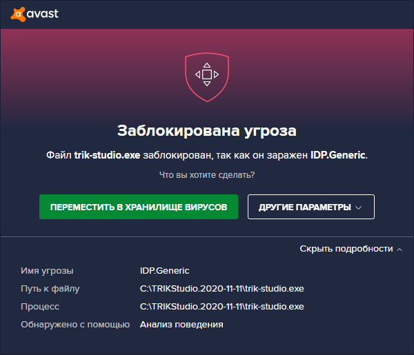
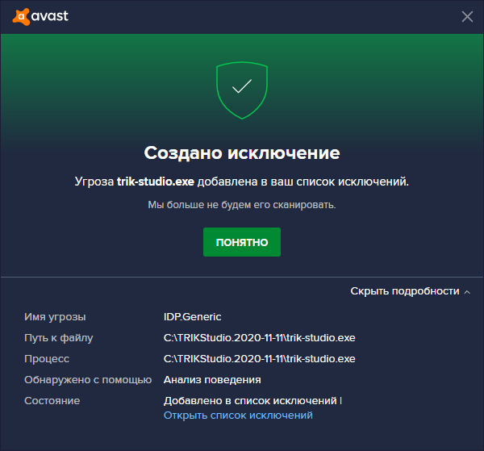

# Антивирус Avast блокирует TRIK Studio. Что делать?

## **Avast выдаёт сообщение о блокировке файла**

Если при установке или запуске TRIK Studio антивирус Avast выдает сообщение о блокировке файла, то указанный файл следует добавить в исключения в настройках антивируса.

Для этого:

1\. В появившемся окне нажмите на кнопку «Другие параметры» и выберите «Создать исключение».

2\. Нажмите на кнопку «Понятно».

3\. После данных действий TRIK Studio запустится.

## Avast не выдает сообщение об угрозе

Возможна ситуация, при которой Avast может удалить исполняемый файл TRIK Studio или просто не выдавать сообщение об угрозе при запуске TRIK Studio.

В данном случае:

1\. Откройте главное окно Avast.

2\. В «Меню» выберите пункт «Моя статистика».

3\. Затем «Угрозы в хранилище вирусов (Открыть хранилище вирусов)».

4\. Наведите курсор мыши на запись о заблокированном файле, после чего справа появится кнопка выпадающего меню «...». Нажмите на нее и выберите «Другие параметры».

5\. Затем выберите «Восстановить и добавить в исключения».

6\. После этих действий TRIK Studio должна запускаться и работать в штатном режиме.
