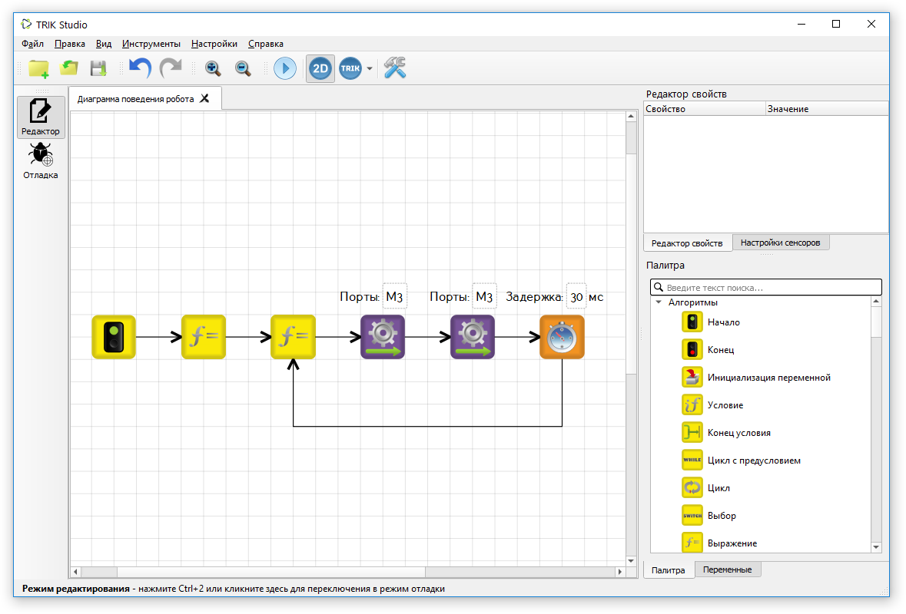
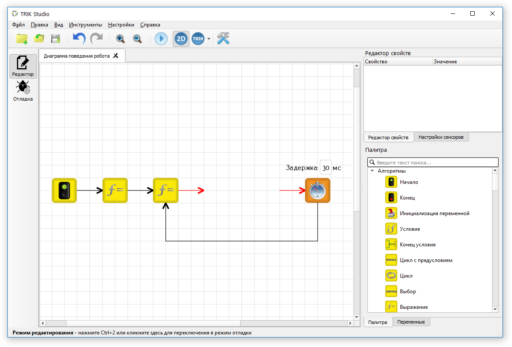
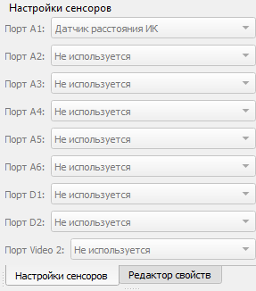

# Упражнения

Упражнение — это обычная программа, в которой нельзя модифицировать некоторые части решения. То есть любую диаграмму можно сохранить как упражнение для учеников (если она еще не является таковой).

## Создание упражнения 

1\. Нарисуйте на сцене поле с помощью [панели редактирования мира](2d-model/#editor-world), если это необходимо для вашей задачи.&#x20;

.png>)

2\. Создайте диаграмму.

3\. Удалите из диаграммы все или часть блоков. Блок [«Начало»](programming-visual/blocks.md#nachalo) обязательно должен присутствовать.

4\. Выберите в [главном меню](interface/#menu) `Инструменты → Сохранить как упражнение…`.

5\. В появившемся диалоговом окне выберите ограничения для упражнения.

|   | Название                                                               | Описание                                                                                           |
| - | ---------------------------------------------------------------------- | -------------------------------------------------------------------------------------------------- |
| 1 | Двумерная модель неизменяема                                           | Запрещает редактировать стены и цветные линии в двумерной модели.                                  |
| 2 | Положение и конфигурация сенсоров неизменяемы                          | Запрещает изменять конфигурацию датчиков, а также их положение и направление в двумерной модели.   |
| 3 | Начальное положение робота в двумерной модели неизменяемо              | Запрещает двигать робот «вручную».                                                                 |
| 4 | Соответствие портов моторов и колёс неизменяемо                        | Запрещает менять моторы в настройках двумерной модели.                                             |
| 5 | Настройки симуляции двумерной модели (физика, шумы и т.д.) неизменяемы | Запрещает менять настройки шумов датчиков и моторов, а также физический движок в двумерной модели. |

6\. Нажмите «OK» и выберите путь для сохранения упражнения.

7\. После сохранения упражнение автоматически откроется в TRIK Studio, где можно будет убедиться, что выбранные опции недоступны для редактирования.

## Загрузка упражнения

Загрузка сохраненного упражнения происходит как обычная программа. Например, с помощью [панели «Файл»](interface/#panel-file).
