# Интерфейс TRIK Studio

## Режимы TRIK Studio

Интерфейс TRIK Studio зависит от выбранного режима. TRIK Studio имеет два режима:

1. ****[**Режим редактирования**](./#mode-edit)\
   Предназначен для создания диаграммы управления роботом и исполнения её на роботе в режиме генерации.\

2. ****[**Режим отладки**](./#mode-debug)\
   Предназначен для исполнения и отладки программы на 2D-модели или в режиме интерпретации на реальном роботе.

### Переключение между режимами

Переключение режимов возможно тремя способами. С помощью:

1. Сочетаний клавиш `Ctrl+1` / `Ctrl+2`.
2. [Панели переключения режимов](./#panel-mode-switching).
3. [Строки статуса](./#status-bar).

## Режим редактирования 

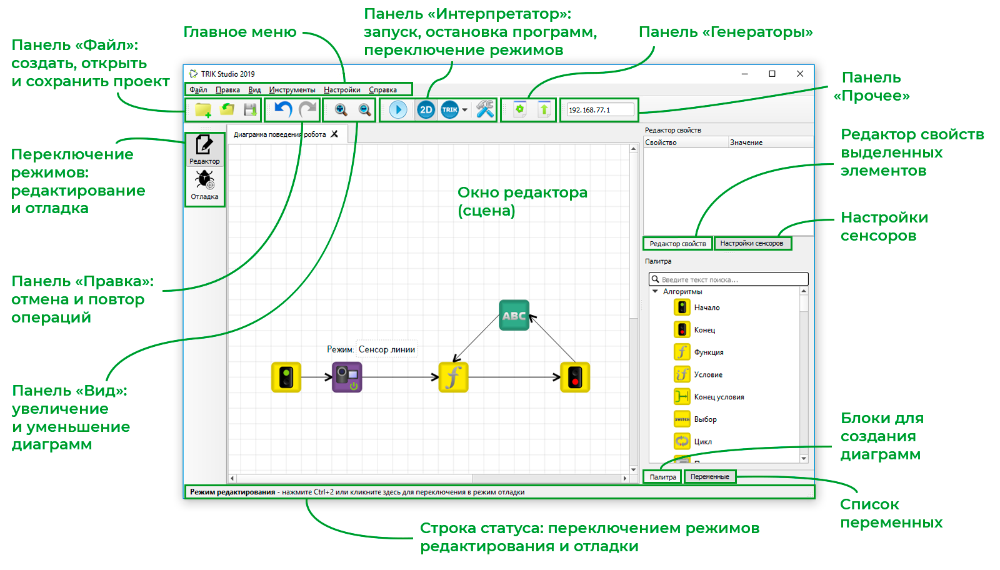

TRIK Studio в режиме редактирования имеет следующие элементы интерфейса:

* [Окно редактора / сцена](./#editor-window)
* [Главное меню](./#menu)
* [Панель «Файл»](./#panel-file)
* [Панель «Правка»](./#panel-edit)
* [Панель «Вид»](./#panel-view)
* [Панель «Интерпретатор»](./#panel-interpreter)
* [Панель «Генераторы»](./#panel-generators)
* [Панель «Прочее»](./#panel-other)
* [Панель переключения режимов](./#panel-mode-switching)
* [Редактор свойств элементов](./#panel-property-editor)
* [Настройки сенсоров](./#panel-configure-devices)
* [Палитра (набор блоков для создания диаграмм)](./#panel-palette)
* [Список переменных](./#panel-variables)
* [Строка статуса](./#status-bar)

### &#x20;

### Окно редактора / сцена 

Сцена отображает диаграмму и позволяет ее редактировать.

О создании нового проекта и работе с диаграммами читайте в статьях:


[start.md](../start.md)



[blocks-add-delete.md](../programming-visual/blocks-add-delete.md)


Здесь же осуществляется отображение текущего исполняемого блока при интерпретации диаграмм.

### Главное меню 

Главное меню **TRIK Studio** содержит набор базовых операций и настроек среды:

* [Файл](main-menu.md#menu-file)
* [Правка](main-menu.md#menu-edit)
* [Вид](main-menu.md#menu-view)
* [Инструменты](main-menu.md#menu-tools)
* [Настройки](main-menu.md#menu-settings)
* [Справка](main-menu.md#menu-about)

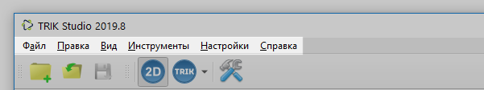

Подробнее смотрите в статье:


[main-menu.md](main-menu.md)


### Панель «Файл» 

Панель «Файл» повторяет основные операции, доступные из меню «[Файл](main-menu.md#menu-file)».

&#x20;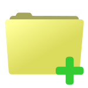 Создать новый проект.\
&#x20; Открыть сохраненный проект.\
&#x20;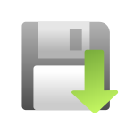 Сохранить текущий проект.

### Панель «Правка» 

 Отмена операции.\
&#x20;Повтор операции.

### Панель «Вид» 

Панель «Вид» содержит кнопки, позволяющие масштабировать диаграммы.

Приблизить / отдалить.

Также масштабировать сцену можно с помощью:

1. Зажатия клавиши `Ctrl` и вращения колесика мыши.
2. Сочетания клавиш `Ctrl+=` и `Ctrl+-`.

### Панель «Интерпретатор» 

Панель «Интерпретатор» содержит команды запуска и остановки выполнения программы, кнопки переключения режимов интерпретации между двумерной моделью и реальным роботом, а также кнопку открытия [настроек робота](../settings.md#robots), доступных из меню «Инструменты».&#x20;

При работе с реальным роботом в режиме интерпретации эта панель также содержит кнопку «Подключиться».

 Запуск выполнения программы.\
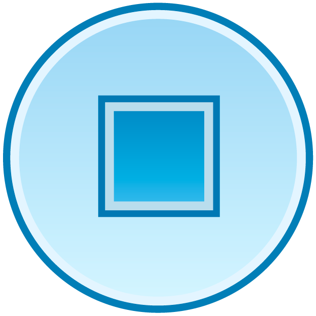 Остановка выполнения программы.\
 Двумерная модель.\
 Реальный робот.\
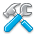 Настройки робота.

### Панель «Генераторы» 


Команды на этой панели изменяются в зависимости от конфигурации программы.


Панель «Генераторы» содержит команды генерации кода и загрузки программы на контроллер.

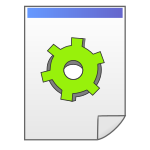 Генерировать код.\
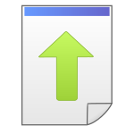 Загрузить программу.

### Панель «Прочее» 

Панель «Прочее» может содержать различную информацию в зависимости от выбранной платформы.

Например, для [конструктора ТРИК](../../trik/about/) на данной панели отображается IP-адрес контроллера, к которому вы подключаетесь.

### Панель переключения режимов редактирования и отладки 

Панель переключения режимов отображает текущий режим TRIK Studio и позволяет переключаться между режимами редактирования и отладки.

 Редактор.\
 Отладка.

### Панель «Редактор свойств» 

Редактор свойств используется для отображения и редактирования значений свойств выделенных объектов (блоков, связей).&#x20;

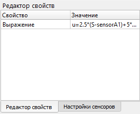

О работе с редактором смотрите статью:


[editing-element-properties.md](../programming-visual/editing-element-properties.md)


### Панель «Настройки сенсоров» 

Настройки сенсоров позволяют указать, какие сенсоры использованы на каком порту. То же можно сделать из диалога настроек робота.


Набор сенсоров зависит от выбранной платформы в настройках на вкладке «[Роботы](../settings.md#robots)».


###

### Панель «Палитра» 

Палитра элементов содержит набор доступных блоков и связей между ними, которые можно добавить на диаграмму.


1. Состав палитры может меняться в зависимости от выбранной в [настройках](../settings.md#robots) платформы.
2. Серым выделены блоки, недоступные в выбранной модели выполнения (2D-модели или на реальном роботе).


О добавлении и удалении блоков на сцену в TRIK Studio читайте в статье:


[blocks-add-delete.md](../programming-visual/blocks-add-delete.md)


### Панель «Переменные» 

Список переменных, используемых при выполнении диаграммы с их текущими значениями, включая [сенсорные переменные](../programming-visual/expression-syntax/sensory-variables.md). При исполнении в режиме интерпретации на двумерной модели или реальном роботе берутся с робота в реальном времени. В режиме генерации не используются.

###

### Строка статуса 

Строка статуса отображает текущий режим TRIK Studio ([редактирования](./#mode-edit) или [отладки](./#mode-debug)) и позволяет переключаться между режимами. Для переключения достаточно кликнуть на строку статуса.

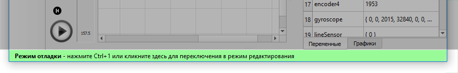

## Режим отладки 

Элементы интерфейса TRIK Studio в режиме отладки повторяют элементы в [режиме редактирования](./#mode-edit), кроме окна редактора, панелей редактора свойств и палитры. Вместо этих элементов отображаются:

* [Окно «Двумерная модель»](./#window-2-d-1)
* [Окно «Ошибки»](./#window-error)
* [Панель «Настройки робота»](./#panel-settings-robot)
* [Панель «Графики»](./#panel-graphics)

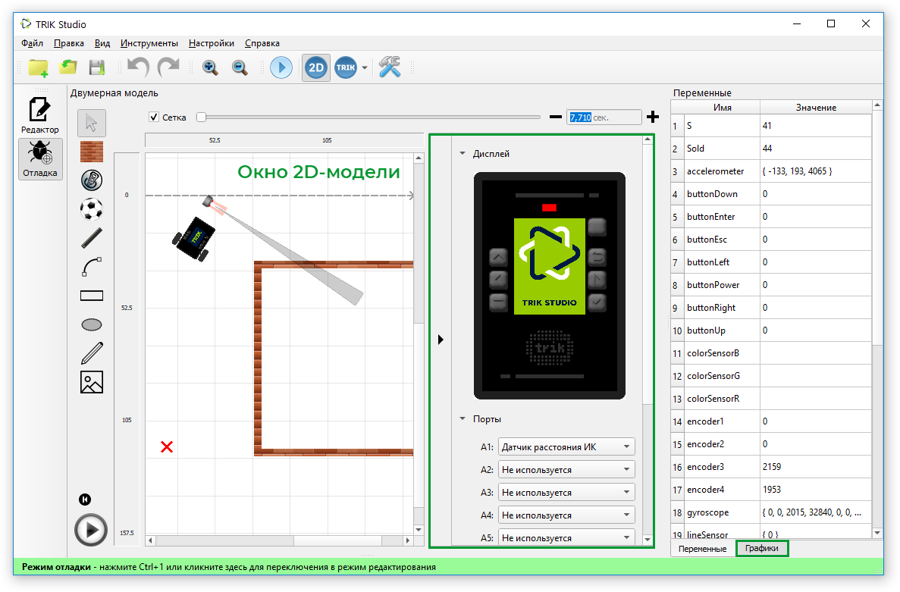

### &#x20;

### Окно «Двумерная модель» 

Окно «Двумерная модель» открывается, если в качестве режима исполнения программы выбрана 2D-модель.

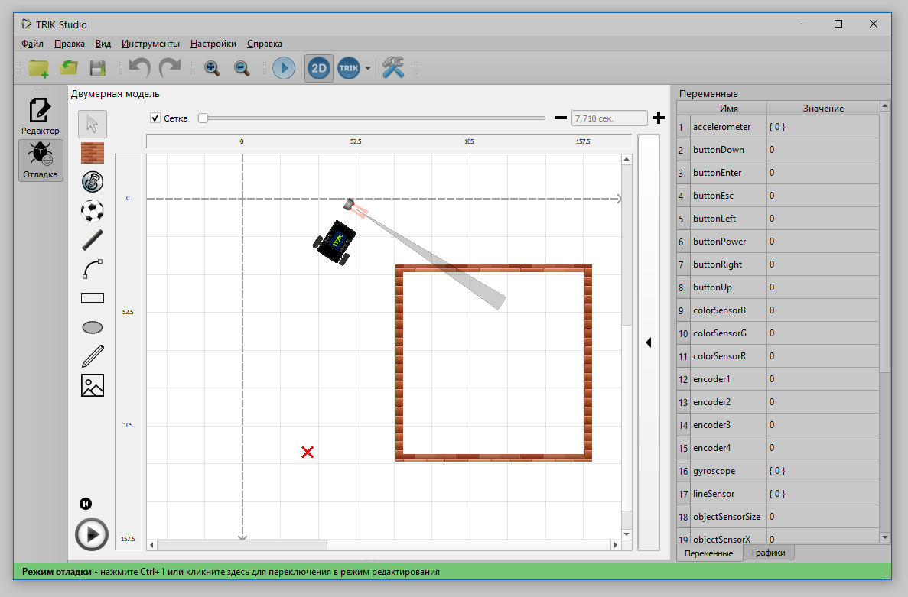

Окно позволяет задать окружение, в котором будет работать робот, задать датчики робота и наблюдать, как будет работать написанная в режиме редактирования программа.

Подробнее о 2D-модели читайте в статье:


[2d-model](../2d-model/)



В режиме интерпретации и генерации программы на реальном роботе это окно не показывается, вместо него отображается исполняемая диаграмма.


###

### Панель «Настройки робота» 

На панели настроек робота отображается вид контроллера и параметры робота, которые зависят от выбранной [платформы](../about/#platforms).

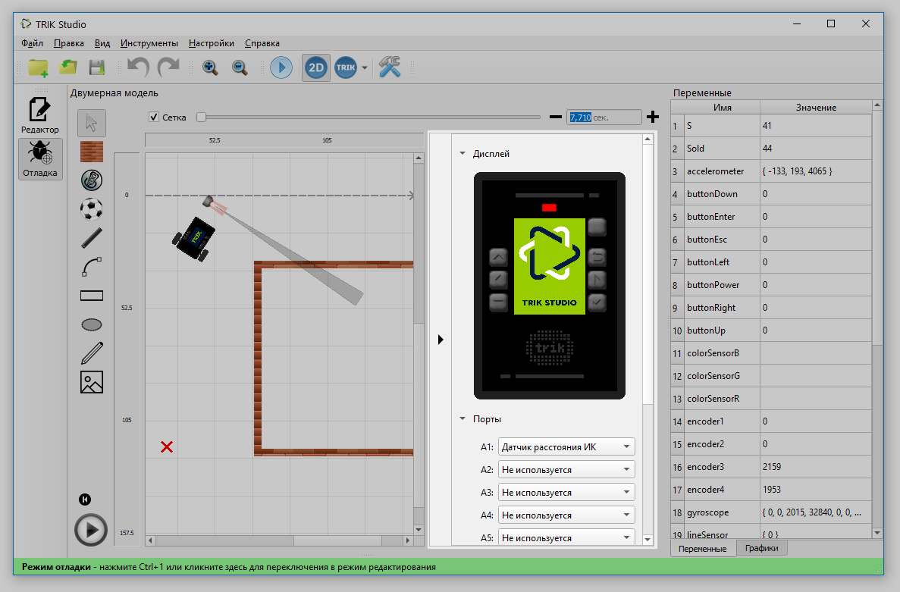

#### Открытие панели «Настройки робота»

### Окно «Ошибки» 

В случае синтаксических и семантических ошибок в TRIK Studio появляется окно с соответствующими сообщениями.

Для просмотра блока, в котором допущена ошибка, необходимо кликнуть на сообщение.

###

### Панель «Графики» 

Окно «Графики» отображает в реальном времени значения, присылаемые датчиками.&#x20;

Подробнее читайте в статье:


[graphics.md](graphics.md)

