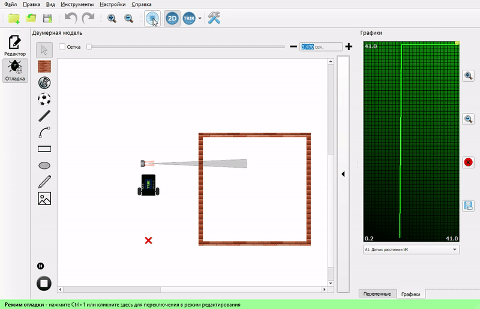
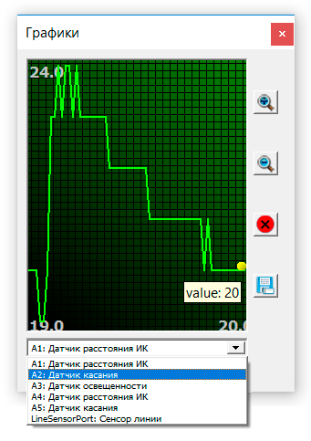
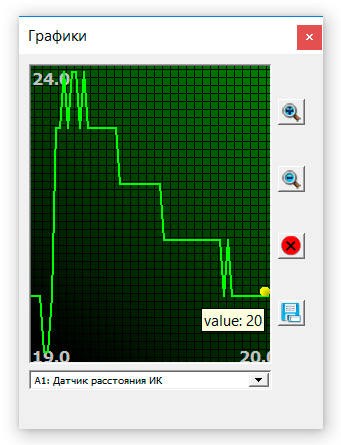

# Работа с графиками

Если программа запущена в режиме интерпретации на роботе или в двумерной модели, можно посмотреть показания сенсоров робота на графике в [специальном окне](./#panel-graphics).

График масштабируется автоматически таким образом, чтобы кривая показаний помещалась по высоте целиком.

Из выпадающего списка снизу можно выбрать сенсор, значения с которого будут отображаться на графике.

При наведении курсора мыши на точку на графике отобразится значение в этой точке.

Справа от графика есть четыре кнопки для работы с ним:

| Кнопка                                                                                                                                      | Описание                                                                                                                                |
| ------------------------------------------------------------------------------------------------------------------------------------------- | --------------------------------------------------------------------------------------------------------------------------------------- |
|     | Изменение масштаба графика.                                                                                                             |
|    | Очистить график.                                                                                                                        |
|  | Экспорт показаний графика в формате `.csv` (comma-separated value). Экспортируются все показания выбранного датчика с начала их записи. |
