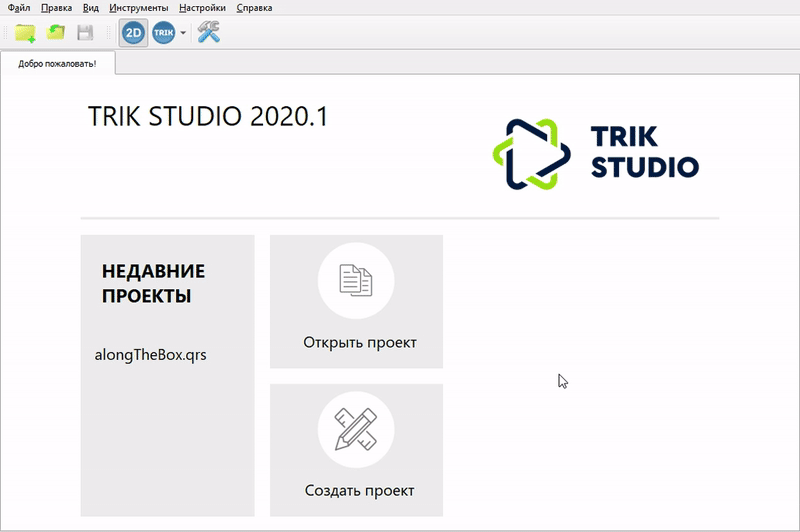

# Программирование на текстовом языке

Текстовый режим программирования позволяет редактировать [сгенерированную](programming-code.md#generation) по диаграмме программу перед загрузкой на робота или [написать программу](programming-code.md#new-programm) в текстовом виде с нуля.

## Создание новой текстовой программы 

1\. [Создайте диаграмму](start.md#new-project), содержащую блоки «Начало» и «Конец».

2\. Выберите режим реального робота.

3\. Нажмите на кнопку «Генерировать код».\
\
После этого появится пустой шаблон программы, которая содержит все необходимые объявления, но ничего не делает.

## Генерация диаграммы в код 

1\. Выберите режим реального робота.

2\. Нажмите на кнопку «Генерировать код».


При повторной генерации диаграммы ручные изменения не потеряются, если текстовый файл сохранен. Результат новой генерации сохранится в другой файл.


.gif>)

## Поддерживаемые языки программирования

Поддерживаемый текстовый язык программирования зависит от платформы. Одна платформа может иметь несколько целевых текстовых языков.


**Внимание!** Доступные генераторы зависят от установленных подключаемых модулей.


### Контроллер ТРИК 

Для платформы ТРИК возможна генерация в:

* [Python](../trik/programming-code/).
* [JavaScript](../trik/programming-code/).

### Контроллер Lego EV3 

Эксперты в EV3 могут посмотреть на сгенерированный на внутреннем языке EV3 код с помощью кнопки «Сгенерировать в байт-код EV3». Теоретически его можно подредактировать и запустить на исполнение или вообще использовать для текстового программирования EV3, но делать это неудобно — язык создавался для автоматической генерации, а не написания программ.

### Контроллер Lego NXT 

Для Lego NXT поддерживается генерация в [язык С](../nxt/c.md) с использованием библиотеки ECRobot.

### Квадрокоптер Геоскан Пионер 

Для квадрокоптера Геоскан Пионер возможна генерация в Lua.
