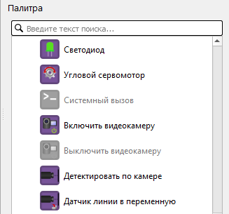
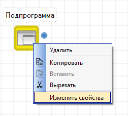
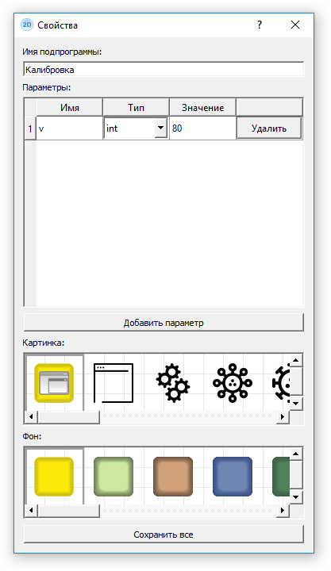

# Общие блоки

Список доступных блоков зависит от выбранной платформы и от модели робота (реальный робот или [двумерная модель](../2d-model/)). При этом недоступные для данной платформы блоки не показываются вообще, а недоступные для данной модели в рамках одной платформы блоки показываются в [палитре](../interface/#panel-palette) серым и недоступны для перетаскивания на [сцену](../interface/#editor-window-1).

Общие блоки для всех платформ представлены ниже. Программа, использующая только эти блоки, будет исполняться на любой платформе без каких-либо правок.

Список блоков, специфичных для конкретного конструктора, можно найти в соответствующих разделах:

* [ТРИК](../../trik/programming-visual/blocks.md)
* [LEGO EV3](../../ev3/blocks.md)
* [LEGO NXT](../../nxt/blocks.md)
* [Квадрокоптер Геоскан Пионер](../../pioneer/blocks.md)

## Все общие блоки

|                                                                                              Вид                                                                                              |                      Название                      | Описание                                                                                                                                                                                                                                                                                            |
| :-------------------------------------------------------------------------------------------------------------------------------------------------------------------------------------------: | :------------------------------------------------: | --------------------------------------------------------------------------------------------------------------------------------------------------------------------------------------------------------------------------------------------------------------------------------------------------- |
|   |             [Начало](blocks.md#initial)            | 
Начальная точка выполнения программы.

На каждой диаграмме должен быть только один такой блок. В него не должно быть входящих связей, а исходящая связь из этого элемента должна быть только одна.

Процесс интерпретации диаграммы начинается именно с этого блока.
 |
|                                                                                                                |              [Конец](blocks.md#final)              | 
Конец программы.

Если программа состоит из нескольких параллельных участков выполнения, достижение этого блока завершает соответствующий участок выполнения.

У данного блока не может быть исходящих связей.
                                                       |
|                                                                                                    | [Инициализация переменной](blocks.md#variableinit) | Блок для объявления новой переменной и задания ей значения.                                                                                                                                                                                                                                         |
|                                                                                                               |           [Условие](blocks.md#condition)           | Разделение выполнения программы в соответствии с заданным условием.                                                                                                                                                                                                                                 |
|                                                                                                                |          [Конец условия](blocks.md#endif)          | Обозначает слияние двух веток условного оператора. Никаких действий не выполняет, но полезен для обеспечения структурности программы.                                                                                                                                                               |
|                                                                                                  |       [Цикл с предусловием](blocks.md#while)       | Цикл, который выполняется пока истинно некоторое условие, указанное перед его началом. Это условие проверяется до выполнения тела цикла, поэтому тело может быть не выполнено ни разу (если условие с самого начала ложно).                                                                         |
|                                                                                                                 |               [Цикл](blocks.md#loop)               | Блок, организующий выполнение последовательности блоков несколько раз.                                                                                                                                                                                                                              |
|                                                                                                               |              [Выбор](blocks.md#switch)             | Условие с несколькими альтернативами.                                                                                                                                                                                                                                                               |
|                                                                                                             |          [Выражение](blocks.md#expression)         | Считает значение заданного выражения. Также допускается инициализация переменных.                                                                                                                                                                                                                   |
|                                                                                                      |        [Подпрограмма](blocks.md#subprogram)        | Вызов подпрограммы.                                                                                                                                                                                                                                                                                 |
|                                                                                                                 |        [Параллельные задачи](blocks.md#fork)       | Блок разделяет выполнение программы на несколько потоков.                                                                                                                                                                                                                                           |
|                                                                                                              |           [Слияние задач](blocks.md#join)          | Блок слияния параллельных задач.                                                                                                                                                                                                                                                                    |
|                                                                                                           |      [Завершить задачу](blocks.md#killthread)      | Завершает задачу с указанным в свойстве «Задача» идентификатором. Должен применяться из другой задачи.                                                                                                                                                                                              |
|                                                                                                           |         [Случайное число](blocks.md#random)        | Блок для присвоения указанной переменной случайного целого числа из заданного промежутка.                                                                                                                                                                                                           |
|                                                                                                             |          [Комментарий](blocks.md#comment)          | Блок для добавления на диаграмму произвольного текста в качестве комментария.                                                                                                                                                                                                                       |
|                                                                                                                |              [Таймер](blocks.md#timer)             | Блок для задания задержки. Устанавливается время задержки в параметре «Задержка» в миллисекундах.                                                                                                                                                                                                   |
|                                                                                                           |       [Опустить маркер](blocks.md#markerdown)      | Начать рисование маркером заданного цвета на полу. При движении робота в двумерной модели за ним будет оставаться цветная линия.                                                                                                                                                                    |
|                                                                                                             |        [Поднять маркер](blocks.md#markerup)        | Закончить рисование маркером.                                                                                                                                                                                                                                                                       |

## Начало 

Начальная точка выполнения программы.

На каждой диаграмме должен быть только один такой блок. В него не должно быть входящих связей, а исходящая связь из этого элемента должна быть только одна.

Процесс интерпретации диаграммы начинается именно с этого блока.

## Конец 

.png>)

Конец программы.

Если программа состоит из нескольких параллельных участков выполнения, достижение этого блока завершает соответствующий участок выполнения.

У данного блока не может быть исходящих связей.

## Инициализация переменной 

Блок для объявления новой переменной и задания ей значения. Этого же можно добиться с помощью блока «[Выражение](blocks.md#expression)», но этот блок делает программу понятнее.

#### Свойства

| Свойство       | Описание                                                           |
| -------------- | ------------------------------------------------------------------ |
| **Значение**   | Указывается выражение, определяющее начальное значение переменной. |
| **Переменная** | Указывается имя переменной.                                        |

## Условие 

.png>)

Разделение выполнения программы в соответствии с заданным условием.

У данного блока должны быть две исходящие связи, у хотя бы одной из которых должно быть задано значение параметра «Условие»: «истина» или «ложь».

#### Свойства

| Свойство    | Описание                                                                                                                                                                                          |
| ----------- | ------------------------------------------------------------------------------------------------------------------------------------------------------------------------------------------------- |
| **Условие** | Указывается логическое выражение (подробнее см. в статье «[Синтаксис выражений](expression-syntax/)»), на основе значения которого будет осуществлен выбор дальнейшего пути выполнения диаграммы. |

## Конец условия 

.png>)

Обозначает слияние двух веток условного оператора.\
\
Никаких действий не выполняет, но полезен для обеспечения структурности программы. Если придерживаться правила, что все ветки операторов «[Условие](blocks.md#condition)» или «[Выбор](blocks.md#switch)» сходятся на таком блоке, это существенно повысит шансы на то, что генератор сможет породить код на текстовом языке без операторов `goto`.

## Цикл с предусловием 

.png>)

Цикл с предусловием — цикл, который выполняется пока истинно некоторое условие, указанное перед его началом. Это условие проверяется до выполнения тела цикла, поэтому тело может быть не выполнено ни разу (если условие с самого начала ложно).

#### Свойства

| Свойство    | Описание                                                                                                                                                                                          |
| ----------- | ------------------------------------------------------------------------------------------------------------------------------------------------------------------------------------------------- |
| **Условие** | Указывается логическое выражение (подробнее см. в статье «[Синтаксис выражений](expression-syntax/)»), на основе значения которого будет осуществлен выбор дальнейшего пути выполнения диаграммы. |

## Цикл 

Блок, организующий выполнение последовательности блоков несколько раз.\
\
Число повторений задается значением параметра «Итерации». Блок должен иметь две исходящие связи, одна из которых должна быть помечена значением «тело цикла» (то есть значение параметра «Условие» у связи должно быть «тело цикла»). Другая связь, исходящая из блока «Цикл», должна оставаться непомеченной: по ней будет осуществляться переход, когда программа пройдет через блок «Цикл» указанное число раз.\
\
Бесконечные циклы и циклы вида `while/do` и `while` организуются без использования этого блока, зацикливанием потока управления с помощью связей. Выход из такого цикла осуществляется с помощью блока «[Условие](blocks.md#condition)».

## Выбор 

Условие с несколькими альтернативами.\
\
В параметре «Выражение» можно указать произвольное выражение (подробнее см. в разделе «[Синтаксис выражений](expression-syntax/)»), на основе значения которого будет осуществлен выбор дальнейшего пути выполнения диаграммы.\
\
У данного блока должны быть несколько исходящих связей. Все связи, кроме одной, должны быть помечены элементарным значением (строка, число и др.), которое может принимать выражение (значение просто пишется в свойство «Условие» у связи). Одна из связей должна быть не помечена: по ней осуществляется переход, если выражение не равно ни одному из перечисленных значений.

## Выражение 

.png>)

Считает значение заданного выражения. Также допускается инициализация переменных.\
\
Подробнее про синтаксис допустимых выражений параметра «Выражение» см. в разделе «[Синтаксис выражений](expression-syntax/)».

## Подпрограмма 

Вызов подпрограммы.\
\
Подпрограммы используются для вынесения повторяющихся фрагментов программы на отдельную диаграмму.\
\
При добавлении этого блока на диаграмму будет предложено ввести имя подпрограммы, после чего двойным кликом на блоке можно будет перейти на диаграмму, соответствующую данной подпрограмме. Также появится дополнительная палитра со всеми подпрограммами. Подпрограммы из неё можно перетаскивать на сцену и использовать как обычные блоки.\
\
Вид, имя и свойства блока можно изменить с помощью контекстного меню.

#### Свойства

Изменение свойств у данного блока происходит не на панели «Редактор свойств», а с помощью пункта «Изменить свойства» в контекстном меню. Для вызова контекстного меню нажмите правой кнопкой мыши на блок «Подпрограмма».

В открывшемся окне вы можете:

* Изменить имя подпрограммы.
* Добавить и изменить параметры подпрограммы, задав имя, тип и значение.
* Изменить картинку на иконке вашей подпрограммы.
* Изменить фон иконки подпрограммы.

## Параллельные задачи 

Блок разделяет выполнение программы на несколько потоков. Например, можно одновременно ждать срабатывания сенсора и истечения временного интервала.\
\
Блок должен иметь хотя бы две исходящие связи.\
\
Чтобы иметь возможность далее ссылаться на параллельные задачи, порождённые этим блоком (например, в блоке «[Завершить задачу](blocks.md#killthread)» или в блоке «[Слияние задач](blocks.md#join)») надо дать задачам имена. Это делается на исходящих связях, в свойстве «Условие». Именем задачи может быть любая строка, но одним из имён должно быть имя задачи, которая входит в этот блок. Имя главной программы — `main`.

## Слияние задач 

Блок слияния параллельных задач.\
\
Блокирует исполнение программы до тех пор, пока исполнение всех параллельных задач, входящих в этот блок, не достигнет этого блока.\
\
Блок должен иметь не менее двух входящих связей. На исходящей связи (в свойстве «Условие») должен быть идентификатор задачи, которая продолжится после того, как блок отработает.

## Завершить задачу 

Завершает задачу с указанным в свойстве «Задача» идентификатором. Должен применяться из другой задачи.

## Случайное число 

Блок для присвоения указанной переменной случайного целого числа из заданного с помощью свойств «От» и «До» промежутка.

## Комментарий 

Блок для добавления на диаграмму произвольного текста в качестве комментария.

Используется для пояснения конкретного блока или участка диаграммы. Может быть связан с блоком, который он поясняет.

При выполнении программы блок не учитывается.

## Таймер 

Блок для задания задержки. Устанавливается время задержки в параметре «Задержка» в миллисекундах.&#x20;

## Опустить маркер 

Начать рисование маркером заданного цвета на полу. При движении робота в двумерной модели за ним будет оставаться цветная линия.

Блок доступен только в режиме двумерной модели.

## Поднять маркер 

Закончить рисование маркером.

Блок доступен только в режиме двухмерной модели.
