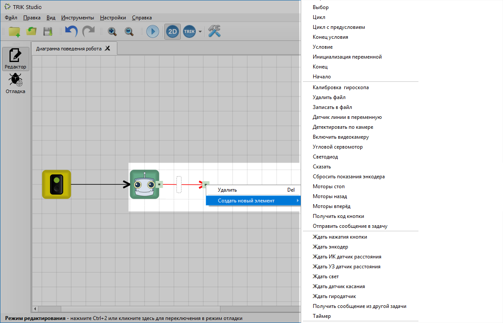
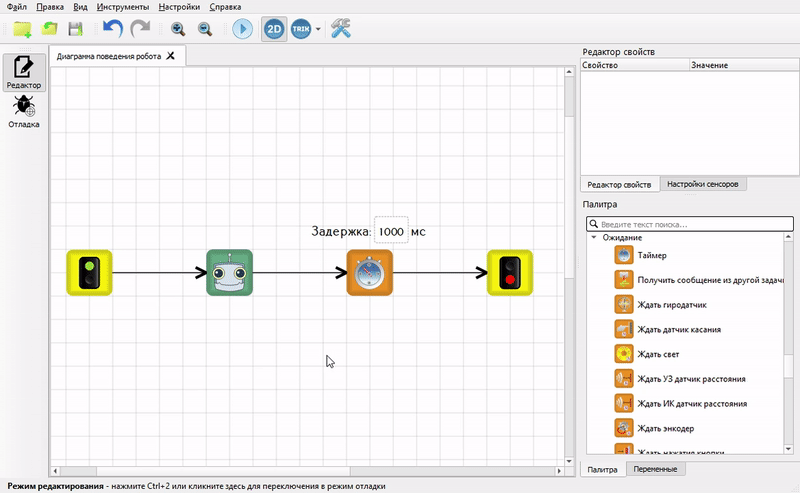

# Связи между блоками

Связи между блоками в TRIK Studio обозначают направление передачи управления между блоками.

#### Пример

Пусть необходимо, чтобы вслед за задержкой программа сразу же завершилась.\
\
Для этого надо соединить блоки [«Таймер»](blocks.md#taimer) и [«Конец»](blocks.md#konec) стрелкой, имеющей направление от блока «Таймер» к блоку завершения программы.

## Создание связей

Связи можно создавать двумя способами:

1. [Жестом мыши](connection-between-blocks.md#mouse).
2. [С помощью линкеров](connection-between-blocks.md#linker).

### Создание связи жестом мыши 

Наведите курсор на блок, зажмите правую кнопку мыши и проведите линию до второго блока. Форма линии может быть произвольной. Важно, чтобы она начиналась строго на одном блоке и заканчивалась на втором.&#x20;

.gif>)

Если навести на связь курсор мыши, то на ее концах отобразятся серые маркеры. Потянув за один из этих маркеров, можно управлять связью.\
\
Чтобы присоединить один из концов связи к блоку, нужно потянуть за соответствующий серый маркер и отпустить его на интересующем блоке.

.gif>)

### Создание связи с помощью линкеров 

Линкер — цветной кружок справа от блока, появляющийся после выделения блока.\
\
При нажатии на этот кружок и движении мыши с зажатой левой клавишей, из элемента начинает вытягиваться связь.

Если «бросить» эту связь на существующем элементе, произойдет соединение данных элементов.

.gif>)

Если же отпустить левую клавишу мыши, когда курсор находится на пустом участке диаграммы, то появится меню с пунктами:

* Удалить
* Создать новый элемент

При выборе пункта меню «Удалить» созданная связь удаляется.

При наведении на пункт меню «Создать новый элемент» появляется новое меню, в котором перечислены все возможные для создания элементы. При выборе одного из этих пунктов на диаграмме создастся соответствующий элемент и присоединится к текущему связью.

## Удаление связей

Удаление связей осуществляется аналогично [удалению блоков](blocks-add-delete.md#del).

## Добавление нового блока на связь

Если необходимо добавить новый блок между двумя связанными блоками, перетащите из панели «Палитра» блок на связь. Отпустите кнопку мыши при наведении курсора (не блока) на связь.

.gif>)

## Создание точек излома

Связи в TRIK Studio могут быть ломаными линиями. Для добавления точки излома наведите курсор мыши на линию связи, нажмите левую кнопку мыши и потяните появившийся серый маркер.

Если точку излома связи разместить так, что она и две ближайшие к ней будут располагаться примерно на одной прямой, то это приведет к уничтожению этой точки излома и сглаживанию ломаной в этом месте.

.gif>)
