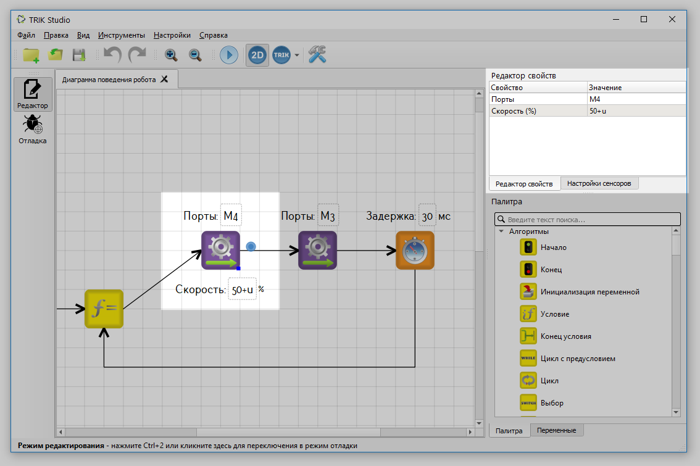
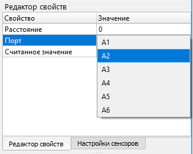
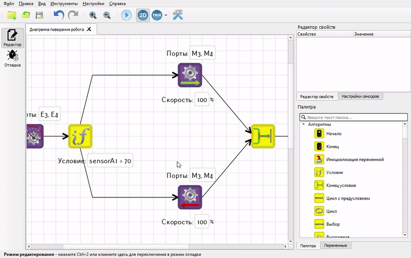

# Редактирование свойств элементов

В TRIK Studio есть два способа редактирования значений свойств, которые имеются у блоков и связей на диаграммах:

1. [С помощью панели «Редактор свойств»](editing-element-properties.md#panel).
2. [Прямо на диаграмме](editing-element-properties.md#diagram).


**Внимание!** Редактирование свойств блока [«Подпрограмма»](blocks.md#subprogram) осуществляется только с помощью контекстного меню.


## Редактирование свойств с помощью панели 

При выделении блока, связи, или элемента, на панели [«Редактор свойств»](../interface/#panel-property-editor) отображаются все свойства текущего элемента.

Редактор свойств представляет собой таблицу. В левой колонке отображается название свойства элемента, в правой — его значение.&#x20;

Изменить значение любого свойства можно, кликнув на соответствующей ячейке правой колонки и введя нужное значение.

Для свойств, которые допускают только определенный набор значений, например, свойство «Порт» у блока [«Ждать ИК датчик расстояния»](../../trik/programming-visual/blocks.md#wait-for-infrared-distance), при попытке их редактирования, появится выпадающее меню, где выбирается нужное значение:

## Редактирование свойств на диаграмме 

Для редактирования свойств прямо на диаграмме:

1. Наведите курсор мыши на значение нужного свойства.
2. Двойным нажатием левой кнопки мыши активируйте редактирование свойства.
3. Введите нужное значение.
4. Кликните в произвольное место сцены.


**Внимание!** Данный подход может служить источником ошибок, поскольку позволяет ввести произвольное текстовое значение свойства, в том числе и некорректное. Будьте внимательны.

