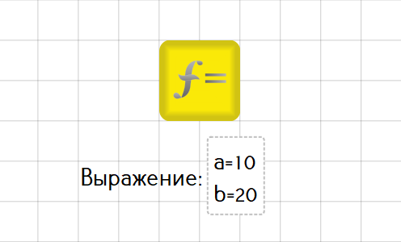
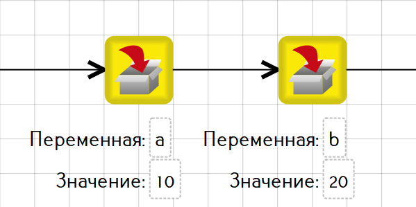
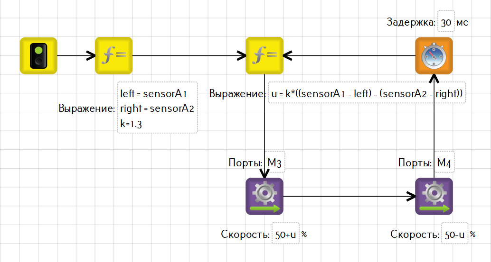
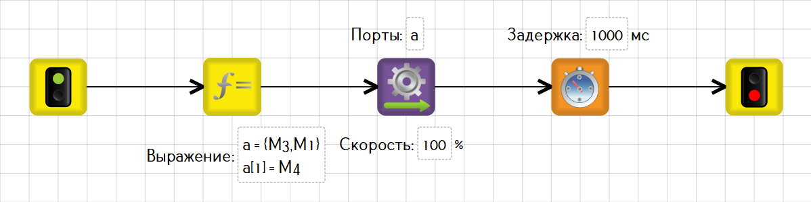

# Синтаксис выражений в блоках

Для объявления переменных и задания им определенных значений используется блок [«Инициализация переменной»](../blocks.md#initialization).

А для записи математических вычислений — блок [«Выражение»](../blocks.md#expression).

Также математические выражения, в том числе и изменяющие значения переменных, могут встречаться почти везде, где можно указать какое-либо значение.

Блоки и их свойства, не допускающие использования математических выражений, описаны в разделе [«Общие блоки»](../blocks.md#vse-obshie-bloki).

Все переменные в программе являются глобальными, т.е. их значения могут использоваться в любом блоке в программе.

## Язык TRIK Studio

Используемый внутри блоков язык создан на базе [Lua 5.3](https://www.lua.org/) и во многом следует его синтаксису. Тем не менее имеются существенные отличия, поэтому полное описание используемого в TRIK Studio языка приводится здесь.

* [Типы языка TRIK Studio](./)
* [Лексемы языка](lexemes.md)
* [Операторы языка](operators.md)
* [Сенсорные переменные](sensory-variables.md)
* [Константы](const.md)
* [Встроенные функции](built-in-functions.md)

## Примеры записи выражений

Объявление нескольких переменных в одном блоке [«Выражение»](../blocks.md#vyrazhenie):

То же через блоки [«Инициализация переменной»](../blocks.md#inicializaciya-peremennoi):

Пропорциональный регулятор для езды по линии с использованием двух датчиков света для платформы ТРИК:

Пример использования [массивов](types/array.md) для задания портов блока «Моторы вперёд». Создаётся массив с именем `a`, нулевому элементу присваивается порт `M3`, первому — `M1`, потом содержимое первого элемента массива меняется на `M4`, затем получившийся массив передаётся в свойство «Порты» блока «Моторы вперёд»:

