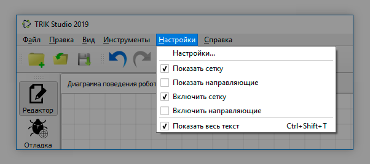
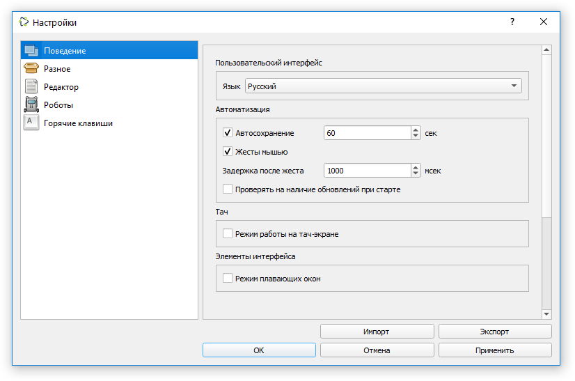
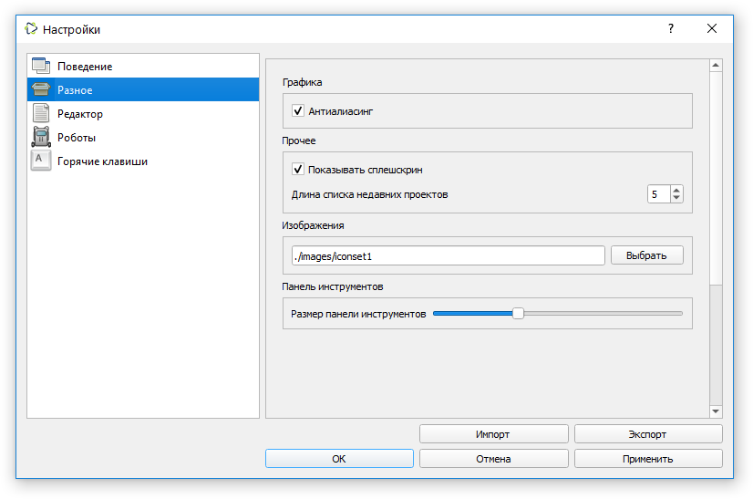
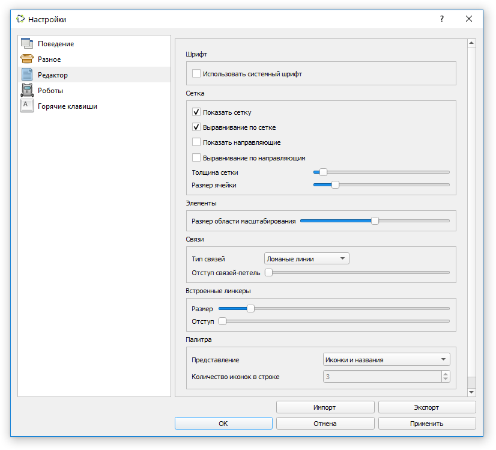
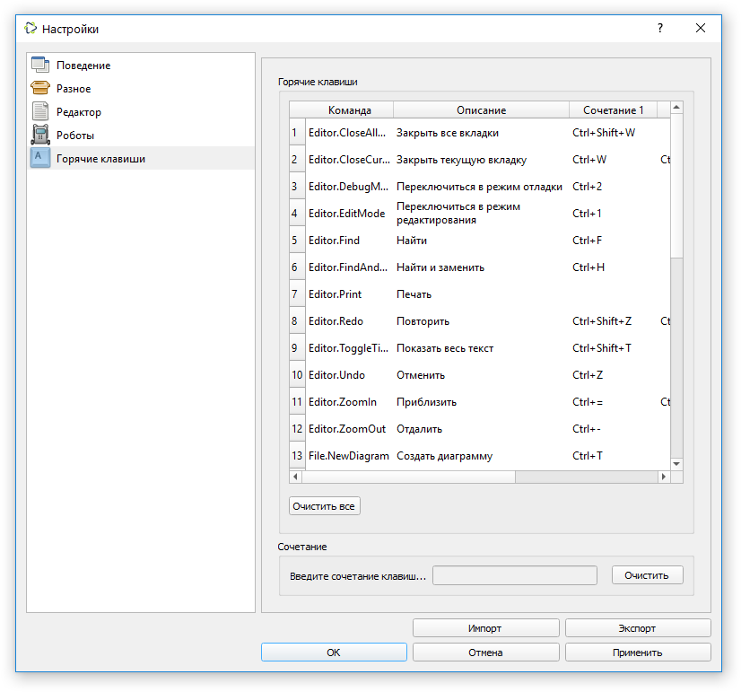

# Настройки TRIK Studio

## Окно настроек

Окно настроек TRIK Studio открывается выбором соответствующего пункта в [главном меню](interface/main-menu.md#menu-settings):`Настройки → Настройки...`.

Интерфейс окна с настройками содержит две панели:

1\. Панель со списком вкладок с настройками:

* [Поведение](settings.md#behavior).
* [Разное](settings.md#vkladka-raznoe).
* [Редактор](settings.md#editor).
* [Роботы](settings.md#robots).
* [Горячие клавиши](settings.md#shortcuts).

2\. Панель с полями для редактирования настроек текущей вкладки.\
\
Кнопки [«Импорт»](settings.md#import) и [«Экспорт»](settings.md#export) внизу окна позволяют сохранить текущие настройки в файл и загрузить его на другом компьютере.

###

### Поведение 

#### Пользовательский интрефейс

* **Язык** — язык среды. После изменения требуется перезапуск TRIK Studio. Настройка «<Системный язык>» означает, что язык будет определяться по текущему языку операционной системы.

#### Автоматизация

* **Автосохранение** — возможность включить или выключить автосохранение открытого проекта, а также задать интервал автосохранения в секундах.\

* **Жесты мышью** — включить или выключить механизм распознавания [жестов мышью](programming-visual/blocks-add-delete.md#mouse-gesture).\

* **Задержка после** **жеста** — временной отрезок системного ожидания между выполнением жеста мышью и его исполнением. Задержка позволяет рисовать жест в несколько штрихов. Значение указывается в миллисекундах.\

* **Проверять на наличие обновлений при старте** — связываться при запуске с сервером обновлений и запускать автообновление при необходимости.

#### Тач

* **Режим работы на тач-экране** — включить оптимизацию пользовательского интерфейса для сенсорных экранов.

#### Элементы интерфейса

* **Режим плавающих окон** — открепляет окна для свободного передвижения.

### Разное

#### Графика

* **Антиалиасинг** — режим рисования линий со сглаживанием, улучшает внешний вид диаграмм за счёт незначительного снижения скорости работы системы.

#### Прочее

* **Показывать сплешскрин** — включить/выключить отображение стартового экрана с логотипом TRIK Studio.
* **Длина списка недавних проектов** — сколько проектов показывать в пункте «Недавние проекты» меню [«Файл»](interface/main-menu.md#menu-file).

#### **Изображения**

Какой набор иконок использовать для отображения диаграммы.

#### Панель инструментов

* **Размер панели инструментов** — задать размер кнопок на панели инструментов.

### Редактор 

#### Шрифт

* **Использовать системный шрифт** — заменить шрифт для отображения надписей на диаграмме по умолчанию на один из шрифтов, установленных в системе. Размеры надписей на блоках заданы жёстко, поэтому изменение шрифта может привести к наползанию надписей друг на друга, однако можно экспериментировать.

#### **Сетка**

* **Показывать сетку** — отображать выравнивающую сетку на сцене редактора диаграмм.
* **Выравнивание по сетке** — осуществлять выравнивание блоков по сетке.
* **Показать направляющие** — отображать направляющие линии на сцене редактора диаграмм. Направляющие линии появляются, когда блок находится на одной горизонтали или вертикали с другим блоком, и помогают выравнивать блоки на сцене.
* **Выравнивание по направляющим** — осуществлять выравнивание блоков по направляющим.
* **Толщина сетки** — толщина линий сетки. Настраивается в зависимости от яркости монитора или проектора.
* **Размер ячейки** — размер одной ячейки сетки. Размер по умолчанию подобран так, чтобы блок накрывал четыре ячейки.

#### **Элементы**

* **Размер области масштабирования** — размер области, потянув за которую, можно изменить размер блока [«Комментарий»](programming-visual/blocks.md#comment).

#### **Связи**

* **Тип связей** — режим рисования связей на диаграмме.
  * **Ломаные линии** — связи рисуются как ломаные с точками излома, которые добавляются пользователем.
  * **Прямоугольные линии** — связи рисуются как ломаные линии, каждый сегмент которых параллелен осям координат. Точки излома в этом случае добавляются системой автоматически.
  * **Кривые Безье** — связи рисуются как гладкие кривые, кривизна которых может быть задана пользователем.
* **Отступ связей-петель** — насколько связь, входящая в тот же блок, из которого она исходит, должна отступать от блока.

#### **Встроенные линкеры**

* **Размер** — размер встроенного линкера, т.е. кружка рядом с блоком на диаграмме, осуществляющего создание связей между элементами (см. статью [«Связи между блоками»](programming-visual/connection-between-blocks.md)).
* **Отступ** — отступ встроенного линкера от пиктограммы блока.

#### **Палитра**

* **Представление** — выбор между режимом отображения иконок и названий или только иконок в палитре.
* **Количество иконок в строке** — количество иконок на строку палитры при выбранном режиме «Иконки».

### Роботы 

Состав этой вкладки зависит от установленных подключаемых модулей поддержки платформ и от текущей выбранной платформы. Типовые элементы вкладки описаны ниже.

.png>)

#### Платформа

Конструктор, для которого пишутся программы в среде. От этой опции зависит список доступных блоков в [палитре](interface/#panel-palette) и доступных действий на панели инструментов.

#### Модель робота

Выбор типа модели исполнения для выбранного конструктора. В большинстве случаев это 2D-модель или реальный робот, но для некоторых конструкторов одна из моделей может быть недоступной, в этом случае этот пункт в окне не отображается.

#### **Картинка робота в 2D**

Внешний вид робота в 2D-модели.

#### **Настройки соединения**

Специфичные для конструктора настройки подключения к роботу, такие как IP-адрес робота для ТРИК или COM-порт Bluetooth-соединения для Lego NXT. Если соединение в выбранном режиме не требуется, данный пункт не отображается.

#### **Настройки сторонних программ**

Специфичные для конструктора настройки программ, непоставляемых в комплекте с TRIK Studio, которые должны быть установлены на компьютере. Для большинства режимов работы дополнительные установленные программы не нужны, так что соответствующие пункты не отображаются в окне.

#### **Настройка сенсоров**

Здесь указывается, какие сенсоры подключены к портам робота.

#### **Загрузка и запуск программ**

* **Запуск после загрузки** — запускать программу сразу после загрузки её на робот или нет. Применимо только для некоторых режимов некоторых конструкторов (например, для Lego NXT в режиме генерации).

#### **Интервалы обновления графиков**

* **Сенсоры** — интервал в миллисекундах, после которого добавляется новая точка с показанием сенсора.
* **Масштабирование** — интервал в миллисекундах, после которого график автоматически изменяет свой масштаб, чтобы оптимально отобразить значения.
* **Текстовая информация** — интервал в миллисекундах, после которого на графике обновляются надписи со значениями.

### **Горячие клавиши** 

Данная вкладка позволяет задать или изменить горячие клавиши для наиболее часто используемых действий. Для этого надо выбрать ячейку, соответствующую действию, и в строке «Сочетание» внизу окна нажать нужное сочетание клавиш.

Кнопка «Очистить» удаляет сочетание клавиш из ячейки.

Все горячие клавиши, установленные по умолчанию, вы можете посмотреть в статье:


[shortcuts.md](shortcuts.md)


## Экспорт настроек 

TRIK Studio позволяет экспортировать текущие настройки в файл для загрузки их на другом компьютере. Для этого необходимо нажать кнопку «Экспорт» внизу окна.

## Импорт настроек 

TRIK Studio позволяет импортировать настройки из экспортированного ранее файла. Для этого необходимо нажать кнопку «Импорт» внизу окна и выбрать нужный файл `.ini`.
