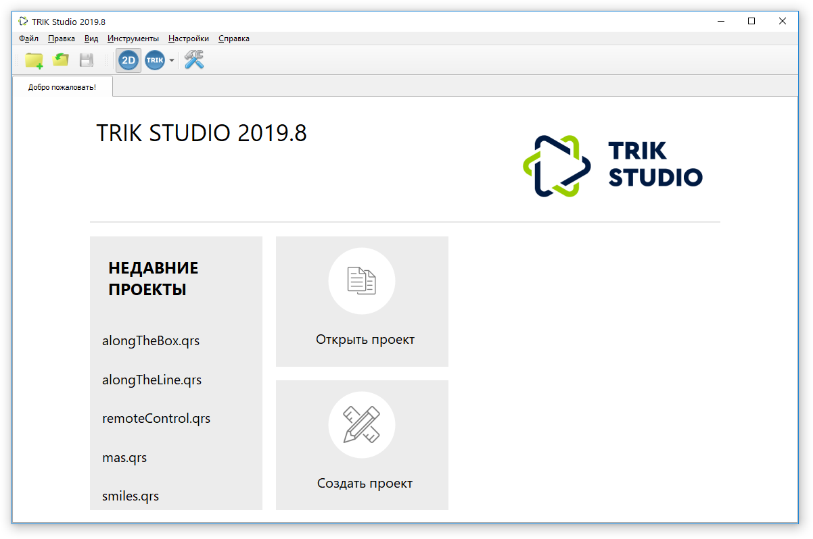
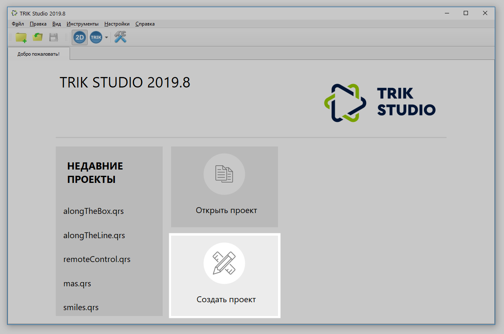
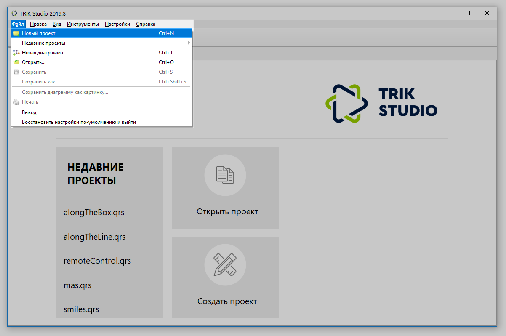
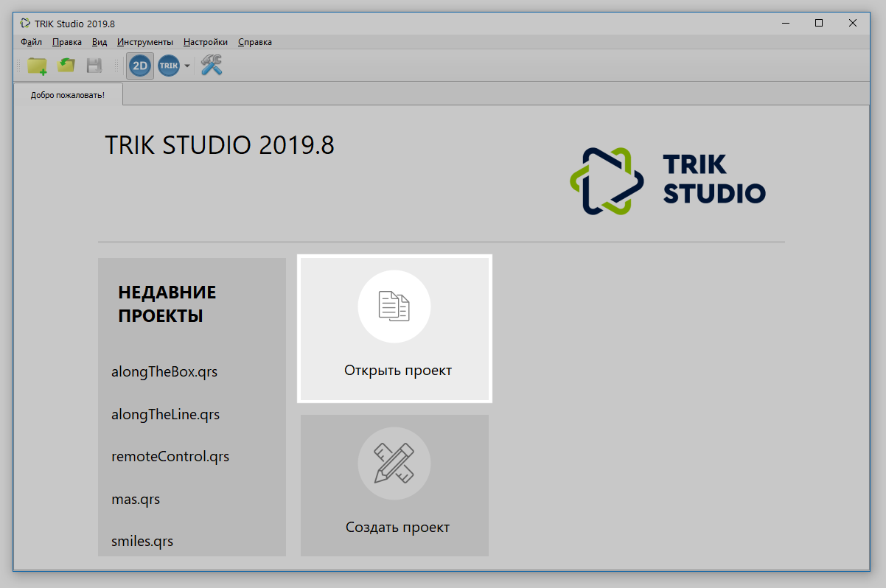
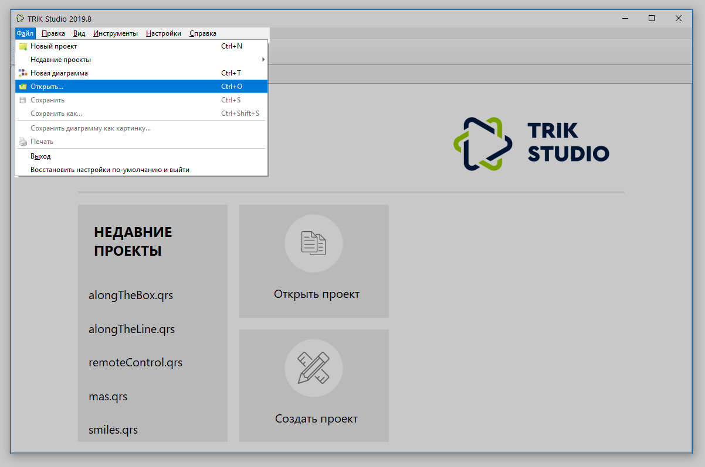
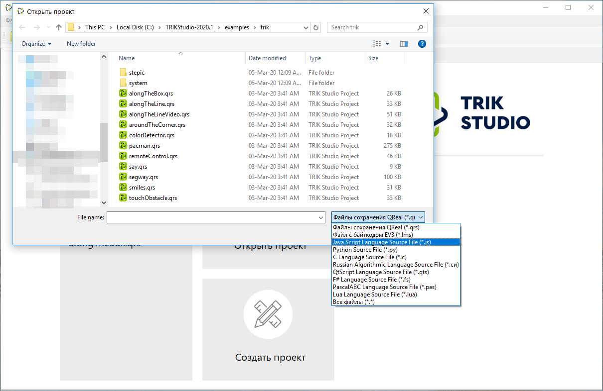

# Начало работы и создание проекта

## Главное окно

После запуска **TRIK Studio** откроется стартовая страница, на которой будет отображена [версия](about/version.md) TRIK Studio, быстрый доступ к недавним проектам, а также кнопки для [открытия существующего проекта](start.md#open-project) и [создания нового](start.md#new-project).

## Создание проекта 

Для создания нового проекта нажмите кнопку «Создать проект» на стартовой странице TRIK Studio.

Или в [главном меню](interface/main-menu.md) выберите `Файл → Новый проект`.&#x20;

Откроется окно с новой программой на визуальном языке программирования:

.png>)

О программировании на визуальном языке читайте в статье:


[programming-visual](programming-visual/)


Про создание новой текстовой программы читайте в статье:


[programming-code.md](programming-code.md)


## Запуск существующего проекта 

Для запуска существующего проекта нажмите кнопку «Открыть проект» на стартовой странице TRIK Studio.

Или в [главном меню](interface/main-menu.md) выберите `Файл → Открыть...`.&#x20;

По умолчанию TRIK Studio ищет файлы в формате `*.qrs` или последнего открытого формата (например, `*.js`). Если требуется существующий проект в другом формате, выберите в выпадающем меню нужный формат (например, `*.py)` или `Все файлы (*.*)`.

