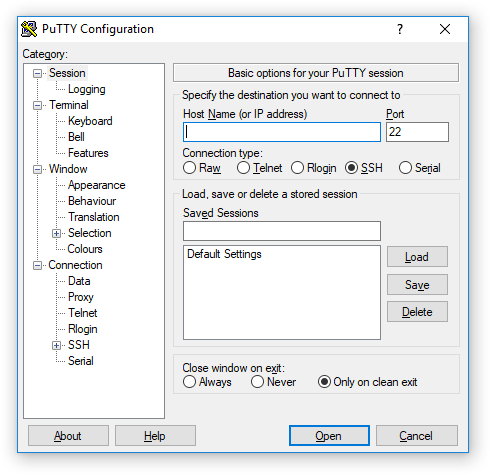

# PuTTY

**PuTTY** — клиентская программа для работы с сетевыми протоколами. К [контроллеру ТРИК](../../trik/about/) можно подключиться, используя протоколы **SSH** и **Serial**.

## Запуск PuTTY из TRIK Studio

Для запуска утилиты зайдите в меню `Инструменты → Сторонние утилиты → PuTTY`.

## Подключение к контроллеру ТРИК в PuTTY

1\. Подключите контроллер к компьютеру по [Wi-Fi](../../trik/wi-fi/network-connection.md).

2\. Пропишите в настройках студии на вкладке «[Роботы](../settings.md#robots)» IP-адрес контроллера, который отображается на главном экране контроллера.

3\. Запустите PuTTY из TRIK Studio, выбрав в главном меню `Инструменты → Сторонние утилиты → PuTTY`.

4\. В открывшемся окне введите логин `root`. Поле `Пароль` оставьте пустым.

