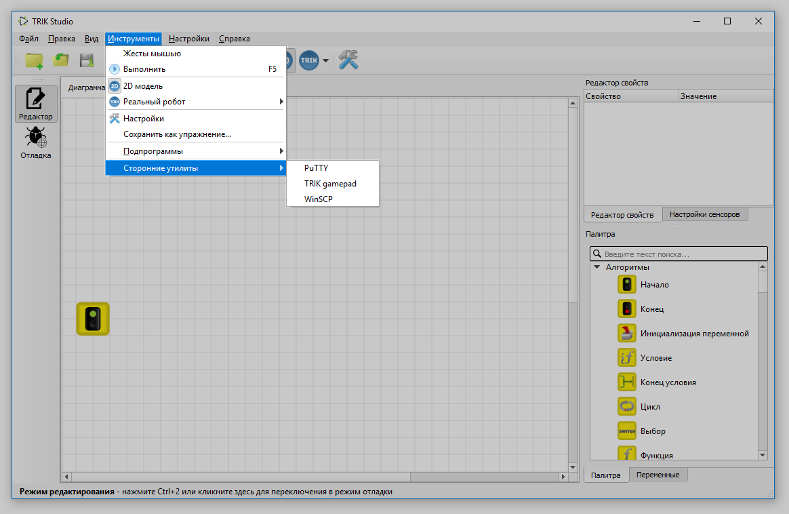
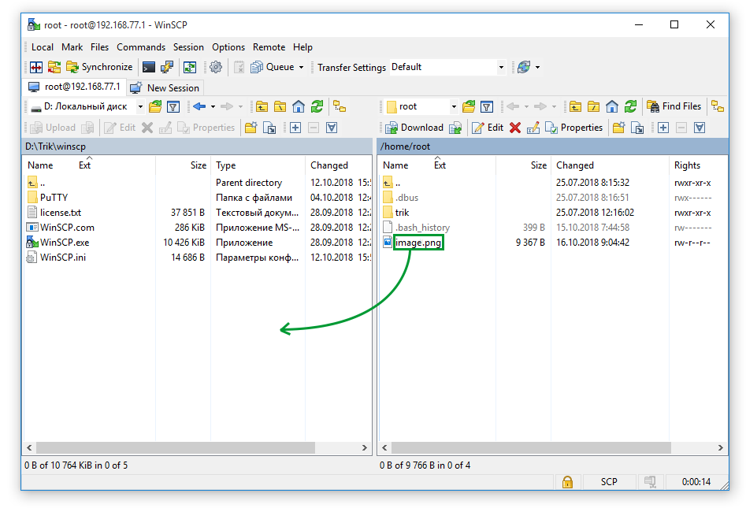

# WinSCP

**WinSCP** — графический клиент протоколов **SFTP** и **SCP**, предназначенный для Windows. С помощью него можно обмениваться файлами между контроллером ТРИК и компьютером по протоколу **SCP**.

## Запуск WinSCP из TRIK Studio

Для запуска утилиты зайдите в меню `Инструменты → Сторонние утилиты → WinSCP`.

## Подключение к контроллеру ТРИК в WinSCP

1\. В каталоге с установленной TRIK Studio зайдите в папку `winscp` и запустите `WinSCP.exe`

2\. **** Заполните данные:

* **File protocol:** SCP
* **Host name:** [IP-адрес контроллера](../../trik/wi-fi/network-connection.md#accesspoint).
* **User name:** root.

Поле `Password` оставьте пустым.

3\. Нажмите кнопку «Login».

4\. Если у вас появилось окно «Warning», нажмите «Yes».


Это предупреждение возникает, когда **WinSCP** подключается к новому серверу **SSH**.


5\. В левой части приложения будет находиться файловая система вашего компьютера, в правой — файловая система контроллера ТРИК.

