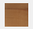
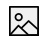
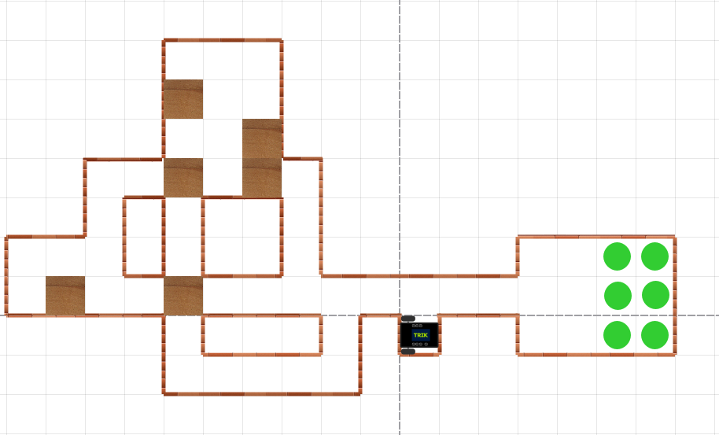

# 2D-модель в TRIK Studio Junior

Интерфейс и работа с 2D-моделью (интерактивным режимом имитационного моделирования) в TRIK Studio Junior почти полностью совпадает с интерфейсом и работой в TRIK Studio:


[2d-model](../studio/2d-model/)


Отличительной особенностью является только элемент [«Кубик»](2d-model.md#cube) на панели редактирования модели мира.

## **Редактирование модели мира** 

Редактирование модели мира **** осуществляется с помощью соответствующей панели.

|                                                                                                                                                         | Название                                              | Описание                                                                                                                                                                                                                                                                                                                                                                                                                                                 | Горячая клавиша |
| ------------------------------------------------------------------------------------------------------------------------------------------------------- | ----------------------------------------------------- | -------------------------------------------------------------------------------------------------------------------------------------------------------------------------------------------------------------------------------------------------------------------------------------------------------------------------------------------------------------------------------------------------------------------------------------------------------- | :-------------: |
|  | **Курсор**                                            | Переключение в режим выбора.                                                                                                                                                                                                                                                                                                                                                                                                                             |        1        |
|               | **Стена**                                             | 
Добавление на сцену препятствия в виде стены.

При добавлении с нажатой клавишей <code>Shift</code> стена помещается либо под прямым углом, либо под углом в 45<strong>°</strong> относительно границ окна. Отображается стена в виде «кирпичной» линии.  При касании такой линии датчиком касания или при попадании в зону действия датчиком расстояния происходит срабатывание сенсора. Робот не может проехать сквозь стену.
 |        2        |
|                                                                                          | ****[**Кубик**](2d-model.md#cube)****                 | Добавление на сцену препятствия в виде кубика                                                                                                                                                                                                                                                                                                                                                                                                            |        3        |
| 

                                                                | **Мяч**                                               | Добавление на сцену препятствия в виде мяча. При касании тележки он отскакивает на некоторое расстояние.                                                                                                                                                                                                                                                                                                                                                 |        4        |
|              | **Линия**                                             | 
Добавление на сцену прямой линии.

При добавлении линии с нажатой клавишей <code>Shift</code> линия помещается либо под прямым углом, либо под углом в 45<strong>°</strong> относительно границ окна.  На линию могут реагировать датчики света и цвета, расположенные на виртуальном роботе.

Можно <a href="../studio/2d-model/#editor-line">настраивать</a> цвет и толщину линии.
                                |        5        |
|                                       | **Кривая Безье**                                      | 
Добавление на сцену линии с возможностью закругления.  На линию могут реагировать датчики света и цвета, расположенные на виртуальном роботе.  Можно <a href="../studio/2d-model/#editor-line">настраивать</a> цвет и толщину линии.
                                                                                                                                                                                                  |        6        |
|                                    | **Прямоугольник**                                     | 
Добавление на сцену прямоугольника.  Можно <a href="../studio/2d-model/#editor-line">настраивать</a> цвет и толщину линий прямоугольника, а также цвет его заливки.
                                                                                                                                                                                                                                                                         |        7        |
|            | **Эллипс**                                            | 
Добавление на сцену эллипса.  Можно <a href="../studio/2d-model/#editor-line">настраивать</a> цвет и толщину линий эллипса, а также цвет его заливки.
                                                                                                                                                                                                                                                                                       |        8        |
|             | **Стилус**                                            | 
Рисование линии мышью. 

На нарисованную линию могут реагировать датчики света и цвета, расположенные на виртуальном роботе.

Можно <a href="../studio/2d-model/#editor-line">настраивать</a> цвет и толщину линий.
                                                                                                                                                                                                           |        9        |
|                                                                                         | ****[**Картинка**](../studio/2d-model/#add-image)**** | Добавление на сцену готового фона.                                                                                                                                                                                                                                                                                                                                                                                                                       |        0        |

### Кубик 

Элемент «Кубик» позволяет создавать упражнения в виде игр-головоломок, в которой «Исполнителю» необходимо расставить ящики по обозначенным местам лабиринта.

