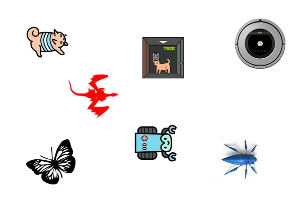
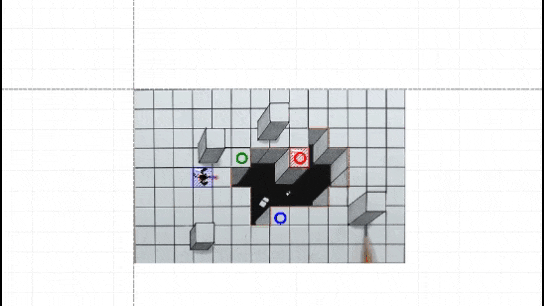
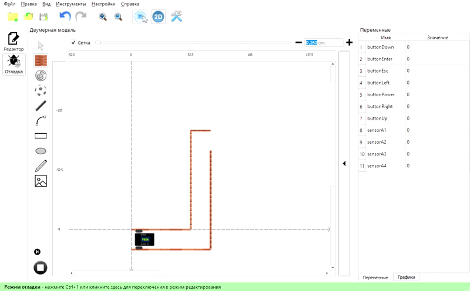

# О TRIK Studio Junior

**TRIK Studio** **Junior** — бесплатная среда программирования с [«Исполнителем»](./#chto-takoe-ispolnitel) для начальной и средней школы.

Среда имеет общий интерфейс со средой программирования роботов [TRIK Studio](../../studio/about/), что позволяет вести непрерывный процесс обучения, начиная с начальной школы.

## Особенности TRIK Studio Junior 

1\. Поддержаны основные алгоритмические структуры (следование, ветвление, циклы, подпрограммы, массивы), математические и логические операции, а также команды для перемещения «Исполнителя».


[blocks.md](../programming/blocks.md)


2\. Вы можете загрузить как своего «Исполнителя» и мир, так и [выбрать](https://trikset.com/products/trik-studio-junior#fields) из заготовленных.


[robot-image-change.md](../interfeis-trik-studio-junior/robot-image-change.md)


3\. Вы можете создавать упражнения для самостоятельного выполнения с автоматической проверкой.


[exercises.md](../exercises.md)


4\. Так же, как и в TRIK Studio, в TRIK Studio Junior есть [интерактивный режим имитационного моделирования](../../studio/2d-model/). Чтобы научиться программировать, необязательно иметь конструктор.


Так как интерфейс и работа в **TRIK Studio** **Junior** во многих моментах совпадает с интерфейсом и работой в **TRIK Studio**, в некоторых статьях данного раздела будут даны ссылки на аналогичные статьи раздела справки про TRIK Studio.


## Что такое «Исполнитель»

«Исполнитель» — объект, который понимает и исполняет команды алгоритма. В TRIK Studio Junior можно менять изображение исполнителя.


[robot-image-change.md](../interfeis-trik-studio-junior/robot-image-change.md)


## Скачать TRIK Studio Junior 

Последнюю версию TRIK Studio Junior можно скачать на сайте [trikset.com](https://trikset.com/downloads#trikstudiojr).


[version.md](version.md)


## Рекомендуемые системные требования для TRIK Studio Junior 

* Оперативная память: 4 ГБ или больше.
* Операционная система:
  * 64-разрядная Windows 10.
  * Ubuntu 16.04 и выше.
  * macOS 10.12 Sierra и выше.
