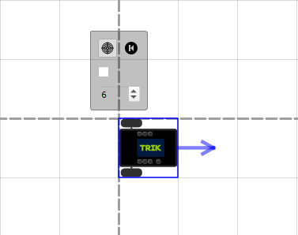
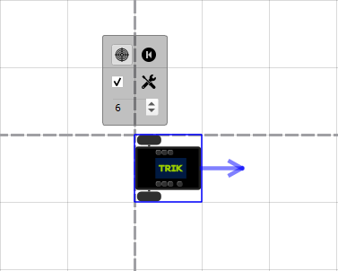
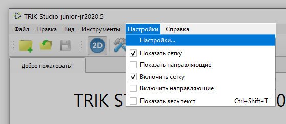
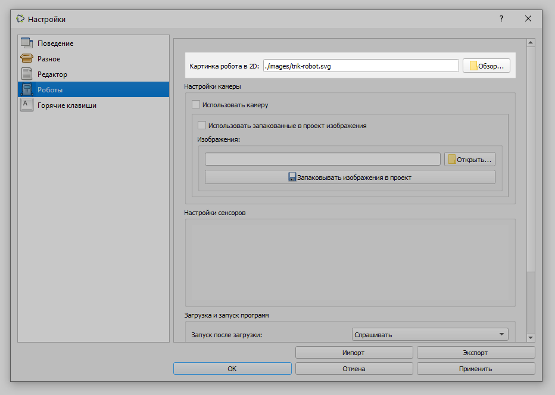

# Как заменить изображение «Исполнителя» в TRIK Studio Junior?

Изменить изображение «Исполнителя» можно двумя способами:

1. [В контекстом меню исполнителя](robot-image-change.md#context). Здесь можно добавить несколько изображений, которые будут менятся в зависимости от направления движения «Исполнителя».
2. [В настройках TRIK Studio Junior](robot-image-change.md#settings).


Если выбрано изображение в контекстном меню «Исполнителя», то изображение, выбранное в настройках TRIK Studio Junior **игнорируется**.


## Замена изображения «Исполнителя» в контекстном меню 

1\. Кликните левой кнопкой мыши на «Исполнителя».

2\. Поставьте «галочку» во второй строке. Появится иконка для выбора изображения «Исполнителя».


Если вы захотите вернуться к варианту изображения «Исполнителя» по умолчанию (изображение, выбранное [в настройках](robot-image-change.md#settings)), уберите «галочку».


3\. Нажмите на появившуюся иконку и выберите одно или несколько изображений «Исполнителей».

Выбор нескольких изображений «Исполнителей» необходим, если у вас есть изображения в разных проекциях. Имя таких файлов должны оканчиваться на:

* `_up` — для изображения, когда «Исполнитель» движется **наверх**
* `_down`— для изображения, когда «Исполнитель» движется **вниз**
* `_right` — для изображения, когда «Исполнитель» движется **направо**
* `_left` — для изображения, когда «Исполнитель» движется **налево**

## Замена изображения «Исполнителя» в настройках TRIK Studio Junior 

1\. Выберите в [главном меню](../../studio/interface/main-menu.md#menu-settings) `Настройки → Настройки...`.

2\. В открывшемся окне выберите вкладку «Роботы», нажмите рядом с полем «Картинка робота в 2D» кнопку «Обзор» и выберите нужное изображение.

3\. Нажмите «OK».

## Скачать изображения «Исполнителя» 

На сайте trikset.com вы можете [скачать](https://trikset.com/products/trik-studio-junior#fields) заготовленные изображения «Исполнителей».
