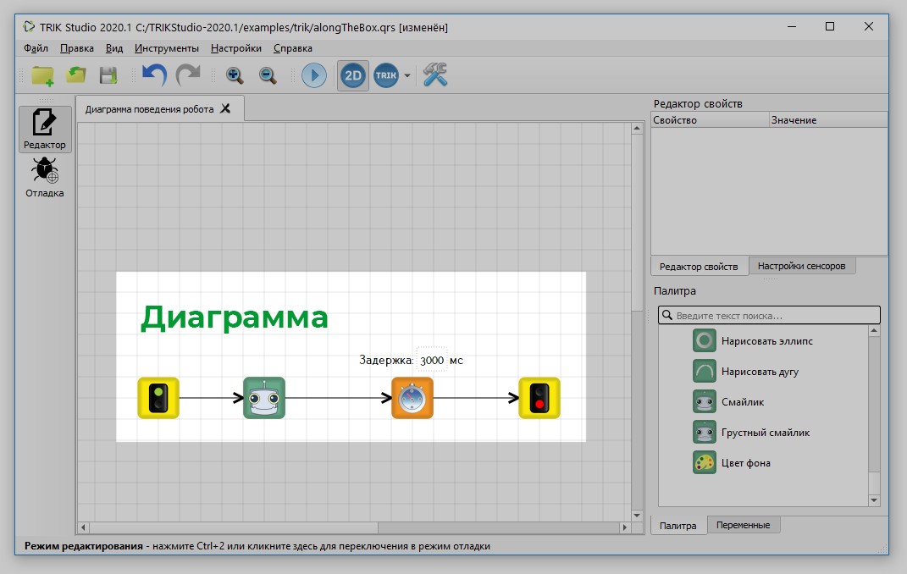
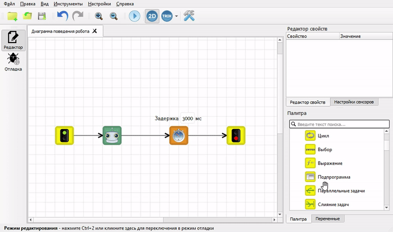

# Программирование на визуальном языке в TRIK Studio Junior

Программа в TRIK Studio Junior представляется в виде последовательности [блоков](blocks.md), соединённых [связями](connection-between-blocks.md).&#x20;

.png>)

Каждой программе соответствует [главная диаграмма](./#main-diagramm), которая может содержать [другие диаграммы (подпрограммы)](./#subprogram). Диаграммы упаковываются в проекты, хранящиеся на диске.

## Главная диаграмма 

Главная диаграмма создаётся при [создании проекта](../start.md#new-project). Про добавление и удаление блоков на [сцену](../../studio/interface/#editor-window-1) читайте в статье:


[blocks-add-delete.md](blocks-add-delete.md)


## Подпрограммы 

Диаграммы с подпрограммами создаются автоматически при добавлении блока «Подпрограмма» на сцену. При этом отображение подпрограммы происходит при двойном клике на блок «Подпрограмма» на сцене.

Подробнее о подпрограммах читайте в статье:


[subprograms.md](subprograms.md)

