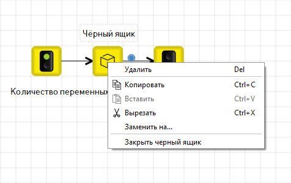
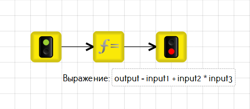
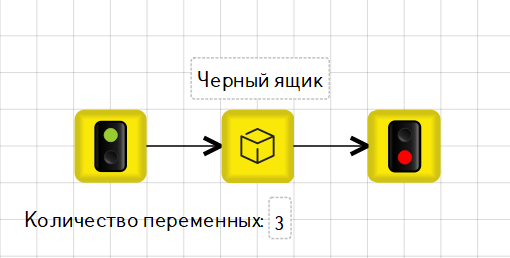
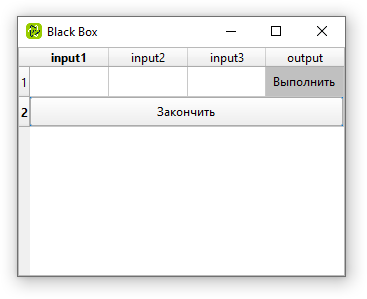
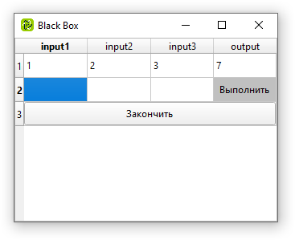
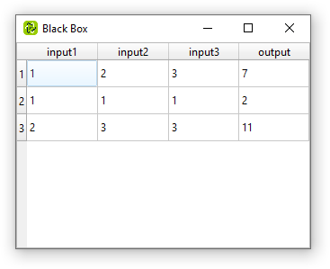

# Блоки в TRIK Studio Junior

Блоки в TRIK Studio Junior делятся на четыре категории:

1. [Алгоритмы](blocks.md#algorithms) — блоки для описания алгоритмов.
2. [Действия](blocks.md#action-blocks) — блоки, выполняющие какое-либо действие «Исполнителя»: команды проезда вперед, поворотов, проигрывания звука и других.
3. [Ожидания](blocks.md#waiting-blocks) — блоки, ждущие наступления какого-либо события: определённых показаний датчиков, нажатия на кнопку и т. д.
4. [Рисования](blocks.md#bloki-risovaniya) — блоки, используемые для вывода графики и текста на экран.

## Алгоритмы 

|                                                                                              Вид                                                                                              |                             Название                            | Описание                                                                                                                                                                                                                                                                                            |
| :-------------------------------------------------------------------------------------------------------------------------------------------------------------------------------------------: | :-------------------------------------------------------------: | --------------------------------------------------------------------------------------------------------------------------------------------------------------------------------------------------------------------------------------------------------------------------------------------------- |
|   |                    [Начало](blocks.md#start)                    | 
Начальная точка выполнения программы.

На каждой диаграмме должен быть только один такой блок. В него не должно быть входящих связей, а исходящая связь из этого элемента должна быть только одна.

Процесс интерпретации диаграммы начинается именно с этого блока.
 |
|                                                                                                                |                     [Конец](blocks.md#final)                    | 
Конец программы.

Если программа состоит из нескольких параллельных участков выполнения, достижение этого блока завершает соответствующий участок выполнения.

У данного блока не может быть исходящих связей.
                                                       |
|                                                                                                    |         [Инициализация переменной](blocks.md#condition)         | Блок для объявления новой переменной и задания ей значения.                                                                                                                                                                                                                                         |
|                                                                                                               |                 [Условие](blocks.md#condition-1)                | Разделение выполнения программы в соответствии с заданным условием.                                                                                                                                                                                                                                 |
|                                                                                                                |                 [Конец условия](blocks.md#endif)                | Обозначает слияние двух веток условного оператора. Никаких действий не выполняет, но полезен для обеспечения структурности программы.                                                                                                                                                               |
|                                                                                                  |              [Цикл с предусловием](blocks.md#while)             | Цикл, который выполняется пока истинно некоторое условие, указанное перед его началом. Это условие проверяется до выполнения тела цикла, поэтому тело может быть не выполнено ни разу (если условие с самого начала ложно).                                                                         |
|                                                                                                                 |                      [Цикл](blocks.md#loop)                     | Блок, организующий выполнение последовательности блоков несколько раз.                                                                                                                                                                                                                              |
|                                                                                                               |                    [Выбор](blocks.md#switch)                    | Условие с несколькими альтернативами.                                                                                                                                                                                                                                                               |
|                                                                                                             |                [Выражение](blocks.md#expression)                | Считает значение заданного выражения. Также допускается инициализация переменных.                                                                                                                                                                                                                   |
|                                                                                                      |               [Подпрограмма](blocks.md#subprogram)              | Вызов подпрограммы.                                                                                                                                                                                                                                                                                 |
|                                                                                                                |                [Черный ящик](blocks.md#black-box)               | Подпрограмма, которую нельзя отредактировать после сохранения.                                                                                                                                                                                                                                      |
|                                                                                                                 |              [Параллельные задачи](blocks.md#fork)              | Блок разделяет выполнение программы на несколько потоков.                                                                                                                                                                                                                                           |
|                                                                                                              | [Слияние задач](../../studio/programming-visual/blocks.md#join) | Блок слияния параллельных задач.                                                                                                                                                                                                                                                                    |
|                                                                                                           |             [Завершить задачу](blocks.md#killthread)            | Завершает задачу с указанным в свойстве «Задача» идентификатором. Должен применяться из другой задачи.                                                                                                                                                                                              |
|                                                                                                           |               [Случайное число](blocks.md#random)               | Блок для присвоения указанной переменной случайного целого числа из заданного промежутка.                                                                                                                                                                                                           |
|                                                                                                             |                 [Комментарий](blocks.md#comment)                | Блок для добавления на диаграмму произвольного текста в качестве комментария.                                                                                                                                                                                                                       |

### Начало 

Начальная точка выполнения программы.

На каждой диаграмме должен быть только один такой блок. В него не должно быть входящих связей, а исходящая связь из этого элемента должна быть только одна.

Процесс интерпретации диаграммы начинается именно с этого блока.

### Конец 

.png>)

Конец программы.

Если программа состоит из нескольких параллельных участков выполнения, достижение этого блока завершает соответствующий участок выполнения.

У данного блока не может быть исходящих связей.

### Инициализация переменной 

Блок для объявления новой переменной и задания ей значения. Этого же можно добиться с помощью блока «[Выражение](blocks.md#expression)», но этот блок делает программу понятнее.

#### Свойства

| Свойство       | Описание                                                           |
| -------------- | ------------------------------------------------------------------ |
| **Значение**   | Указывается выражение, определяющее начальное значение переменной. |
| **Переменная** | Указывается имя переменной.                                        |

### Условие 

.png>)

Разделение выполнения программы в соответствии с заданным условием.

У данного блока должны быть две исходящие связи, у хотя бы одной из которых должно быть задано значение параметра «Условие»: «истина» или «ложь».

#### Свойства

| Свойство    | Описание                                                                                                                                                                                            |
| ----------- | --------------------------------------------------------------------------------------------------------------------------------------------------------------------------------------------------- |
| **Условие** | Указывается логическое выражение (подробнее см. в статье «[Синтаксис выражений](expression-syntax.md)»), на основе значения которого будет осуществлен выбор дальнейшего пути выполнения диаграммы. |

### Конец условия 

.png>)

Обозначает слияние двух веток условного оператора.\
\
Никаких действий не выполняет, но полезен для обеспечения структурности программы. Если придерживаться правила, что все ветки операторов «[Условие](blocks.md#condition-1)» или «[Выбор](blocks.md#switch)» сходятся на таком блоке, это существенно повысит шансы на то, что генератор сможет породить код на текстовом языке без операторов `goto`.

### Цикл с предусловием 

.png>)

Цикл с предусловием — цикл, который выполняется пока истинно некоторое условие, указанное перед его началом. Это условие проверяется до выполнения тела цикла, поэтому тело может быть не выполнено ни разу (если условие с самого начала ложно).

#### Свойства

| Свойство    | Описание                                                                                                                                                                                            |
| ----------- | --------------------------------------------------------------------------------------------------------------------------------------------------------------------------------------------------- |
| **Условие** | Указывается логическое выражение (подробнее см. в статье «[Синтаксис выражений](expression-syntax.md)»), на основе значения которого будет осуществлен выбор дальнейшего пути выполнения диаграммы. |

### Цикл 

Блок, организующий выполнение последовательности блоков несколько раз.\
\
Число повторений задается значением параметра «Итерации». Блок должен иметь две исходящие связи, одна из которых должна быть помечена значением «тело цикла» (то есть значение параметра «Условие» у связи должно быть «тело цикла»). Другая связь, исходящая из блока «Цикл», должна оставаться непомеченной: по ней будет осуществляться переход, когда программа пройдет через блок «Цикл» указанное число раз.\
\
Бесконечные циклы и циклы вида `while/do` и `while` организуются без использования этого блока, зацикливанием потока управления с помощью связей. Выход из такого цикла осуществляется с помощью блока «[Условие](blocks.md#condition-1)».

### Выбор 

Условие с несколькими альтернативами.\
\
В параметре «Выражение» можно указать произвольное выражение (подробнее см. в разделе «[Синтаксис выражений](expression-syntax.md)»), на основе значения которого будет осуществлен выбор дальнейшего пути выполнения диаграммы.\
\
У данного блока должны быть несколько исходящих связей. Все связи, кроме одной, должны быть помечены элементарным значением (строка, число и др.), которое может принимать выражение (значение просто пишется в свойство «Условие» у связи). Одна из связей должна быть не помечена: по ней осуществляется переход, если выражение не равно ни одному из перечисленных значений.

### Выражение 

.png>)

Считает значение заданного выражения. Также допускается инициализация переменных.\
\
Подробнее про синтаксис допустимых выражений параметра «Выражение» см. в разделе «[Синтаксис выражений](expression-syntax.md)».

### Подпрограмма 

Вызов подпрограммы.\
\
Подпрограммы используются для вынесения повторяющихся фрагментов программы на отдельную диаграмму.\
\
При добавлении этого блока на диаграмму будет предложено ввести имя подпрограммы, после чего двойным кликом на блоке можно будет перейти на диаграмму, соответствующую данной подпрограмме. Также появится дополнительная палитра со всеми подпрограммами. Подпрограммы из неё можно перетаскивать на сцену и использовать как обычные блоки.\
\
Вид, имя и свойства блока можно изменить с помощью контекстного меню.

#### Свойства

Изменение свойств у данного блока происходит не на панели «Редактор свойств», а с помощью пункта «Изменить свойства» в контекстном меню. Для вызова контекстного меню нажмите правой кнопкой мыши на блок «Подпрограмма».

В открывшемся окне вы можете:

* Изменить имя подпрограммы.
* Добавить и изменить параметры подпрограммы, задав имя, тип и значение.
* Изменить картинку на иконке вашей подпрограммы.
* Изменить фон иконки подпрограммы.

### Черный ящик 

 (1).png>)

Блок «Черный ящик» используется для составления задач на поиск правила обработки информации.

#### Свойства блока

| Свойство              | Описание                                                                                                                                                            |
| --------------------- | ------------------------------------------------------------------------------------------------------------------------------------------------------------------- |
| Количество переменных | В данном свойстве необходимо указать количество переменных, которые необходимо подать на вход. В подпрограмме должно использоваться такое же количество переменных. |

#### Как работает блок

На вход подается одно или несколько значений, на выходе выдается одно значение. Ученику необходимо понять, по какому правилу обрабатывается информация.

Само правило записывается в виде алгоритма «внутри» блока «Черный ящик». То есть по сути это подпрограмма, которую нельзя отредактировать после сохранения.

#### Алгоритм работы с блоком

1. Добавить блок «Черный ящик» на сцену.
2. Написать алгоритм подпрограммы «Черного ящика».
3. Указать в свойствах количество переменных.
4. В контекстном меню выбрать «Закрыть "Черный ящик"». После этого подпрограмму отредактировать будет нельзя.


**Важно!** Если вы используете одну переменную в подпрограмме, то её имя должно быть **`input`**. Если вы используете несколько переменных, то **`input1`**,  **`input2`**, **`input3`** и т.д.

Выходная переменная должна именоваться **`output`**.


#### Пример

1\. Запрограммируем правило, по которому входные значения обрабатываются следующим образом:

`Результат = Переменная1 + Переменная2 + Переменная3`

2\. Добавим блок «Черный ящик» и напишем подпрограмму:

3\. Главная диаграмма будет выглядеть так:

4\. «Закроем» блок и сохраним программу.

5\. При выполнении программы и обработке блока «Чёрный ящик» появится окно:

6\. Введем все значения и нажмем кнопку «Выполнить».

7\. Далее можно вводить комбинации значений до тех пор, пока мы не установим правило обработки. Нажмем кнопку «Завершить».

8\. После этого продолжиться выполнение алгоритма программы.

### Параллельные задачи 

Блок разделяет выполнение программы на несколько потоков. Например, можно одновременно ждать срабатывания сенсора и истечения временного интервала.\
\
Блок должен иметь хотя бы две исходящие связи.\
\
Чтобы иметь возможность далее ссылаться на параллельные задачи, порождённые этим блоком (например, в блоке «[Завершить задачу](blocks.md#killthread)» или в блоке «[Слияние задач](blocks.md#join)») надо дать задачам имена. Это делается на исходящих связях, в свойстве «Условие». Именем задачи может быть любая строка, но одним из имён должно быть имя задачи, которая входит в этот блок. Имя главной программы — `main`.

### Слияние задач 

Блок слияния параллельных задач.\
\
Блокирует исполнение программы до тех пор, пока исполнение всех параллельных задач, входящих в этот блок, не достигнет этого блока.\
\
Блок должен иметь не менее двух входящих связей. На исходящей связи (в свойстве «Условие») должен быть идентификатор задачи, которая продолжится после того, как блок отработает.

### Завершить задачу 

Завершает задачу с указанным в свойстве «Задача» идентификатором. Должен применяться из другой задачи.

### Случайное число 

Блок для присвоения указанной переменной случайного целого числа из заданного с помощью свойств «От» и «До» промежутка.

### Комментарий 

Блок для добавления на диаграмму произвольного текста в качестве комментария.

Используется для пояснения конкретного блока или участка диаграммы. Может быть связан с блоком, который он поясняет.

При выполнении программы блок не учитывается.

## Блоки действия 

| Вид                                                                                            |                             Название                             | Описание                                                                      |
| ---------------------------------------------------------------------------------------------- | :--------------------------------------------------------------: | ----------------------------------------------------------------------------- |
|   | [Отправить сообщение в задачу](blocks.md#send-message-to-thread) | Отправляет данное сообщение в параллельную задачу с заданным идентификатором. |
|            |         [Получить код кнопки](blocks.md#get-button-code)         | Сохраняет в указанную переменную код нажатой на роботе кнопки.                |
|    |               [Вперед](blocks.md#get-button-code-1)              | Перемещает «Исполнителя» на указанное количество клеток вперед.               |
|   |               [Назад](blocks.md#get-button-code-2)               | Перемещает «Исполнителя» на указанное количество клеток назад.                |
|         |              [Направо](blocks.md#get-button-code-3)              | Поворачивает «Исполнителя» направо.                                           |
|          |               [Налево](blocks.md#get-button-code-4)              | Поворачивает «Исполнителя» налево.                                            |
|                      |                     [Сказать](blocks.md#say)                     | Произнести с помощью динамика фразу, переданную в качестве аргумента блока.   |
|                  |                    [Светодиод](blocks.md#led)                    | Установить указанный цвет светодиода на корпусе контроллера.                  |

### Отправить сообщение в задачу 

.png>)

Отправляет данное сообщение в параллельную задачу с заданным идентификатором (идентификатор должен быть указан при создании задачи в блоке [«Параллельные задачи»](blocks.md#fork)).\
\
В качестве сообщения может быть любое выражение.

### Получить код кнопки 

.png>)

Сохраняет в указанную переменную код нажатой на роботе кнопки.\
\
Свойство «Ожидание» позволяет дождаться или не дожидаться, когда кнопка действительно будет нажата. Если нажатия кнопки блок не дожидается и кнопка не нажата, переменной присваивается значение «-1».

### Вперед 

.png>)

Перемещает «Исполнителя» на указанное количество клеток вперед.\
\
Свойство «Количество» позволяет задать количество клеток, на которое должен переместиться «Исполнитель».

### Назад 

Перемещает «Исполнителя» на указанное количество клеток назад.\
\
Свойство «Количество» позволяет задать количество клеток, на которое должен переместиться «Исполнитель».

### Направо 

Поворачивает «Исполнителя» направо.

### Налево 

Поворачивает «Исполнителя» налево.

### Сказать 

.png>)

Произнести с помощью динамика фразу, переданную в качестве аргумента блока.

### Светодиод 

.png>)

Установить указанный цвет светодиода на корпусе контроллера.

## Блоки ожидания 

|                                                Вид                                                |                                   Название                                   | Описание                                                                                           |
| :-----------------------------------------------------------------------------------------------: | :--------------------------------------------------------------------------: | -------------------------------------------------------------------------------------------------- |
|                    |                          [Таймер](blocks.md#timer-1)                         | Блок для задания задержки. Устанавливается время задержки в параметре «Задержка» в миллисекундах.  |
|   | [Получить сообщение из другой задачи](blocks.md#receive-message-from-thread) | Ждать получения сообщения из другой параллельной задачи.                                           |
|                      .png>)                     |                 [Пользовательский ввод](blocks.md#userinput)                 | Ждать ввода значения от пользователя.                                                              |
|          |               [Ждать нажатия кнопки](blocks.md#wait-for-button)              | Ждать, пока не будет нажата указанная кнопка на корпусе робота.                                    |

### Таймер 

Блок для задания задержки. Устанавливается время задержки в параметре «Задержка» в миллисекундах.&#x20;

### Получить сообщение из другой задачи 

.png>)

Ждать получения сообщения из другой параллельной задачи.\
\
Когда сообщение будет получено, оно будет присвоено указанной в блоке переменной.\
\
Свойство «Дождаться сообщения» позволяет указать, что делать, если очередь сообщений пуста: дождаться прихода нового сообщения или продолжить работу, присвоив переменной пустую строку.\
\
Сообщение автоматически приводится к типу, соответствующему типу переменной-приёмника. Пример: если вы посылаете число в виде строки, то оно будет принято как число.

### Пользовательский ввод 

Ждать ввода значения от пользователя. После ввода значение будет присвоено указанной в блоке переменной.

#### Свойства

Блок «Пользовательский ввод» имеет 3 свойства:

| Свойство         | Описание                          |
| ---------------- | --------------------------------- |
| **Переменная**   | Имя переменной.                   |
| **По умолчанию** | Значение переменной по умолчанию. |
| **Текст**        | Описание поля ввода.              |

**Пример**

| **Программа**                                                                  | Исполнение программы                                                           |
| ------------------------------------------------------------------------------ | ------------------------------------------------------------------------------ |
| 

 | 

 |

### Ждать нажатия кнопки 

.png>)

Ждать, пока не будет нажата указанная кнопка на корпусе робота.

## Блоки рисования

| Вид                                                                                     |                       Название                       | Описание                                                                                                                                                                                                         |
| --------------------------------------------------------------------------------------- | :--------------------------------------------------: | ---------------------------------------------------------------------------------------------------------------------------------------------------------------------------------------------------------------- |
|   |       [Очистить экран](blocks.md#clear-screen)       | Стереть всё, что нарисовано на экране.                                                                                                                                                                           |
|     |        [Опустить маркер](blocks.md#markerdown)       | Начать рисование маркером заданного цвета на полу. При движении «Исполнителя» за ним будет оставаться цветная линия.                                                                                             |
|       |         [Поднять маркер](blocks.md#markerup)         | Закончить рисование маркером.                                                                                                                                                                                    |
|              |          [Закрасить клетку](blocks.md#fill)          | Закрасить клетку, на которой находится «Исполнитель».                                                                                                                                                            |
|     |       [Напечатать текст](blocks.md#print-text)       | Печатает заданную строку в заданном месте на экране робота. Значение свойства «Текст» по умолчанию трактуется как строка в чистом виде, оно так и будет выведено на экран.                                       |
|        |         [Цвет кисти](blocks.md#painter-color)        | Указать цвет, которым будут рисоваться простые графические фигуры на экране робота.                                                                                                                              |
|        |       [Толщина кисти](blocks.md#painter-width)       | Указать ширину линии, которой будут рисоваться простые графические фигуры на экране робота.                                                                                                                      |
|     |       [Нарисовать точку](blocks.md#draw-pixel)       | Нарисовать на экране точку в указанных координатах.                                                                                                                                                              |
|      |        [Нарисовать линию](blocks.md#draw-line)       | Нарисовать на экране отрезок. В качестве параметров блоку указываются концы отрезка.                                                                                                                             |
|      | [Нарисовать прямоугольник](blocks.md#draw-rectangle) | Нарисовать на экране прямоугольник. В качестве параметров указываются координаты левого верхнего угла, ширина и высота прямоугольника.                                                                           |
|    |      [Нарисовать эллипс](blocks.md#draw-ellipse)     | Нарисовать на экране эллипс, вписанный в заданный прямоугольник.                                                                                                                                                 |
|           |         [Нарисовать дугу](blocks.md#draw-arc)        | Нарисовать на экране дугу, заданную координатами прямоугольника, в который она будет вписана, и углами (в градусах) её начала и конца на окружности. Если начало и конец совпадают, будет нарисована окружность. |
|             |              [Смайлик](blocks.md#smile)              | Нарисовать на экране смайлик.                                                                                                                                                                                    |
|          |        [Грустный смайлик](blocks.md#sad-smile)       | Нарисовать на экране грустный смайлик.                                                                                                                                                                           |
|     |        [Цвет фона](blocks.md#background-color)       | Задаёт цвет фона экрана.                                                                                                                                                                                         |

### Очистить экран 

.png>)

Стереть всё, что нарисовано на экране.

### Опустить маркер 

Начать рисование маркером заданного цвета на полу. При движении «Исполнителя» за ним будет оставаться цветная линия.

### Поднять маркер 

Закончить рисование маркером.

### Закрасить клетку 

.png>)

Закрасить клетку, на которой находится «Исполнитель», выбранным цветом. Цвет выбирается в свойствах блоках в выпадающем меню.

#### Свойства

| Свойство  | Описание                                                                                                   |
| --------- | ---------------------------------------------------------------------------------------------------------- |
| Цвет      | Цвет, которым будет закрашиваться клетка.                                                                  |
| Вычислять | 
Истина — печатает в клетке значение переменной или выражения.

Ложь — печатает в клетке текст.
 |
| Текст     | Текст / имя переменной (выражение) для вывода в клетке.                                                    |

### Напечатать текст 

.png>)

Печатает заданную строку в заданном месте на экране робота.

#### Свойства

| Свойство          | Значение                                                                                              |
| ----------------- | ----------------------------------------------------------------------------------------------------- |
| Вычислять         | 
Истина — вывод на экран значения переменной или выражения.

Ложь — вывод на экран текста.
 |
| Текст             | Текст / имя переменной (выражение) для вывода на экран.                                               |
| Обновить картинку | 
Истина — обновить экран. Ложь — не обновлять экран.
                                         |
| X, Y              | Координаты начала текста.                                                                             |

#### Как вывести текст на экран?

Для вывода текста:

1. В свойстве «Текст» напишите нужный текст.
2. Уберите галочку в свойстве «Вычислять».

#### Как вывести значение переменной на экран?

Для вывода значения переменной:

1. В свойстве «Текст» напишите имя переменной.
2. Поставьте галочку в свойстве «Вычислять».

### Цвет кисти 

.png>)

Указать цвет, которым будут рисоваться простые графические фигуры на экране робота.

### Толщина кисти 

.png>)

Указать ширину линии, которой будут рисоваться простые графические фигуры на экране робота.

### Нарисовать точку 

.png>)

Нарисовать на экране точку в указанных координатах.

### Нарисовать линию 

.png>)

Нарисовать на экране отрезок. В качестве параметров блоку указываются концы отрезка.

### Нарисовать прямоугольник 

.png>)

Нарисовать на экране прямоугольник. В качестве параметров указываются координаты левого верхнего угла, ширина и высота прямоугольника.

### Нарисовать эллипс 

.png>)

Нарисовать на экране эллипс, вписанный в заданный прямоугольник.

### Нарисовать дугу 

.png>)

Нарисовать на экране дугу, заданную координатами прямоугольника, в который она будет вписана, и углами (в градусах) её начала и конца на окружности. Если начало и конец совпадают, будет нарисована окружность.

### Смайлик 

.png>)

Нарисовать на экране смайлик.

### Грустный смайлик 

.png>)

Нарисовать на экране грустный смайлик.

### Цвет фона 

.png>)

Задаёт цвет фона экрана.

