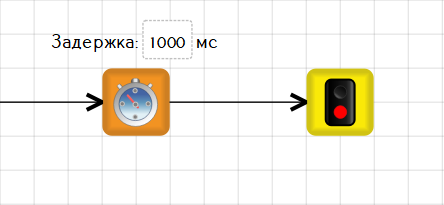

# Связи между блоками в TRIK Studio Junior

Связи между блоками в TRIK Studio Junior обозначают направление передачи управления между блоками.

#### Пример

Пусть необходимо, чтобы вслед за задержкой программа сразу же завершилась.\
\
Для этого надо соединить блоки [«Таймер»](blocks.md#timer) и [«Конец»](blocks.md#final) стрелкой, имеющей направление от блока «Таймер» к блоку завершения программы.

Создание и удаление связей в TRIK Studio Junior происходит так же, как и в TRIK Studio:


[connection-between-blocks.md](../../studio/programming-visual/connection-between-blocks.md)

