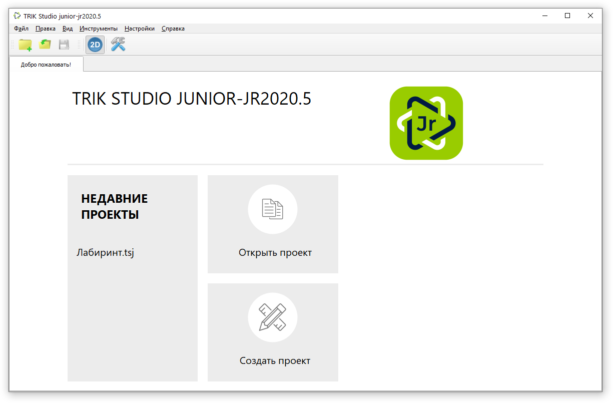
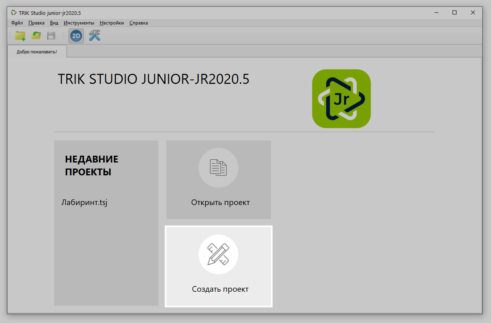
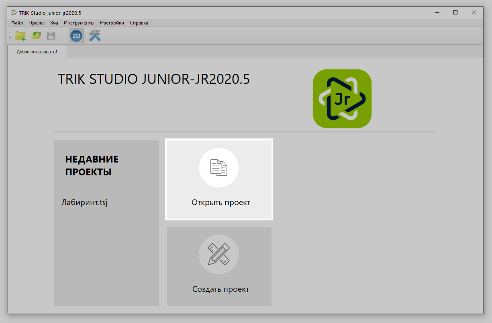
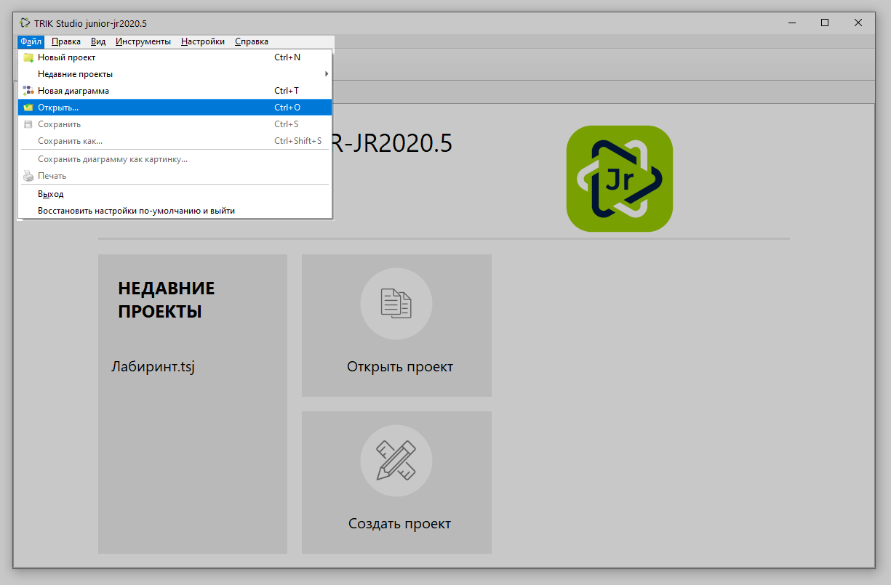

# Начало работы и создание проекта в TRIK Studio Junior

## Главное окно

После запуска **TRIK Studio Junior** откроется стартовая страница, на которой будет отображена [версия](about/version.md) TRIK Studio Junior, быстрый доступ к недавним проектам, а также кнопки для [открытия существующего проекта](start.md#new-project) и [создания нового](start.md#open-project).

## Создание проекта 

Для создания нового проекта нажмите кнопку «Создать проект» на стартовой странице TRIK Studio Junior.

Или в [главном меню](../studio/interface/main-menu.md) выберите `Файл → Новый проект`.&#x20;

Откроется окно с новой программой на визуальном языке программирования:

.png>)

## Запуск существующего проекта 

Для запуска существующего проекта нажмите кнопку «Открыть проект» на стартовой странице TRIK Studio Junior.

Или в [главном меню](../studio/interface/main-menu.md) выберите `Файл → Открыть...`.&#x20;

По умолчанию TRIK Studio Junior ищет файлы в формате `*.tsj` .
