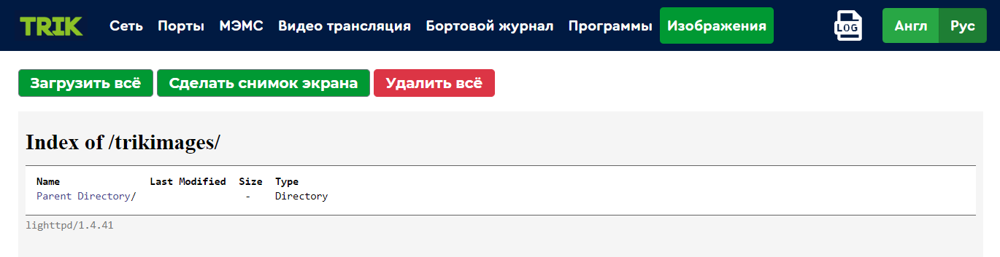
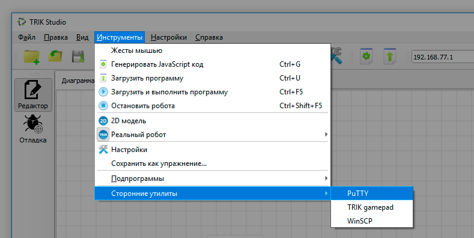
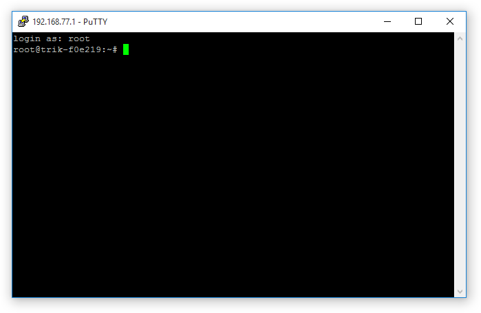
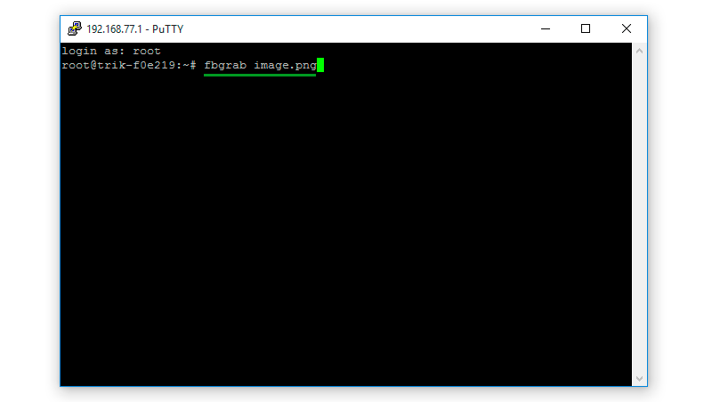
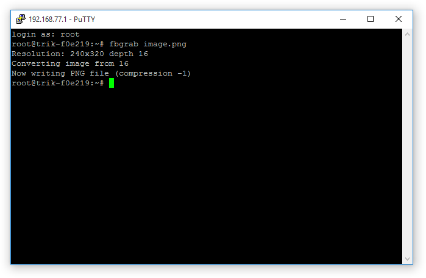
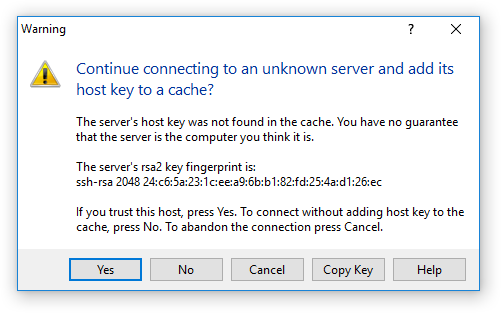

# Скриншот экрана контроллера ТРИК

Скриншот экрана контроллера ТРИК можно сделать двумя способами:

1. С помощью [веб-интерфейса](screenshot.md#web).
2. С помощью утилит [PuTTY и WinSCP](screenshot.md#utilities).

## С помощью веб-интерфейса 

1\. Подключитесь к контроллеру по Wi-Fi любым из [способов](../wi-fi/network-connection.md).

2\. Войдите в [веб-интерфейс](../web-interface.md), набрав ip-адрес контроллера в браузере.

3\. Убедитесь, что на экран контроллера выведено изображение или текст, скриншот которого хотите сделать.

4\. Выберите в веб-интерфейсе пункт меню «Изображение» и нажмите кнопку «Сделать снимок экрана».

5\. После этого скриншот появится в списке. Если этого не произошло, обновите страницу.

.png>)

6\. Для загрузки сделанных скриншотов нажмите кнопку «Загрузить всё».

## С помощью утилит PuTTY и WinSCP 

1\. Подключитесь к контроллеру по Wi-Fi любым из [способов](../wi-fi/network-connection.md).

2\. Откройте TRIK Studio.

3\. Запустите утилиту [PuTTY](../../studio/utilities/putty.md). Для этого в главном меню откройте `Инструменты → Сторонние программы → PuTTY`.

4\. Дождитесь завершения процесса подключения.&#x20;

5\. Убедитесь, что на экран контроллера выведено изображение или текст, скриншот которого хотите сделать.

6\. Введите команду `fbgrab image.png`, где `image` — произвольное название сохраненного изображения.

7\. При удачном исходе в консоль будет выведен следующий текст:

`Resolution: 240x320 depth 16`\
`Converting image from 16`\
`Now writing PNG file (compression -1)`

8\. Запустите утилиту [WinSCP](../../studio/utilities/winscp.md). Для этого в главном меню откройте `Инструменты → Сторонние программы → WinSCP`.&#x20;

9\. Если у вас появилось окно «Warning», нажмите «Yes».

10\. Выберите в левом окне директорию, в которую хотите сохранить снимок. Перетащите созданное изображение из правого окна в левое.

