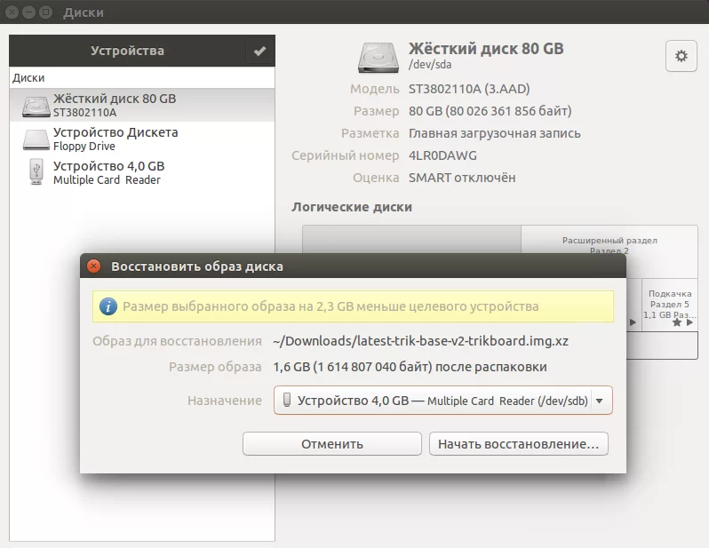

# Обновление встроенного программного обеспечения контроллера ТРИК

Выберите операционную систему:

* [Windows](./#windows)
* [Linux](./#linux)
* [Ubuntu](./#ubuntu)

## Windows

1\. Скачайте последнюю версию [встроенного программного обеспечения](https://trikset.com/downloads#firmware).\
2\. Скачайте и установите программу [DiskImager](https://github.com/RomanBelkov/DiskImager/releases/download/1.4.1/DiskImager.Installer.msi).&#x20;



**Внимание!** Для установки и использования DiskImager вам понадобятся права администратора.


3\. Извлеките карту памяти microSD из контроллера ТРИК.\
4\. Вставьте её в компьютер, используя картридер.\
5\. Запустите DiskImager. Для смены языка выберите в меню `About → Language`.


6\. Выберите диск для записи.


&#x20;7\. Нажмите «Восстановить флешки из образа» («Restore drives from»).


8\. В появившемся окне отфильтруйте файлы по типу `.xz` и выберите скачанный файл.


9\. Нажмите «Открыть».


10\. Дождитесь выполнения операции.


&#x20;   &#x20;

## Linux

1\. Скачайте последнюю версию [встроенного программного обеспечения](https://trikset.com/downloads#firmware).\
2\. Извлеките карту памяти microSD из контроллера ТРИК.\
3\. Вставьте её в компьютер, используя картридер.\
4\. Если SD-карта имеет правильную таблицу разделов (первый раздел не менее 2 Гб, файловая система ext4), то перейдите к пункту 18.\
5\. Получите права суперпользователя (root):

```
sudo -i
```

6\. Посмотрите устройства, которые в данный момент подключены к компьютеру:

```
fdisk -l
```

7\. Размонтируйте все разделы с помощью команды `umount`.

```
umount /dev/{first partition}
umount /dev/{second partition}
...
```

Пример:

```
umount /dev/sdb1
```

8\. Выберите вставленную карту памяти microSD:

```
fdisk /dev/{устройство}
```

Пример:

```
sudo fdisk /dev/sdb
```

9\. Посмотрите текущую таблицу разделов с помощью команды `p`.

```
p
```

10\. Удалите все существующие разделы с помощью команды `d`.

```
d
```

11\. Убедитесь, что все разделы удалились:

```
p
```

12\. Создайте новый раздел с помощью команды `n`.

```
n
```

13\. Все параметры, кроме размера, оставьте по умолчанию — жмите `Enter`. На запрос «Last sector, +sectors or +size{K, M, G}» укажите `+2G`.

```
Command (m for help): n
Partition type:
     p     primary (0 primary, 0 extended, 4 free)
     e     extended
Select (default p):
Partition number (1-4, default 1):
First sector (4096-784932712):
Last sector, +sectors or +size{K,M,G}: +2G
```

14\. Создайте раздел на оставшейся части карты памяти с помощью команды `n`. Все параметры оставьте по умолчанию.

```
Command (m for help): n
Partition type:
     p     primary (0 primary, 0 extended, 4 free)
     e     extended
Select (default p):
Partition number (1-4, default 1):
First sector (4096-784932712):
Last sector, +sectors or +size{K,M,G}:
```

15\. Проверьте командой `p`, что получилось.

```
p
```

16\. Примените изменения с помощью команды `w`.

```
w
```

17\. Отформатируйте разделы с помощью команд `sudo mkfs. ext4`.

```
sudo mkfs.ext4 /dev/{раздел}
```

Пример:

```
sudo mkfs.ext4 /dev/sdb1
sudo mkfs.ext4 /dev/sdb2
```

18\. Размонтируйте первый раздел с помощью команды `umount`.

```
umount /dev/{first partition}
```

Пример:

```
umount /dev/sdb1
```

19\. Распакуйте скачанный образ прошивки с помощью Archive Manager.\
20\. Скопируйте распакованный образ на карту памяти с помощью команды `dd`.

```
sudo dd bs=4M if=trik-base-v2-trikboard.ext4 of=/dev/{first partion}
```

Пример:

```
sudo dd bs=4M if=trik-base-v2-trikboard.ext4 of=/dev/sdb1
```

## Ubuntu


Инструкция для версии 14.04 и старше.


1\. Скачайте последнюю версию [встроенного программного обеспечения](https://trikset.com/downloads#firmware).\
2\. Извлеките карту памяти microSD из контроллера ТРИК.\
3\. Вставьте её в компьютер, используя картридер.\
4\. Откройте в файловом менеджере местоположение загруженного образа прошивки.\
5\. Вызовите контекстное меню правым кликом мыши по архиву и выберите первый пункт «Открыть в „Создание загрузочного диска“».\
6\. Из выпадающего меню выберите диск, на который хотите записать прошивку. Затем нажмите кнопку «Начать восстановление».


