# Блоки ТРИК

Специализированные блоки для ТРИК делятся на три категории:

1. [Действия](blocks.md#action-blocks) — блоки, выполняющие какое-либо действие на контроллере: включение моторов, проигрывание звука и т. д.
2. [Ожидания](blocks.md#waiting-blocks) — блоки, ждущие наступления какого-либо события: определённых показаний датчиков, нажатия на кнопку и т. д.
3. [Рисования](blocks.md#bloki-risovaniya) — блоки, используемые для вывода графики и текста на экран.

Блоки, доступные для всех платформ см. в статье


[blocks.md](../../studio/programming-visual/blocks.md)


## Блоки действия 

| Вид                                                                                              |                               Название                              | Описание                                                                                                                                                                                                                                          |
| ------------------------------------------------------------------------------------------------ | :-----------------------------------------------------------------: | ------------------------------------------------------------------------------------------------------------------------------------------------------------------------------------------------------------------------------------------------- |
|     |   [Отправить сообщение в задачу](blocks.md#send-message-to-thread)  | Отправляет данное сообщение в параллельную задачу с заданным идентификатором.                                                                                                                                                                     |
|              |           [Получить код кнопки](blocks.md#get-button-code)          | Сохраняет в указанную переменную код нажатой на роботе кнопки.                                                                                                                                                                                    |
|                   |                 [Играть звук](blocks.md#play-sound)                 | Проигрывает на контроллере звук с заданной частотой и длительностью.                                                                                                                                                                              |
|               |        [Играть звуковой файл](blocks.md#igrat-zvukovoi-fail)        | Проиграть на контроллере заданный звуковой файл.                                                                                                                                                                                                  |
|         |              [Моторы вперёд](blocks.md#motors-forward)              | Включить моторы по заданным портам с заданной мощностью.                                                                                                                                                                                          |
|        |              [Моторы назад](blocks.md#motors-backward)              | Включить моторы в режиме реверса по заданным портам с заданной мощностью.                                                                                                                                                                         |
|            |                 [Моторы стоп](blocks.md#stop-motors)                | Выключить моторы по заданным портам.                                                                                                                                                                                                              |
|   |        [Сбросить показания энкодера](blocks.md#clear-encoder)       | Сбросить показания количества оборотов моторов по указанным портам.                                                                                                                                                                               |
|               |          [Угловой сервомотор](blocks.md#uglovoi-servomotor)         | Установить валы угловых сервомоторов на указанных портах в указанное положение                                                                                                                                                                    |
|                        |                       [Сказать](blocks.md#say)                      | Произнести с помощью динамика фразу, переданную в качестве аргумента блока.                                                                                                                                                                       |
|                    |                      [Светодиод](blocks.md#led)                     | Установить указанный цвет светодиода на корпусе контроллера.                                                                                                                                                                                      |
|                 |               [Системный вызов](blocks.md#system-call)              | Блок имеет логический параметр «Код». Если он имеет значение «Истина», содержимое параметра «Команда» генерируется напрямую в текст программы при генерации этого блока. Если «Ложь», генерируется вызов консольной команды операционной системы. |
|                 |       [Включить видеокамеру](blocks.md#initialize-videocamera)      | Включить видеокамеру на контроллере в одном из трёх режимов.                                                                                                                                                                                      |
| 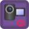                |      [Выключить видеокамеру](blocks.md#vyklyuchit-videokameru)      | Выключить видеокамеру.                                                                                                                                                                                                                            |
|                 |       [Детектировать по камере](blocks.md#detect-videocamera)       | Фиксирует изображение в центре кадра и инициализирует им датчик линии или датчик объекта.                                                                                                                                                         |
| 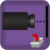  |  [Датчик линии в переменную](blocks.md#line-detector-into-variable) | Помещает текущее показание датчика линии в указанную переменную.                                                                                                                                                                                  |
|         |           [Запустить видеотрансляцию](blocks.md#camera-on)          | Запускает видеотрансляцию на роботе.                                                                                                                                                                                                              |
| 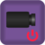        | [Отключить видеотрансляцию](blocks.md#otklyuchit-videotranslyaciyu) | Останавливает видеотрансляцию с камеры робота.                                                                                                                                                                                                    |
|            |             [Послать сообщение](blocks.md#send-message)             | Отправляет данное сообщение роботу с данным бортовым номером.                                                                                                                                                                                     |
|                |              [Записать в файл](blocks.md#write-to-file)             | Записывает значение данного выражения в заданный файл на роботе.                                                                                                                                                                                  |
|                 |                [Удалить файл](blocks.md#remove-file)                | Удаляет заданный файл на роботе.                                                                                                                                                                                                                  |
|     |        [Калибровка гироскопа](blocks.md#kalibrovka-giroskopa)       | Устанавливает гироскоп в 0 в текущей позиции.                                                                                                                                                                                                     |

### Отправить сообщение в задачу 

.png>)

Отправляет данное сообщение в параллельную задачу с заданным идентификатором (идентификатор должен быть указан при создании задачи в блоке [«Параллельные задачи»](../../studio/programming-visual/blocks.md#fork)).\
\
В качестве сообщения может быть любое выражение.

### Получить код кнопки 

.png>)

Сохраняет в указанную переменную код нажатой на роботе кнопки.\
\
Свойство «Ожидание» позволяет дождаться или не дожидаться, когда кнопка действительно будет нажата. Если нажатия кнопки блок не дожидается и кнопка не нажата, переменной присваивается значение «-1».

### Играть звук 

.png>)

Проигрывает на контроллере звук с заданной частотой и длительностью.

### Играть звуковой файл

.png>)

Проиграть на контроллере заданный звуковой файл.\
\
Файл должен быть заранее загружен на контроллер. Путь до файла указывается относительно папки `trik` на контроллере. Загрузить файл на контроллер можно, например, с помощью программы [WinSCP](../../studio/utilities/winscp.md).

### Моторы вперёд 

.png>)

Включить моторы по заданным портам с заданной мощностью.\
\
Порты задаются строками M1, M2, M3 и M4, разделенными запятыми. Мощность задается в процентах числом от -100 до 100. Если задано отрицательное значение, мотор включается в режиме реверса.

### Моторы назад 

.png>)

Включить моторы в режиме реверса по заданным портам с заданной мощностью.\
\
Параметры аналогичны параметрами блока [«Моторы вперёд»](blocks.md#motors-forward).

### Моторы стоп 

.png>)

Выключить моторы по заданным портам.\
\
Порты задаются строками M1, M2, M3 и M4, разделенными запятыми.

### Сбросить показания энкодера 

.png>)

Сбросить показания количества оборотов моторов по указанным портам.\
\
Порты задаются строками E1, E2, E3 и E4, разделенными запятыми.

### Угловой сервомотор

.png>)

Установить валы угловых сервомоторов на указанных портах в указанное положение (в градусах, от -90 до 90).\
\
Порты задаются строками, разделенными запятыми.

### Сказать 

.png>)

Произнести с помощью динамика фразу, переданную в качестве аргумента блока.

### Светодиод 

.png>)

Установить указанный цвет светодиода на корпусе контроллера.

### Системный вызов 

.png>)

Блок имеет логический параметр «Код». Если он имеет значение «Истина», содержимое параметра «Команда» генерируется напрямую в текст программы при генерации этого блока. Если «Ложь», генерируется вызов консольной команды операционной системы.

### Включить видеокамеру 

.png>)

Включить видеокамеру на контроллере в одном из трёх режимов:

1. **Сенсор линии** — детектирует цветную линию в центре кадра и в дальнейшем возвращает отклонение центра линии от центра кадра, как число в интервале от -100 (влево) до 100 (вправо).
2. **Сенсор объекта** — детектирует контрастный объект в центре кадра и в дальнейшем возвращает координаты его центра и диаметр в пикселях.
3. **Сенсор цвета** — возвращает доминирующий цвет в центре кадра в виде его координат в цветовой шкале RGB.

### Детектировать по камере 

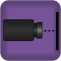

Фиксирует изображение в центре кадра и инициализирует им датчик линии или датчик объекта. Камера должна быть включена в соответствующем режиме блоком [«Включить видеокамеру»](blocks.md#initialize-videocamera).

### Датчик линии в переменную 

.png>)

Помещает текущее показание датчика линии в указанную переменную.\
\
Камера должна быть включена в режиме датчика линии блоком [«Включить видеокамеру»](blocks.md#initialize-videocamera) и инициализирована блоком [«Детектировать по камере»](blocks.md#detect-videocamera).

### Запустить видеотрансляцию 

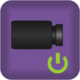

Запускает видеотрансляцию на роботе.\
\
Видео может быть просмотрено на пульте управления ТРИК или в браузере по адресу вида:\
`{ip-адрес робота}:8080/?action=stream/`.

### Послать сообщение 

.png>)

Отправляет данное сообщение роботу с данным бортовым номером.\
\
Робот должен быть в той же сети, что и робот, отправляющий сообщение, и зарегистрирован как ведущий или ведомый с помощью меню `Настройки → Сообщения` на роботе. Если роботов с данным бортовым номером в сети несколько, сообщение получат все они.

### Записать в файл 

.png>)

Записывает значение данного выражения в заданный файл на роботе.\
\
Путь до файла может быть абсолютным или относительно папки с `trik-studio.exe`.\
\
Файл можно получить с контроллера, например, с помощью программы [WinSCP](../../studio/utilities/winscp.md) для Windows или scp для Linux.

### Удалить файл 

.png>)

Удаляет заданный файл на роботе.\
\
Путь до файла может быть абсолютным или относительно папки с `trik-studio.exe`.

### Выключить видеокамеру

.png>)

Выключает видеокамеру.

### Отключить видеотрансляцию

.png>)

Останавливает видеотрансляцию с камеры робота.

### Калибровка гироскопа

.png>)

Устанавливает гироскоп в 0 в текущей позиции.

## Блоки ожидания 

| Вид                                                                                               |                                   Название                                   | Описание                                                                                                                                              |
| ------------------------------------------------------------------------------------------------- | :--------------------------------------------------------------------------: | ----------------------------------------------------------------------------------------------------------------------------------------------------- |
|   | [Получить сообщение из другой задачи](blocks.md#receive-message-from-thread) | Ждать получения сообщения из другой параллельной задачи.                                                                                              |
| .png>)                                          |                 [Пользовательский ввод](blocks.md#userinput)                 | Ждать ввода значения от пользователя.                                                                                                                 |
|        |                [Ждать гиродатчик](blocks.md#zhdat-girodatchik)               | Ждать, пока значение, возвращаемое гиродатчиком на указанном порту, не будет сравнимо с указанным в значении параметра «градусы».                     |
|      |            [Ждать датчик касания](blocks.md#wait-for-touch-sensor)           | Ждать срабатывания датчика касания на указанном порту.                                                                                                |
|            |                    [Ждать свет](blocks.md#wait-for-light)                    | Ждать, пока значение, возвращаемое сенсором света на указанном порту, не будет сравнимо с указанным значением в параметре «Проценты».                 |
|    |     [Ждать УЗ датчик расстояния](blocks.md#wait-for-ultrasonic-distance)     | Ждать, пока расстояние, возвращаемое ультразвуковым сенсором расстояния, не будет сравнимо со значением, указанным в параметре «Расстояние».          |
|    |      [Ждать ИК датчик расстояния](blocks.md#wait-for-infrared-distance)      | Ждать, пока расстояние, возвращаемое инфракрасным сенсором расстояния, не будет сравнимо с указанным в значении параметра «Расстояние».               |
|          |                  [Ждать энкодер](blocks.md#wait-for-encoder)                 | Ждать, пока показания счетчика количества оборотов на заданном порту не станут больше или меньше указанного в значении параметра «Предел оборотов».   |
|          |               [Ждать нажатия кнопки](blocks.md#wait-for-button)              | Ждать, пока не будет нажата указанная кнопка на корпусе робота.                                                                                       |
|          |               [Получить сообщение](blocks.md#wait-for-message)               | Ждать получения сообщения через систему почтовых ящиков. Когда сообщение будет получено, оно будет помещено в указанную в параметре блока переменную. |
|       |          [Ждать кнопки на пульте](blocks.md#wait-for-gamepad-button)         | Ждать нажатия на кнопку на пульте, подключённом к роботу.                                                                                             |
| 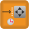           |            [Ждать нажатия на пульт](blocks.md#wait-for-pad-press)            | Ждать нажатия на одну из двух активных областей пульта, подключённого к роботу.                                                                       |
|        |          [Ждать "руля" на пульте](blocks.md#wait-for-gamepad-wheel)          | Ждать нужного наклона пульта, подключённого к роботу.                                                                                                 |
|   |       [Ждать отключения пульта](blocks.md#wait-for-gamepad-disconnect)       | Ждать, пока пульт не отключится от робота. Если пульт не подключен, программа продолжит выполнение.                                                   |
| 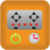     |        [Ждать подключения пульта](blocks.md#wait-for-gamepad-connect)        | Ждать, пока к роботу не подключится пульт. Если пульт уже подключен, программа продолжит выполнение.                                                  |

### Получить сообщение из другой задачи 

.png>)

Ждать получения сообщения из другой параллельной задачи.\
\
Когда сообщение будет получено, оно будет присвоено указанной в блоке переменной.\
\
Свойство «Дождаться сообщения» позволяет указать, что делать, если очередь сообщений пуста: дождаться прихода нового сообщения или продолжить работу, присвоив переменной пустую строку.\
\
Сообщение автоматически приводится к типу, соответствующему типу переменной-приёмника. Пример: если вы посылаете число в виде строки, то оно будет принято как число.

### Пользовательский ввод 

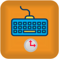

Ждать ввода значения от пользователя. После ввода значение будет присвоено указанной в блоке переменной.

#### Свойства

Блок «Пользовательский ввод» имеет 3 свойства:

| Свойство         | Описание                          |
| ---------------- | --------------------------------- |
| **Переменная**   | Имя переменной.                   |
| **По умолчанию** | Значение переменной по умолчанию. |
| **Текст**        | Описание поля ввода.              |

**Пример**

| **Программа**                                                                  | Исполнение программы                                                           |
| ------------------------------------------------------------------------------ | ------------------------------------------------------------------------------ |
| 

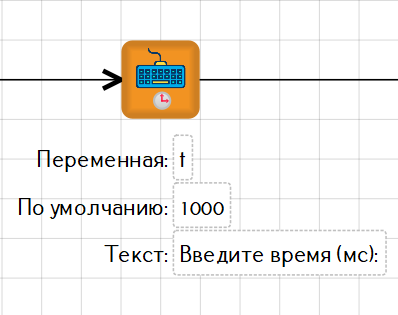
 | 

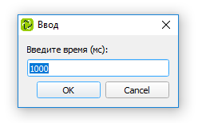
 |

### Ждать гиродатчик

.png>)

Ждать, пока значение, возвращаемое гиродатчиком на указанном порту, не будет сравнимо с указанным в значении параметра «градусы».

### Ждать датчик касания 

.png>)

Ждать срабатывания датчика касания на указанном порту.

### Ждать свет 

.png>)

Ждать, пока значение, возвращаемое сенсором света на указанном порту, не будет сравнимо с указанным значением в параметре «Проценты».\
\
Параметры:\
«Проценты» — значение для сравнения со значением, возвращаемым датчиком света.\
«Порт» — порт, к которому подключен сенсор света.\
«Считанное значение» — операция, которая будет использоваться для сравнения со значением параметра «Проценты».

### Ждать УЗ датчик расстояния 

.png>)

Ждать, пока расстояние, возвращаемое ультразвуковым сенсором расстояния, не будет сравнимо со значением, указанным в параметре «Расстояние» (расстояние задается в сантиметрах, от 0 до 300).\
\
Параметры:\
«Расстояние» — значение для сравнения со значением, возвращаемым датчиком расстояния.\
«Порт» — порт, к которому подключен датчик расстояния.\
«Считанное значение» — операция, которая будет использоваться для сравнения со значением параметра «Расстояние».

### Ждать ИК датчик расстояния 

.png>)

Ждать, пока расстояние, возвращаемое инфракрасным сенсором расстояния, не будет сравнимо с указанным в значении параметра «Расстояние».\
\
По умолчанию на портах A1 и A2 расстояние задается в сантиметрах (от 0 до 100), к остальным подключение не рекомендуется, так как чистое значение с датчика будет обработано с ожиданием другого подключенного датчика.\
\
Еще один параметр — номер порта, к которому подключен датчик расстояния. Также параметром указывается операция, которая будет использоваться для сравнения с введенным расстоянием.

### Ждать энкодер 

.png>)

Ждать, пока показания счетчика количества оборотов на заданном порту не станут больше или меньше указанного в значении параметра «Предел оборотов».

### Ждать нажатия кнопки 

.png>)

Ждать, пока не будет нажата указанная кнопка на корпусе робота.

### Получить сообщение 

.png>)

Ждать получения сообщения через систему почтовых ящиков. Когда сообщение будет получено, оно будет помещено в указанную в параметре блока переменную.\
\
Свойство «Дождаться сообщения» позволяет указать, что делать, если очередь сообщений пуста: дождаться прихода нового сообщения или продолжить работу, положив в переменную пустую строку.\
\
Сообщение автоматически приводится к типу, соответствующему типу переменной-приёмника, то есть, например, можно послать число в виде строки и принять его как число.

### Ждать кнопки на пульте 

.png>)

Ждать нажатия на кнопку на пульте, подключённом к роботу. Кнопки имеют номера от 1 до 5.

### Ждать нажатия на пульт 

.png>)

Ждать нажатия на одну из двух активных областей пульта, подключённого к роботу. Координаты нажатия можно получить с помощью сенсорных переменных [«gamepadPad»](sensory-variables.md#gamepadpad).

### Ждать «руля» на пульте 

.png>)

Ждать нужного наклона пульта, подключённого к роботу.\
\
Наклон регистрируется только если на пульте включён режим «руля», угол наклона кодируется числами от -100 (максимально влево) до 100 (максимально вправо).\
\
Также параметром указывается операция, которая будет использоваться для сравнения со значением параметра «Угол».

### Ждать отключения пульта 

.png>)

Ждать, пока пульт не отключится от робота. Если пульт не подключен, программа продолжит выполнение.

### Ждать подключения пульта 

.png>)

Ждать, пока к роботу не подключится пульт. Если пульт уже подключен, программа продолжит выполнение.

## Блоки рисования

| Вид                                                                                     |                       Название                       | Описание                                                                                                                                                                                                         |
| --------------------------------------------------------------------------------------- | :--------------------------------------------------: | ---------------------------------------------------------------------------------------------------------------------------------------------------------------------------------------------------------------- |
|        |         [Цвет кисти](blocks.md#painter-color)        | Указать цвет, которым будут рисоваться простые графические фигуры на экране робота.                                                                                                                              |
|        |        [Ширина кисти](blocks.md#painter-width)       | Указать ширину линии, которой будут рисоваться простые графические фигуры на экране робота.                                                                                                                      |
|     |       [Нарисовать точку](blocks.md#draw-pixel)       | Нарисовать на экране точку в указанных координатах.                                                                                                                                                              |
|      |        [Нарисовать линию](blocks.md#draw-line)       | Нарисовать на экране отрезок. В качестве параметров блоку указываются концы отрезка.                                                                                                                             |
|      | [Нарисовать прямоугольник](blocks.md#draw-rectangle) | Нарисовать на экране прямоугольник. В качестве параметров указываются координаты левого верхнего угла, ширина и высота прямоугольника.                                                                           |
|    |      [Нарисовать эллипс](blocks.md#draw-ellipse)     | Нарисовать на экране эллипс, вписанный в заданный прямоугольник.                                                                                                                                                 |
| 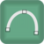          |         [Нарисовать дугу](blocks.md#draw-arc)        | Нарисовать на экране дугу, заданную координатами прямоугольника, в который она будет вписана, и углами (в градусах) её начала и конца на окружности. Если начало и конец совпадают, будет нарисована окружность. |
|             |              [Смайлик](blocks.md#smile)              | Нарисовать на экране смайлик.                                                                                                                                                                                    |
|          |        [Грустный смайлик](blocks.md#sad-smile)       | Нарисовать на экране грустный смайлик.                                                                                                                                                                           |
|     |        [Цвет фона](blocks.md#background-color)       | Задаёт цвет фона экрана.                                                                                                                                                                                         |
|     |       [Напечатать текст](blocks.md#print-text)       | Печатает заданную строку в заданном месте на экране робота. Значение свойства «Текст» по умолчанию трактуется как строка в чистом виде, оно так и будет выведено на экран.                                       |
|   |       [Очистить экран](blocks.md#clear-screen)       | Стереть всё, что нарисовано на экране.                                                                                                                                                                           |

### Цвет кисти 

.png>)

Указать цвет, которым будут рисоваться простые графические фигуры на экране робота.

### Ширина кисти 

.png>)

Указать ширину линии, которой будут рисоваться простые графические фигуры на экране робота.

### Нарисовать точку 

.png>)

Нарисовать на экране точку в указанных координатах.

### Нарисовать линию 

.png>)

Нарисовать на экране отрезок. В качестве параметров блоку указываются концы отрезка.

### Нарисовать прямоугольник 

.png>)

Нарисовать на экране прямоугольник. В качестве параметров указываются координаты левого верхнего угла, ширина и высота прямоугольника.

### Нарисовать эллипс 

.png>)

Нарисовать на экране эллипс, вписанный в заданный прямоугольник.

### Нарисовать дугу 

.png>)

Нарисовать на экране дугу, заданную координатами прямоугольника, в который она будет вписана, и углами (в градусах) её начала и конца на окружности. Если начало и конец совпадают, будет нарисована окружность.

### Смайлик 

.png>)

Нарисовать на экране смайлик.

### Грустный смайлик 

.png>)

Нарисовать на экране грустный смайлик.

### Цвет фона 

.png>)

Задаёт цвет фона экрана.

### Напечатать текст 

.png>)

Печатает заданную строку в заданном месте на экране робота.

#### Свойства

| Свойство          | Значение                                                                                              |
| ----------------- | ----------------------------------------------------------------------------------------------------- |
| Вычислять         | 
Истина — вывод на экран значения переменной или выражения.

Ложь — вывод на экран текста.
 |
| Текст             | Текст / имя переменной (выражение) для вывода на экран.                                               |
| Обновить картинку | 
Истина — обновить экран. Ложь — не обновлять экран.
                                         |
| X, Y              | Координаты начала текста.                                                                             |

#### Как вывести текст на экран?

Для вывода текста:

1. В свойстве «Текст» напишите нужный текст.
2. Уберите галочку в свойстве «Вычислять».

#### Как вывести значение переменной на экран?

Для вывода значения переменной:

1. В свойстве «Текст» напишите имя переменной.
2. Поставьте галочку в свойстве «Вычислять».

### Очистить экран 

.png>)

Стереть всё, что нарисовано на экране.
