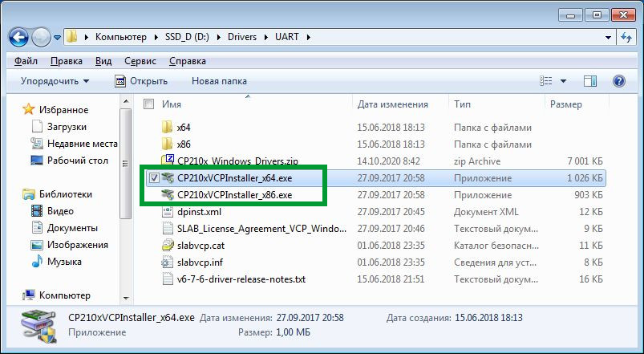
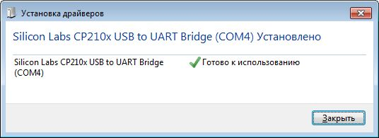
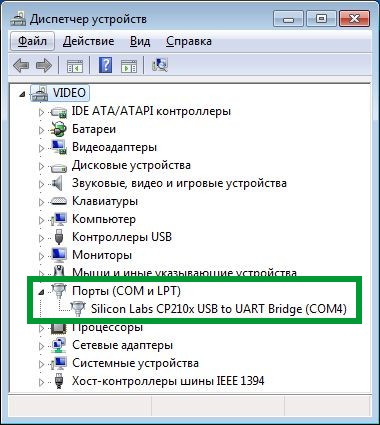
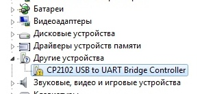
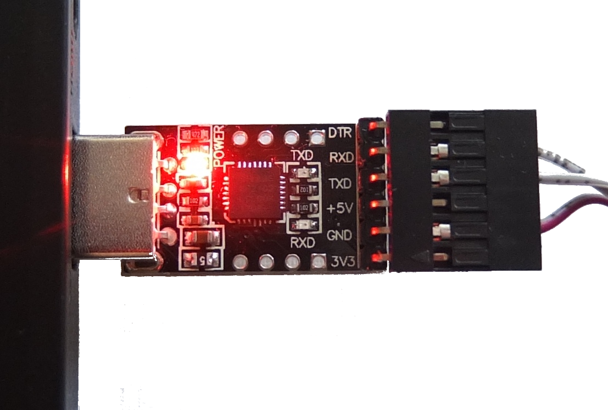
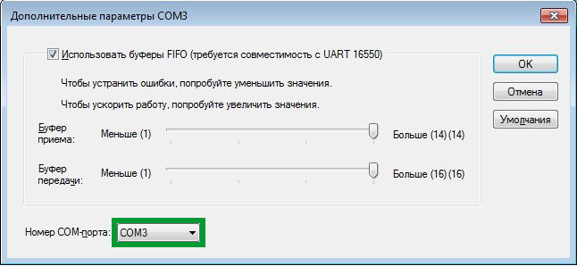
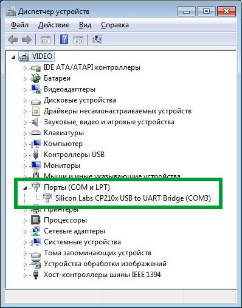
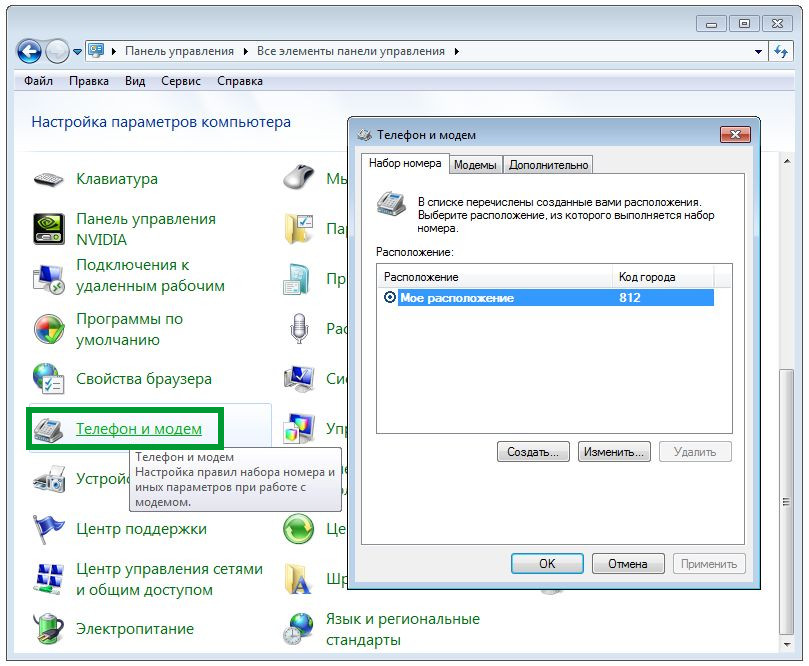

# Подключение к контроллеру ТРИК с помощью UART

Кроме подключения контроллера ТРИК к компьютеру с [помощью Wi-Fi](wi-fi/), его можно подлючить через преобразователь интерфейса USB в интерфейс UART на базе чипа CP2102:

Ниже описан алгоритм подключения.

1. [Установка драйверов](uart.md#uart-driver)
2. [Настройка COM-порта](uart.md#uart-com)
3. [Установка модема](uart.md#uart-modem1)
4. [Настройка модема](uart.md#uart-modem2)
5. [Создание сетевого подключения](uart.md#uart-lan1)
6. [Настройка сетевого подключения](uart.md#6-nastroika-setevogo-podklyucheniya)
7. [Подключение к контроллеру](uart.md#7-podklyuchenie-k-kontrolleru)

## 1. Установка драйверов 

1\. [Скачайте драйвера](https://www.silabs.com/documents/public/software/CP210x\_Windows\_Drivers.zip) с официального сайта производителя преобразователя: [silabs.com](https://www.silabs.com).

2\. Распакуйте архив и запустите установщик драйвера, соответствующий вашей операционной системе (32 или 64 бит).

3\. После окончания установки подключите преобразователь USB — UART к компьютеру (без контроллера). Дождитесь, пока устройство определится.

4\. Проверьте в «Диспетчере устройств», правильно ли установился драйвер.

5\. Если в «Диспетчере устройств» `CP2102 USB to UART Bridge Controller` отображается с восклицательным знаком, как на примере ниже, значит драйвер устройства не установлен. Повторите процедуру установки или обратитесь к специалисту.

Если данное устройство в списке «Диспетчера устройств» отсутствует, проверьте работоспособность USB-порта и правильность установки устройства в USB-порт. При корректном подключении преоразователя на нем должен загореться красный светодиод «POWER».

## 2. Настройка COM-порта 

1\. В «Диспетчере Устройств» вызовите свойства `Silicon Labs CP210x USB to UART Bridge (COMx)`.&#x20;

На вкладке «Параметры порта» установите:

* Бит в секунду: 115200.
* Управление потоком: Нет.

По кнопке «Дополнительно» можно выбрать номер COM-порта, если это необходимо:

## 3. Установка модема 

1\. На панели управления выберите раздел «Телефон и модем».

2\. Введите любой телефонный код города и нажмите «ОК».

3\. На вкладке «Модемы» нажмите кнопку «Добавить».&#x20;

4\. Выберите «Не определять тип модема (выбор из списка)» и нажмите «Далее».

5\. Выберите «Стандартные типы модемов» → «Последовательный кабель для соединения компьютеров» и нажмите «Далее».

6\. Выберите указанный ранее порт (в нашем примере — COM3), затем нажмите «Далее» и «Готово».

## 4. Настройка модема 

1\. Вновь на панели управления выберите «Телефон и модем» и перейдите на вкладку «Модемы».

2\. Выберите «Последовательный кабель для соединения компьютеров (COM3)» и нажмите кнопку «Свойства».

3\. Если параметры на вкладках «Модем» и «Дополнительные параметры связи» невозможно изменить,

на вкладке «Общие» нажмите кнопку «Изменить параметры».

4\. На вкладке «Дополнительные параметры связи» нажмите кнопку «Изменить умолчания...»

5\. На вкладке «Общие» установите:\
– Скорость порта: 115200.\
– Управление потоком: Отсутствует.

И нажмите «ОК».

6\. На вкладке «Модем» должны правильно отображаться COM-порт (COM3) и скорость соединения (115200).

## 5. Создание сетевого подключения 

1\. На панели управления выберите «Центр управления сетями и общим доступом».

2\. Затем «Настройка нового подключения или сети».

3\. Выберите «Настройка телефонного подключения» и нажмите «Далее».

4\. В поле «Набираемый номер» введите `1` и нажмите кнопку «Подключить».

5\. Затем выберите «Всё равно создать это подключение».

6\. Нажмите «Закрыть».

## 6. Настройка сетевого подключения&#x20;

1\. На панели управления выберите «Центр управления сетями и общим доступом», а затем нажмите «Изменение параметров адаптера».

2\. Зайдите в свойства «Телефонного подключения».

3\. На вкладке «Общие» в окне «Подключаться через» выберите «Последовательный кабель для соединения компьютеров (COMx)» и нажмите «Настроить».

4\. Выберите следующий параметр:\
– Наибольшая скорость: 115200.

И уберите галочку «Аппаратное управление потоком». Нажмите «ОК».

5\. На вкладке «Параметры» нажмите на кнопку «Параметры PPP...»

6\. Уберите галочку «Использовать программное сжатие данных» и нажмите «ОК».

7\. На вкладке «Сеть» должен быть включен протокол «IPv4».

.jpg>)

## 7. Подключение к контроллеру

1\. Извлеките преобразователь USB — UART из разъема USB.

2\. Включите контроллер.

3\. Подключите преобразователь USB — UART к соответствующему порту контроллера.

3\. Подкючите преобразователь USB — UART к компьютеру.

4\. Откройте «Сетевые подключения» (Панель управления → «Центр управления сетями и общим доступом»→ «Изменение параметров адаптера»).

5\. Откройте «Телефонное подключение» и нажмите на кнопку «Вызов».

6\. Если всё сделано верно, на преобразователе должны замигать лампочки «RXD» и «TXD».

.png>)

А статус соединения должен измениться на активный.

7\. Откройте окно состояния телефонного подлючения.

8\. Нажмите на кнопку «Сведения».

9\. Адрес IPv4 должен быть `10.0.5.1` .

10\. Если всё верно, то можно зайти в [веб-интерфес](web-interface.md) по адресу `10.0.5.2`.

11\. Или указать IP-адрес `10.0.5.2` в соответствующем окне TRIK Studio для управления контроллером.

