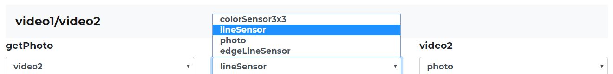

# Веб-интерфейс контроллера ТРИК

Веб-интерфейс контроллера ТРИК позволяет:

* [Изменить настройки Wi-Fi на контроллере.](web-interface.md#set)
* [Настроить взаимодействие нескольких контроллеров.](web-interface.md#set)
* [Изменить конфигурацию датчиков, моторов и энкодеров.](web-interface.md#porty)
* [Изменить конфигурацию микроэлектромеханических систем (гироскоп и акселерометр).](web-interface.md#mems)
* [Запустить видеотрансляцию с камеры контроллера.](web-interface.md#videotranslyaciya)
* [Скачать лог-файлы.](web-interface.md#bortovoi-zhurnal)
* [Посмотреть программы, загруженные на контроллер.](web-interface.md#programmy)
* [Сделать скриншоты экрана контроллера и скачать их.](web-interface.md#izobrazheniya)
* [Сделать снимки с камеры, подключенной к контроллеру, и скачать их.](web-interface.md#izobrazheniya)

## Запуск веб-интерфейса

‌Для запуска веб-интерфейса:

1. Подключите контроллер ТРИК к компьютеру любым из [возможных способов](wi-fi/network-connection.md).
2. Введите в адресной строке браузера IP-адрес контроллера.

IP-адрес контроллера отображается на экране после подключения к сети.

## Меню веб-интерфейса

Меню веб-интерфейса содержит следующие пункты:

1. [Сеть.](web-interface.md#set)
2. [Порты.](web-interface.md#porty)
3. [МЭМС (микроэлектромеханические системы).](web-interface.md#mems)
4. [Видеотрансляция.](web-interface.md#videotranslyaciya)
5. [Бортовой журнал.](web-interface.md#bortovoi-zhurnal)
6. [Программы.](web-interface.md#programmy)
7. [Изображения.](web-interface.md#izobrazheniya)

## Сеть

На вкладке «Сеть» можно:

* ‌Задать параметры Wi-Fi-сети для контроллера в режиме точки доступа [Wi-Fi-клиента](wi-fi/network-connection.md#client).
* Изменить имя точки доступа Wi-Fi для контроллера в режиме [точки доступа Wi-Fi](wi-fi/network-connection.md#accesspoint).
* Задать бортномер контроллера и IP-адрес ведущего контроллера для [взаимодействия контроллеров](wi-fi/interaction/).
* Включить или отключить PPP-демон (PPP-демон нужен для эмуляции сетевого подключения через последовательный порт).

## Порты

На вкладке «Порты» можно:

* Выбрать тип подключаемых [силовых моторов](web-interface.md#silovye-motory) для каждого порта.
* Выбрать тип подключаемых [сервомоторов](web-interface.md#servomotory) для каждого порта.
* Выбрать тип подключаемых [аналоговых датчиков](web-interface.md#analogovye-sensory) для каждого порта.
* Выбрать тип [энкодеров](web-interface.md#enkodery), использующихся в моторах, для каждого порта, а также положительное направление отсчета положения вала мотора для каждого порта.
* Выбрать тип подключаемых [цифровых датчиков](web-interface.md#datchiki-distancii) для каждого порта.
* Сконфигурировать порты для подключения [видеокамер](web-interface.md#video1-video2).

.png>)

После изменения настроек необходимо нажать на кнопку «Сохранить» внизу экрана и подтвердить действие.

### Силовые моторы

В разделе «Силовые моторы» вы можете выбрать тип подключаемых силовых моторов для каждого порта.

### Сервомоторы

В разделе «Сервомоторы» вы можете выбрать тип подключаемых сервомоторов для каждого порта.

### Аналоговые сенсоры

В разделе «Аналоговые сенсоры» вы можете выбрать тип подключаемых аналоговых сенсоров для каждого порта.

### Энкодеры

В разделе «Энкодеры» вы можете выбрать тип энкодеров, использующихся в моторах, для каждого порта, а также положительное направление отсчета положения вала мотора для каждого порта.

### Датчики дистанции

В разделе «Датчики дистанции» вы можете выбрать тип подключаемых цифровых датчиков для каждого порта.

### Video1 / Video2

Видеопорты и подключенные к ним видеокамеры могут работать в следующих режимах:

* colorSensor3x3 — режим датчика цвета.
* lineSensor — режим сенсора линии с детектированием цвета.
* photo — камера используется для получения снимков и видеопотока.
* edgeLineSensor — режим сенсора линии с детектированием границ (работает на инверсных линиях).

## МЭМС

Вкладка МЭМС (микроэлектромеханические системы) позволяет:

* Включить или отключить гироскоп или акселерометр.
* Выбрать частоту обновления и диапазон работы акселерометра и гироскопа в «Расширенных настройках».

Для изменения конфигурации необходимо нажать кнопку «Сохранить» и подтвердить действие.

## Видеотрансляция

Вкладка «Видеотрансляция» позволяет смотреть видео с установленной на контроллере камеры.

Для её запуска необходимо в [программу управления роботом с пульта](../gamepad/remote-control.md) добавить блок «[Запустить видеотрансляцию](programming-visual/blocks.md#camera-on)».

## Бортовой журнал

На вкладке «Бортовой журнал» отображаются логи контроллера, которые можно скачать [для последующей отправки их в службу поддержки](../feedback/logging.md#trik).

## Программы

На вкладке «Программы» отображаются загруженные на контроллер программы.

Удалить все программы можно через интерфейс контроллера.

## Изображения

Вкладка «Изображения» содержит изображения, сделанные с помощью подключенной камеры, а также скриншоты экрана контроллера.

На вкладке вы можете:

* [Сделать снимок экрана контроллера](about/screenshot.md).
* Просмотреть и скачать полученные с контроллера изображения как по отдельности, так и все вместе.
* Удалить все имеющиеся изображения (выборочного удаления не предусмотрено).

## LOG

Иконка  позволяет скачать лог-файлы. Подробнее читайте в статье «Действия при неправильной работе TRIK Studio или контроллера ТРИК» в разделе «[Сбор логов на контроллере ТРИК](../feedback/logging.md#trik)».
