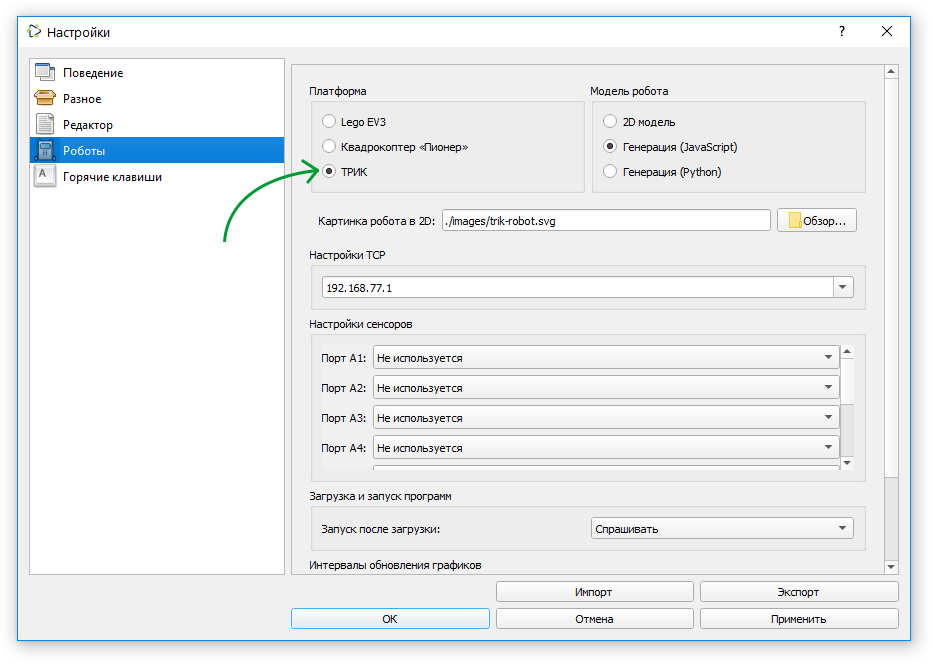
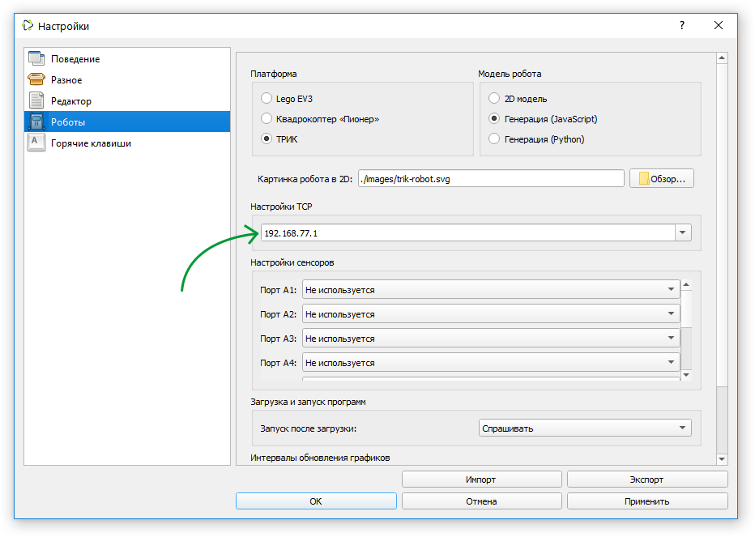
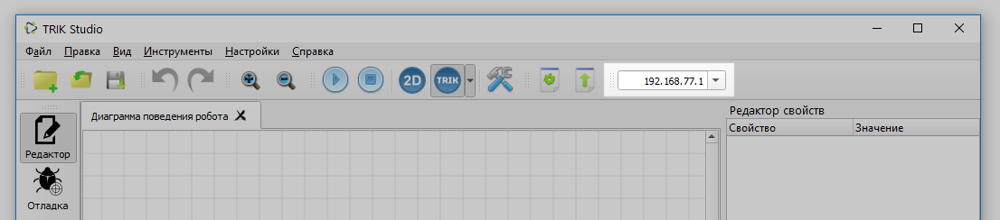
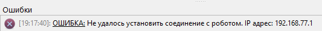

# Подключение контроллера ТРИК к TRIK Studio

1\. Подключите контроллер к компьютеру, на котором установлена TRIK Studio, любым из [двух способов](network-connection.md).

2\. В настройках TRIK Studio перейдите в раздел «Роботы» и выберите платформу ТРИК в окне «Платформы».

3\. Укажите IP-адрес контроллера в строке «Настройки TCP».

Также IP-адрес контроллера можно указать на панели инструментов:

4\. Нажмите «OK».

## Как проверить соединение?

Попробуйте [загрузить](../run-upload-programs.md) программу на контроллер.

## Что делать, если соединения нет?

Если соединения с контроллером нет, TRIK Studio выдаст ошибку:

В этом случае проверьте:

1. Совпадает ли IP-адрес в TRIK Studio с IP-адресом на контроллере.
2. Отображает ли контроллер ТРИК свой IP-адрес.\
   \
   IP-адреса может не быть, если контроллер в режиме Wi-Fi-клиента подключен к Wi-Fi-сети, но роутер не выдал его. Рекомендуем немного подождать или переключиться в режим «Точка доступа» и обратно в режиме Wi-Fi-клиента.\
   \
   Также это может произойти в режиме «Точка доступа». Рекомендуем выключить контроллер на некоторое время, а затем снова запустить.
