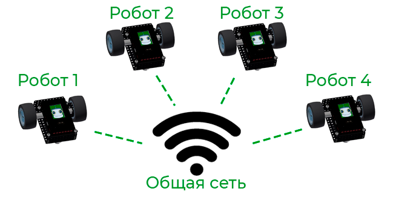
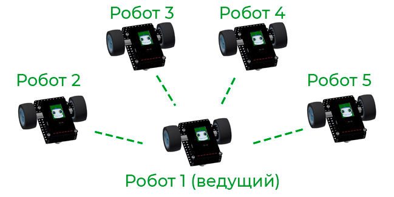
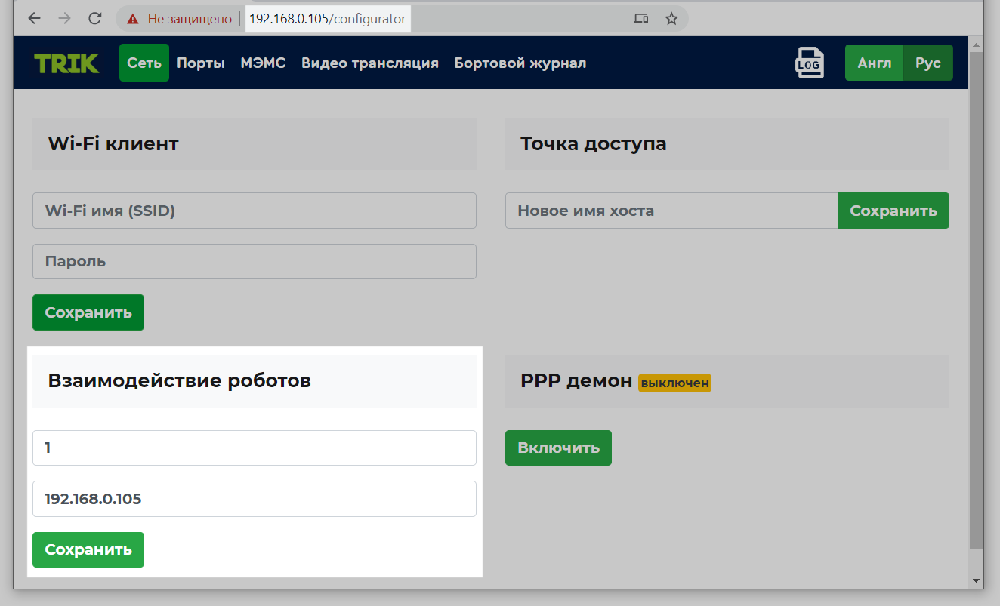
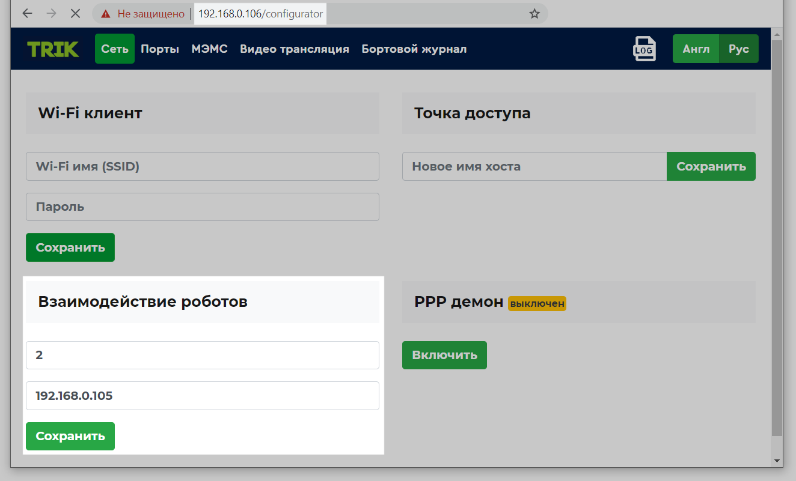
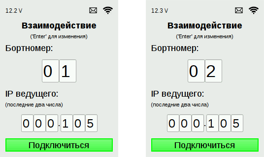
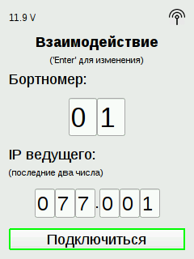

# Взаимодействие контроллеров ТРИК

Контроллеры ТРИК могут взаимодействовать друг с другом, что позволяет решать [задачи](interaction-example.md) по передаче сообщений между роботами.

Для взаимодействия контроллеров необходимо будет выбрать **ведущий** контроллер — тот, к которому мы будем подключать остальные контроллеры. А также подключить все контроллеры к одной сети. Это можно сделать двумя способами:

1\. С помощью существующей сети.

2\. С помощью создания точки доступа Wi-Fi на одном из контроллеров.

## Способ 1. Взаимодействие с помощью существующей Wi-Fi-сети

1\. Выберите **ведущий** контроллер и подключите его к существующей Wi-Fi-сети в [режиме клиента](../network-connection.md#client).

2\. В [веб-интерфейсе](../../web-interface.md) **ведущего** контроллера в поле «Взаимодействие роботов» укажите бортовой номер (обычно для ведущего это `01`, но можно любой другой) и его IP-адрес.

3\. Подключите **все** остальные контроллеры к этой же Wi-Fi-сети в [режиме клиента](../network-connection.md#client).

4\. Укажите для каждого из них в своих веб-интерфейсах в поле «Взаимодействие роботов» бортовой номер (отличный от других) и IP-адрес **ведущего** контроллера.


Также бортномер и IP-адрес **ведущего** контроллера можно указать на контроллере в пункте меню `Взаимодействие`.


4\. На **всех** контроллерах зайдите в пункт меню `Взаимодействие` и нажмите кнопку «Подключиться». В правом верхнем углу на экранах контроллеров должна появиться иконка.

## Способ 2. Взаимодействие с помощью Wi-Fi точки доступа одного из контроллеров 

### Действия с ведущим контроллером

1\. Выберите **ведущий** контроллер и раздайте с него Wi-Fi с помощью [режима точки доступа](../network-connection.md#accesspoint) (выберите в меню `Сеть → Wi-Fi точка доступа`).

2\. Далее вернитесь на главный экран меню и выберите пункт `Взаимодействие`.

3\. Укажите бортовой номер (обычно для ведущего это `01`, но можно любой другой) и его IP-адрес.

### Действия с остальными контроллерами

4\. Подключите остальные контроллеры к ведущему с помощью [режима Wi-Fi-клиент](../network-connection.md#client). Для этого в веб-интерфейсе каждого контроллера необходимо в полях «Wi-Fi клиент» указать имя и пароль сети ведущего контроллера в режиме Wi-Fi точки доступа.

5\. Зайдите в веб-интерфейс, используя IP-адрес, который отображается на контроллере в режиме Wi-Fi клиент.

6\. Укажите для каждого из контроллеров в своих веб-интерфейсах в поле «Взаимодействие роботов» бортовой номер (отличный от других) и IP-адрес **ведущего** контроллера.


Также бортномер и IP-адрес **ведущего** контроллера можно указать на контроллере в пункте меню `Взаимодействие`.


### Действие со всеми контроллерами

7\.  На всех контроллерах зайдите в пункт меню `Взаимодействие` и нажмите кнопку «Подключиться». В правом верхнем углу на экранах контроллера должна появиться иконка.


[interaction-example.md](interaction-example.md)

