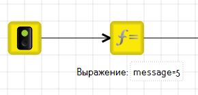
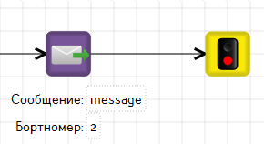
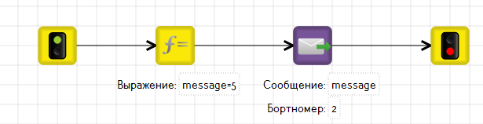
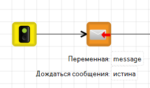
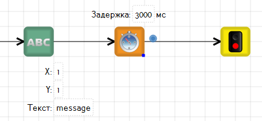
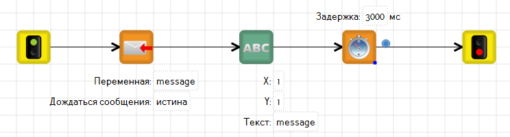

# Пример решения задачи по взаимодействию двух роботов

## Условие задачи

Отправить сообщение «5» с одного робота и принять его на втором.


Обратите внимание, что решить задачу возможно только в режиме реального робота.


## Решение

Для решения задачи необходимо:

1. Написать [алгоритм передачи сообщения](interaction-example.md#algoritm-peredachi-soobsheniya) для ведущего робота.
2. Написать [алгоритм приема сообщения](interaction-example.md#algoritm-priema-soobsheniya) для второго робота.
3. [Подключить](./) роботов в единую сеть.
4. Запустить программы на роботах.

### Алгоритм передачи сообщения

1\. Перейдите в TRIK Studio в режим [реального робота](../../../studio/interface/#panel-interpreter).

2\. Введите переменную для сообщения `message` и инициализируйте её, присвоив ей цифру `5` в блоке «[Выражение](../../../studio/programming-visual/blocks.md#expression)».

3\. Добавьте блок «[Послать сообщение](https://help.trikset.com/trik-controller/blocks#send-message)» и «[Конец](https://help.trikset.com/trik-studio/blocks-common#block-final)». В свойствах блока «[Послать сообщение](https://help.trikset.com/trik-controller/blocks#send-message)» укажите бортномер робота, на который вы хотите отправить сообщение, и переменную, содержащую сообщение.

#### Общий вид алгоритма

### Алгоритм приема сообщения

1\. Перейдите в TRIK Studio в режим [реального робота](../../../studio/interface/#panel-interpreter).

2\. Добавьте блок «[Получить сообщение](../../programming-visual/blocks.md#receive-message-from-thread)».\
\
В свойствах блока укажите переменную, в которую хотите записать сообщение, отправленное с другого робота. Переменная может называться как угодно.\
\
В свойстве «Дождаться сообщения» укажите значение `истина`.

3\. После того как сообщение пришло, выведите его на экран робота в течение 3 секунд, а затем закончите выполнение алгоритма. Для этого добавьте блоки «[Напечатать текст](../../programming-visual/blocks.md#print-text)», «[Таймер](../../../studio/programming-visual/blocks.md#timer)» и «[Конец](../../../studio/programming-visual/blocks.md#final)».\
\
В свойствах блока «Напечатать текст» поставьте флажок `Вычислять` и укажите значение `истина` в поле «Обновить картинку».

#### Общий вид алгоритма

