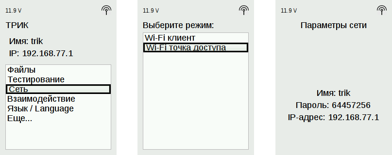
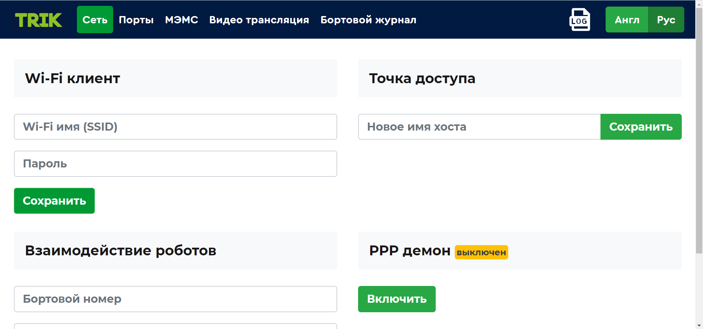
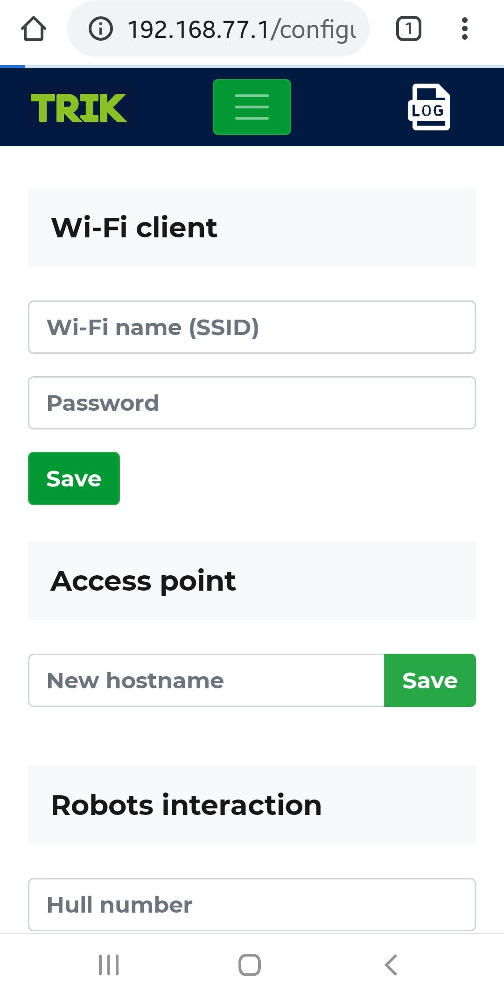
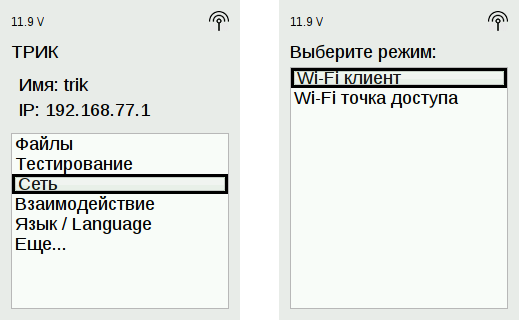
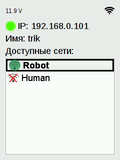

# Подключение контроллера ТРИК к компьютеру и смартфону

Контроллер ТРИК может быть подключен к другим устройствам двумя способами:

1. Используем контроллер ТРИК как [**точку доступа**](network-connection.md#accesspoint) **(**то есть контроллер сам создает новую сеть) и подключаем к нему устройства.
2. Используем контроллер ТРИК в режиме [**Wi-Fi-клиента**](network-connection.md#client) и подключаем устройства и сам контроллер к существующей сети.

## Способ 1. Контроллер в режиме точки доступа Wi-Fi 

В этом режиме контроллер сам создает новую сеть, и мы к нему подключаем устройства.

1\. Выберите в меню `Сеть → Wi-Fi точка доступа`. Контроллер раздаст Wi-Fi, а на экране появятся параметры сети:

* Имя сети.
* Пароль сети.
* IP-адрес контроллера.

2\. При подключении к сети Wi-Fi компьютера или смартфона выберите сеть контроллера и введите пароль.

## Способ 2. Контроллер в режиме Wi-Fi-клиента 

В этом режиме контроллер и устройства мы подключаем к уже существующей Wi-Fi-сети.

Для этого нам в [веб-интерфейсе](../web-interface.md) контроллера надо прописать имя и пароль сети, к которой будем подключать контроллер.

1\. Для запуска веб-интерфейса подключите компьютер или смартфон к контроллеру как к [точке доступа](network-connection.md#accesspoint).

2\. В адресной строке браузера введите IP-адрес контроллера. Откроется веб-интерфейс.











3\. В поле «Wi-Fi-клиент» введите имя и пароль сети, к которой хотите подключить контроллер. Нажмите кнопку «Сохранить».

4\. Переключите контроллер в режим Wi-Fi-клиента.

5\. При успешном подключении вверху экрана рядом с иконкой  отобразится ip-адрес контроллера, а в списке иконкой  будет выделено имя сети.

