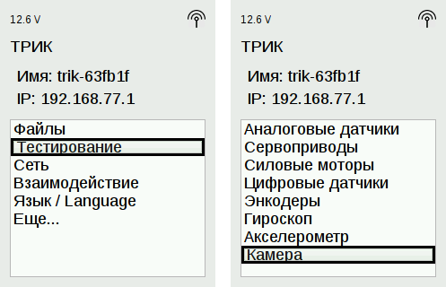
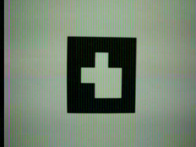
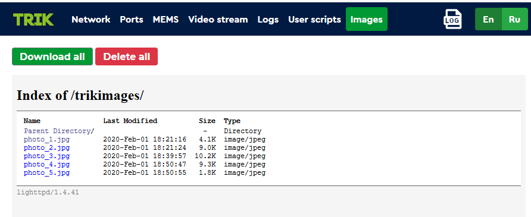

# Съемка изображений на камеру ТРИК и использование их в TRIK Studio


**Внимание!** Данная функциональность находится в тестовом режиме. Для её использования необходимо установить [тестовую версию прошивки](https://dl.trikset.com/distro/testing/trik-image-core-trikboard-20200219175703.rootfs.img.xz). Будем рады вашим отзывам и предложениям по данной функциональности. Пишите в службу [поддержки](https://trikset.com/support) с примечанием «Тест работы с изображениями в TRIK Studio».


Разработка алгоритма в неизменных условиях позволяет быстрее его отладить и протестировать, а также оценить и сравнить качество работы алгоритма и его модификаций. Это особенно важно для алгоритмов компьютерного зрения, когда любое, даже малое, движение камеры значительно меняет условия съемки и, как результат, захваченное изображение.

В данной статье будет рассказано как снять изображения на камеру контроллера ТРИК, выгрузить эти данные на компьютер и использовать их в TRIK Studio для разработки и отладки алгоритмов компьютерного зрения.


**Датасеты
&#x20;ARTag 5x5**

Программы распознавания маркеров ARTag можно совершенствовать и тестировать в TRIK Studio на [датасете](https://dl.trikset.com/trikset-help/ARTags.zip) (см. шаг 3). Он включает в себя фото маркеров ARTag 5x5 с различных ракурсов на стандартную камеру контроллера ТРИК. Название каждой из папок в датасете — это число, которое закодировано на маркерах ARTag, лежащих в данной папке.


## **Съемка изображений на контроллере ТРИК**


**Внимание!** Подключите камеру в порт «video2» до включения контроллера.



1\. В меню контроллера выберите пункт`Тестирование → Камера`.



2\. На экране отобразится изображение, снятое на камеру. Оно будет сохранено во внутреннюю память контроллера.&#x20;



Для того чтобы сделать ещё фотографии, необходимо нажать на контроллере кнопку «Выход» (крестик) и вновь выбрать пункт меню `Камера`.&#x20;


Выгрузка изображений через веб-интерфейс ТРИК


1\. Подключите контроллер ТРИК к компьютеру.


[network-connection.md](../wi-fi/network-connection.md)


2\. В адресной строке браузера введите IP-адрес контроллера. Откроется веб-интерфейс ТРИК.


[web-interface.md](../web-interface.md)


3\. Перейдите на вкладку «Images» и нажмите «Download all», чтобы скачать архив с изображениями.




4\. Перейдите в папку со скаченным архивом и разархивируйте его. Теперь вы можете отобрать те изображения, которые лучше всего подходят для разработки и тестирования текущего алгоритма.

Использование изображений в TRIK Studio


1\. Откройте в TRIK Studio настройки робота.


[faq-robot-settings.md](../../studio/interface/faq-robot-settings.md)


2\. В открывшемся окне выберите `Модель робота → 2D-модель` и пропишите путь к загруженным ранее изображениям.



3\. Теперь при вызове **getPhoto** будут последовательно подгружаться изображения из указанной папки. &#x20;


[function-getphoto.md](../programming-code/function-getphoto.md)




Не забывайте пользоваться функциями для рисования графических примитивов ([drawRect](../programming-code/object-brick/class-display.md#drawrect), [drawLine](../programming-code/object-brick/class-display.md#drawline), [drawPoint](../programming-code/object-brick/class-display.md#drawpoint) и т.п) и функцией [show](../programming-code/object-brick/class-display.md#show) для ускорения процесса разработки и отладки алгоритмов обработки изображений.



Пример программы



Пример программы, которая последовательно выводит на экран изображения, подгружаемые из указанной папки, с задержкой в 2 секунды.



1\. [Скачайте](https://drive.google.com/open?id=1B-OcmMpYiCu5iMWoJRawnvL54F-MhHp7) файл на компьютер или создайте новый проект и скопируйте код:

```javascript
var main = function()
{   
    var msCount = 2000;
    for (var i = 0; i< 5; i++) { // вывести последовательно на экран контроллера 5 изображений   	 
   	 brick.display().show(getPhoto(), 160, 120, "rgb32");
   	 brick.display().redraw();
   	 script.wait(msCount);   	 
    } 
	return;
}
```

2\. Запустите код в режиме отладки, используя в качестве режима исполнения программы [двумерную модель](../../studio/2d-model/). На дисплее контроллера будут последовательно выводиться изображения.


