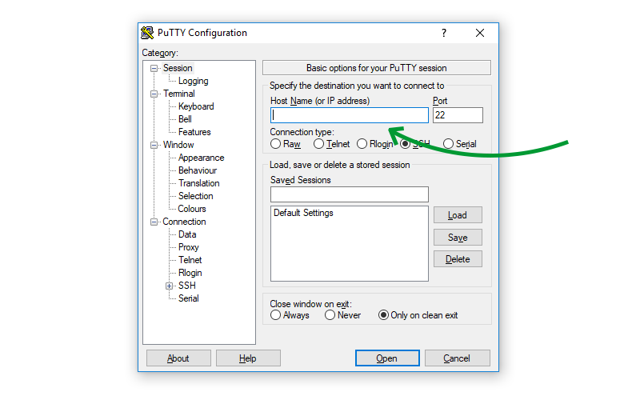
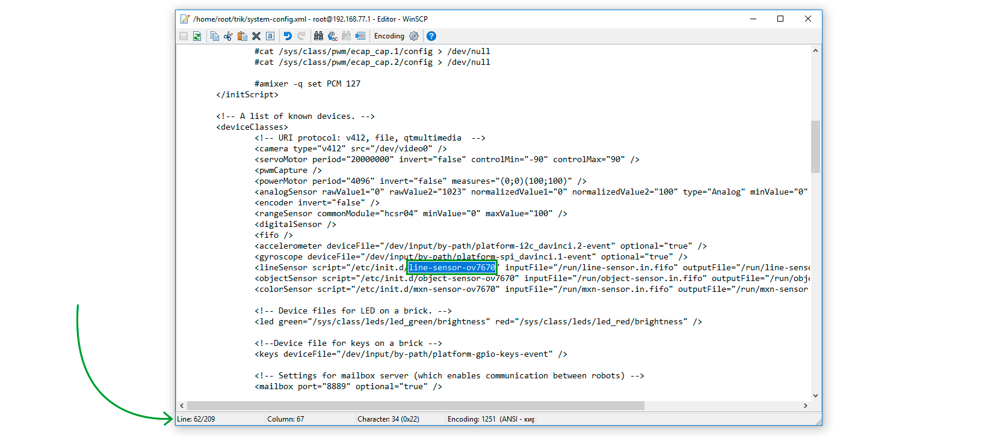

# Настройка работы USB-камеры с контроллером ТРИК


Ниже описана настройка USB-камеры в режиме датчика линии **`lineSensor`**.


Для работы с USB-камерой необходимо изменить путь к скрипту в файле `system-config.xml` на контроллере ТРИК.

Это можно сделать с помощью любой из двух утилит:

1. [PuTTY](usb-camera.md#putty).
2. [WinSCP](usb-camera.md#winscp).

## **PuTTy**

1\. [Подключитесь](../wi-fi/network-connection.md) к контроллеру с помощью режима «Wi-Fi точка доступа» или «Wi-Fi клиент».

2\. Откройте [TRIK Studio](https://trikset.com/products/trik-studio).

3\. Запустите утилиту **PuTTY**. Для этого в главном меню откройте `Инструменты → Сторонние программы → PuTTY`.&#x20;

.png>)

4\. Введите [ip-адрес контроллера](../wi-fi/network-connection.md) (указан в параметрах сети контроллера) и нажмите «Open».&#x20;



5\. В открывшемся окне введите `root`. Поле «Пароль» оставьте пустым.


6\. Введите команду `cd trik` для перехода в соответствующую директорию.


7\. Для редактирования файла используйте редактор **vi**. Для его запуска введите `vi system-config.xml`.


8\. С помощью стрелок на клавиатуре перейдите на 62 строку.&#x20;


```markup
Resolution: 240x320 depth 16
Converting image from 16
Now writing PNG file (compression -1)
```

9\. Нажмите `i` для редактирования, найдите название скрипта `line-sensor-ov7670` и исправьте его на `line-sensor-webcam`.&#x20;


10\. Для выхода из режима редактирования нажмите «Esc».

11\. Введите команду `:wq` и нажмите «Enter» для сохранения и выхода из редактора **vi**.

## **WinSCP**

1 . В каталоге с установленной TRIK Studio зайдите в папку `winscp` и запустите **WinSCP.exe**.

2\. Заполните данные:

* **File protocol:** SCP.
* **Host name —** [ip-адрес контроллера](../wi-fi/network-connection.md).
* **User name:** root.

Поле «Password» оставьте пустым.&#x20;


3\. Нажмите кнопку «Login».

4\. Если у вас появилось окно «Warning», нажмите «Yes».&#x20;


5\. Перейдите в папку `trik`.&#x20;


6\. Найдите и откройте файл `system-config.xml`.


7\. В открывшемся файле на 62 строке найдите название скрипта `line-sensor-ov7670` и исправьте его на `line-sensor-webcam`.&#x20;



8\. Сохраните изменения, нажав `Ctrl+s` или на иконку «дискеты» в левом верхнем углу, и закройте редактор.


