# Подключение и работа с видеомодулем

К контроллеру ТРИК можно подключать как видеомодули, так и веб-камеры с интерфейсом USB.

|                                   Видеомодуль                                  |                                 Веб-камера                                |
| :----------------------------------------------------------------------------: | :-----------------------------------------------------------------------: |
| 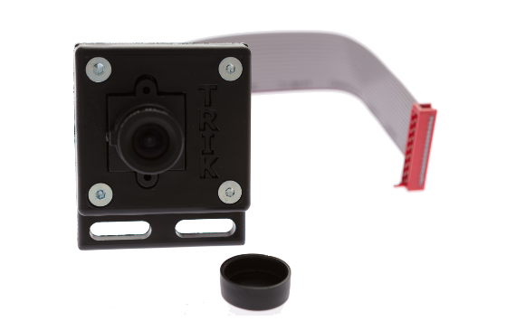  | 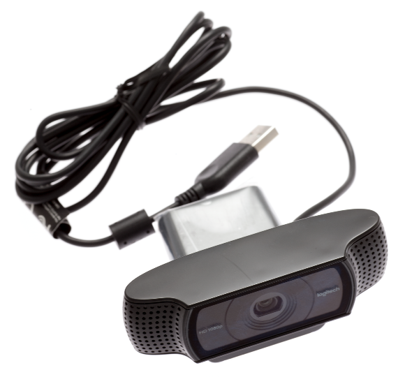  |

## Подключение

Видеомодуль подключается к порту **video1** или **video2**, USB веб-камеры — к порту **USB**.

Подключение видеомодуля к порту **video2 (**или **video1)** происходит таким образом, чтобы ножка у красного штекера была справа.\
&#x20;&#x20;

## Использование

Камеру в TRIK Studio можно запустить в трех режимах:

1. &#x20;[Как сенсор линии (linesensor)](video.md#linesensor).
2. &#x20;[Как сенсор объектов (objectsensor)](video.md#objectsensor).
3. &#x20;[Как сенсор цвета (colorsensor)](video.md#colorsensor).

Для инициализации видеокамеры напишите алгоритм:&#x20;

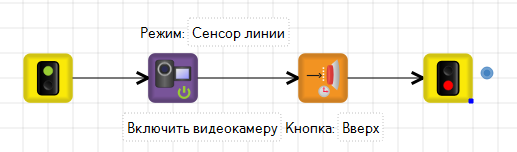

После инициализации камеры на дисплее появится трансляция видео с дополнительными графическими элементами.&#x20;


**Внимание!** По умолчанию будет включен режим **`Сенсор линии`**.  Чтобы поменять режим использования, зайдите в свойства блока «Включить видеокамеру» и смените режим на нужный.


## LineSensor

Камера как сенсор линии необходима для решения задачи движения по линии, а также по прерывистой линии (линии-профи).

Для того чтобы включить камеру как сенсор линии, вам необходимо изменить режим работы камеры в свойствах блока [«Включить видеокамеру»](../programming-visual/blocks.md#initialize-videocamera), на `Сенсор линии`. Режим `Сенсор линии` имеет сенсорную переменную [lineSensor](../programming-visual/sensory-variables.md#linesensor).&#x20;

#### Пример

Задача: напишите алгоритм движения робота по линии с использованием камеры.

#### Написание алгоритма

1\. Объявите переменную `k` — коэффициент пропорциональности, который будет использоваться в пропорциональном регуляторе для движения робота.&#x20;

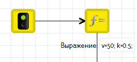

2\. Инициализируйте камеру как сенсор линии.

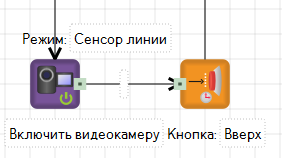


**Внимание!** Блок [«Ждать нажатия кнопки»](../programming-visual/blocks.md#wait-for-button) необходим, чтобы камера успела включиться. Когда на экране робота появится изображение с камеры, можно приступать к следующему пункту.


3\. Детектируйте камеру на объекте.

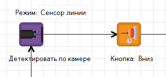

4\. Напишите регулятор для движения. Используйте блок [«Датчик линии в переменную»](../programming-visual/blocks.md#line-detector-into-variable), который записывает показания отклонения объекта от центра экрана по оси `Х` (от -100 до 100) в переменную, указанную в свойствах. Другими словами, это динамическая ошибка.

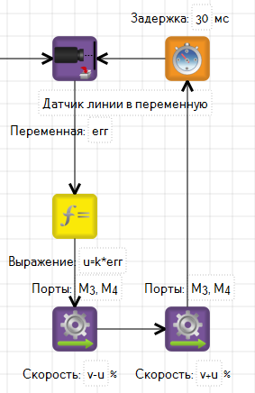

#### Общий вид алгоритма

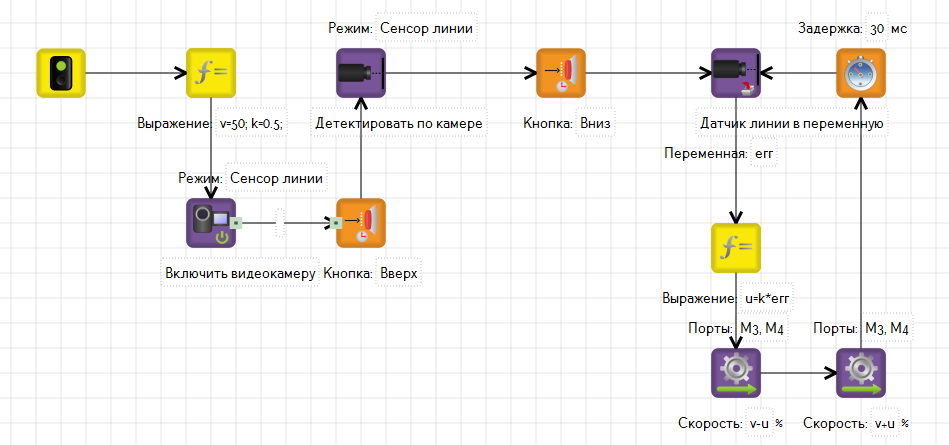

#### Запуск алгоритма на реальном роботе

1\. Запустите программу на роботе.

2\. Дождитесь, пока включится видеокамера.

3\. В режиме сенсора линии на экране будет отображаться 4 фиолетовые направляющие. Наведите камеру на линию таким образом, чтобы правая граница линии попадала в коридор между двумя правыми направляющими, а левая между двумя левыми.

4\. Нажмите кнопку `Вверх` на контроллере для детектирования объекта (линии).

Обратите внимание, что видео транслируется на экран в формате 240×140 px, а это как раз половина экрана.

Чтобы понять, что детектирование произошло, линия должна заполниться желтыми точками, как на картинке:

5\. Нажмите кнопку `Вниз`.

## ObjectSensor

Камера как сенсор объекта необходима для решения задач распознавания и отслеживания объектов. Для того чтобы включить камеру как сенсор линии, вам необходимо изменить режим работы камеры, в свойствах блока [«Включить видеокамеру»](../programming-visual/blocks.md#initialize-videocamera), на `Сенсор объекта`.\
Режим `Сенсор объекта` имеет сенсорные переменные: [objectSensorSize, objectSensorX, objectSensorY.](../programming-visual/sensory-variables.md)

#### Пример

Задача: напишите алгоритм распознавания объекта с использованием камеры.


**Внимание!** Робот должен выводить в консоль координаты центра объекта и его диаметр в пикселях.


#### Написание алгоритма

1\. Инициализируйте камеру как сенсор объекта.

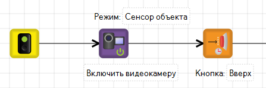


**Внимание!** Блок «Ждать нажатия кнопки» необходим, чтобы камера успела включиться. Когда на экране робота включиться изображение с камеры, можно приступать к следующему пункту.


2\. Детектируйте камеру на объекте.

.png>)

3\. Напишите цикл с условием на выход из программы по нажатию на `Esc` на ложной ветке.

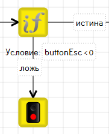

4\. На истинную ветку добавьте функцию присвоения координат центра объекта и диаметр в пикселях, переменным `a`, `b`, `c`.

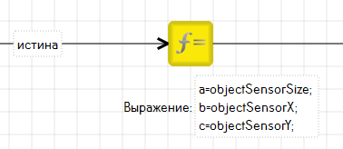

5\. Далее добавьте вывод в консоль переменных `a`, `b`, `c` и закончите цикл блоком [«Таймер»](../../studio/programming-visual/blocks.md#timer):

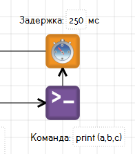

#### Общий вид алгоритма

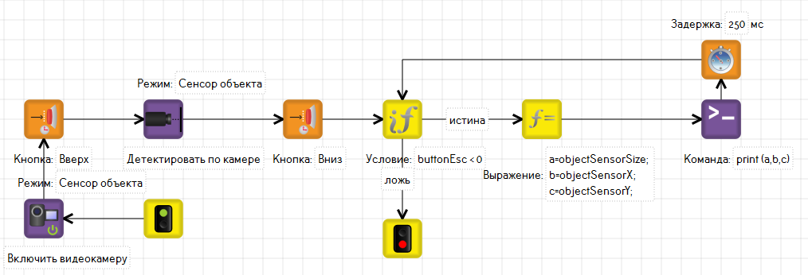

#### Запуск алгоритма на реальном роботе

1 . Запустите программу на роботе.

2\. Дождитесь, пока включится видеокамера.

3\. Поставьте робота таким образом, чтобы камера была направлена маленьким квадратом на объект. Нажмите кнопку `Вверх` на контроллере, для детектирования объекта.

Чтобы понять, что детектирование произошло, объект должен заполниться желтыми точками, как на картинке:

&#x20;4\. Нажмите кнопку `Вниз` на контроллере.

## ColorSensor

Камера как сенсор цвета необходима для решения задач распознавания цвета.

Для того чтобы включить камеру как сенсор линии, вам необходимо изменить режим работы камеры, в свойствах блока [«Включить видеокамеру»](../programming-visual/blocks.md#initialize-videocamera), на `Сенсор цвета`.

Режим `Сенсор цвета` имеет сенсорные переменные трех цветов (красный, зеленый, синий): [colorSensorR, colorSensorG, colorSensorB](../programming-visual/sensory-variables.md#colorsensor).

В режиме сенсора цвета камера делит кадр на 9 зон и возвращает среднее значение цвета центральной зоны.

#### Пример

Напишите алгоритм распознавания зеленого и красного цвета с использованием камеры. Робот должен выводить в консоль цвет, который видит.


Обратите внимание, что решить задачу можно только на реальном роботе.


#### Написание алгоритма

1\. Инициализируйте камеру как сенсор цвета.

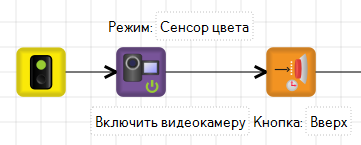


**Внимание!** Блок [«Ждать нажатия кнопки»](../programming-visual/blocks.md#wait-for-button) необходим, чтобы камера успела включиться. Когда на экране робота включиться изображение с камеры, можно приступать к следующему пункту.


2\. Добавьте функцию присвоения сенсорных переменных, переменным `a`, `b`.

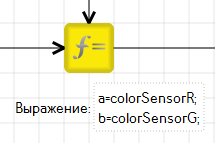

3\. Напишите условие, которое будет различать красный и зеленый. Учитывая, что красный — это `colorSensorR = 255` , а зеленый — это `colorSensorG = 255` .

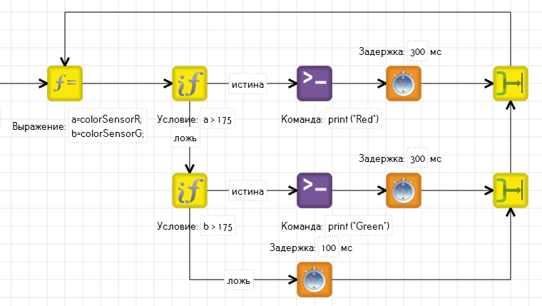

#### Общий вид алгоритма

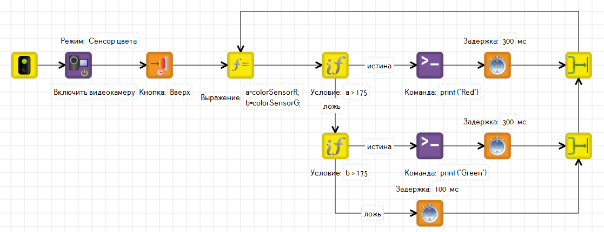

#### Запуск алгоритма на реальном роботе

1\. Исполните программу на роботе.\
2\. Дождитесь, пока включится видеокамера.\
3\. Поставьте робота таким образом, чтобы камера была направлена на распознаваемый цвет.

4\. Нажмите кнопку `Вверх` на контроллере для начала распознавания цвета. На экран робота должен выводиться цвет, на который направлена камера (Green, Red).\
